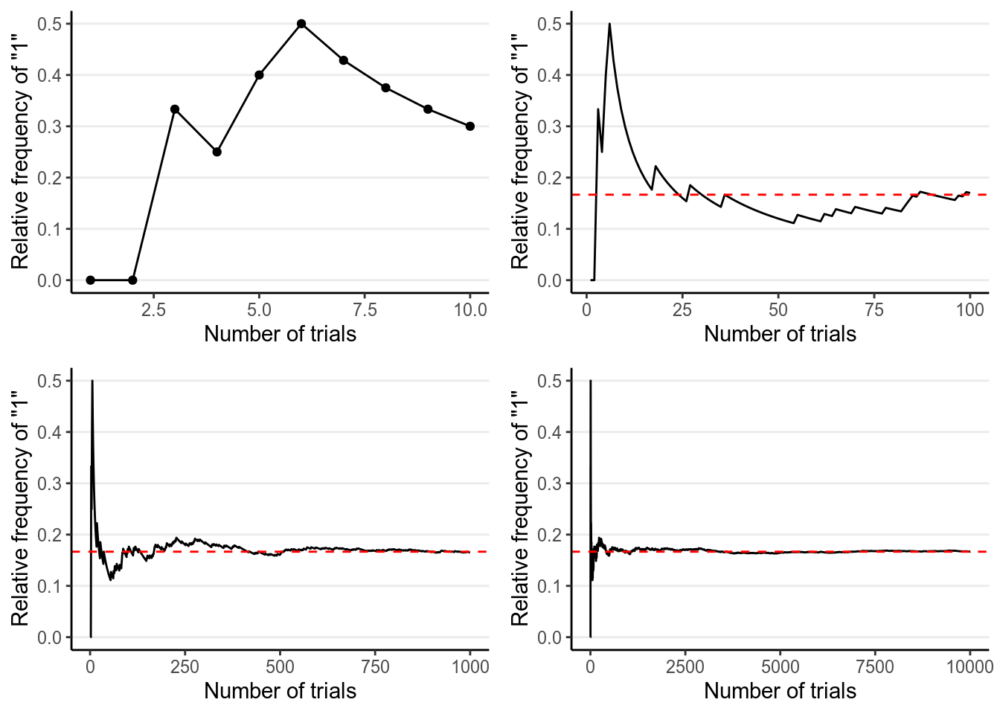

# Introduction

There will be some math in this notes. Don't worry if you feel the math is 
challenging; for applied focused students, it is much more important to 
understand the concepts of Bayesian methods than to understand the mathematical 
symbols, as they usually can be handled by the software. 

## History of Bayesian Statistics

Here is a nice brief video that covers some of the 250+ years of history of 
Bayesian statistics: https://www.youtube.com/watch?v=BcvLAw-JRss. If you are 
interested in learning more about the story, check out the nice popular science 
book, ["The theory that would not die," by Sharon Bertsch McGrayne](https://yalebooks.yale.edu/book/9780300188226/theory-would-not-die)

### Thomas Bayes (1701--1762)

You may find a biography of Bayes from
https://www.britannica.com/biography/Thomas-Bayes. There is also a nice story in
the book by @Lambert2018. He was an English Presbyterian minister. The important
work he wrote that founded Bayesian statistics was "An Essay towards solving a
Problem in the Doctrine of Chances", which he did not publish and was later
discovered and edited by his friend, Richard Price, after Bayes's death [^Price]

[^Price]: Price is another important figure in mathematics and philosopher, and
have taken Bayes' theorem and applied it to insurance and moral philosophy. 

### Pierre-Simon Laplace (1749--1827)

Laplace, a French Mathematician, was an important figure in not just Bayesian
statistics, but also in other areas of mathematics, astronomy, and physics. We
actually know much more the work by Laplace than by Bayes, and Laplace has
worked independently on the inverse probability problem (i.e.,
$P[\text{Parameter} | \text{Data}]$). Indeed, he was credited for largely
formalizing Bayesian interpretation of probability and most of the machinery for
Bayesian statistics, and making it a useful technique to be applied to different
problems, despite the discipline being called "Bayesian." His other
contributions include the methods of least square and the central limit theorem.
See a short biography of him at
https://www.britannica.com/biography/Pierre-Simon-marquis-de-Laplace.

### 20th Century

Until early 1920s, the _inverse probability_ method, which is based on what is
now called Bayes's Theorem, is pretty much the predominant point of view of
statistics. Then a point of view later known as _frequentist_ statistics
arrived, and quickly became the mainstream school of thinking for statistical
inferences, and is still the major framework for quantitative research. In the
early 1920s, frequentist scholar, most notably R. A. Fisher and Jerzy Neyman,
criticized Bayesian inference for the use of subjective elements in an objective
discipline. In Fisher's word,

> The theory of inverse probability is founded upon an error, and must be wholly 
rejected---Fisher, 1925

Ironically, the term _Bayesian_ was first used in one of Fisher's work. And 
interestingly, Fisher actually thought he "have been doing almost exactly 
what Bayes had done in the 18th century."[^Aldrich] 

[^Aldrich]: See the [paper by John
Aldrich](https://projecteuclid.org/download/pdf_1/euclid.ba/1340370565) on this.

Despite criticisms from frequentist scholars, Bayesian methods has been used by
scholars in the Allies in World War II, such as Alan Turing, in an algorithm to
break coded messages in the Enigma machine that the German Navy used to
communicate. However, because of the more complex mathematics involved in
Bayesian statistics, Bayesian statistics is limited to straight-forward problems
and theoretical discussions until the early 1980s, when computing speed
increases tremendously and makes _Markov Chain Monte Carlo_---the major
algorithm for Bayesian estimation in modern Bayesian statistics---feasible. With
the help of increased computing speed, Bayesian statistics has come back and
been used as an alternative way of thinking, especially given growing
dissatisfaction towards the misuse of frequentist statistics by some scholars
across disciplines. Bayesian estimation methods have also been applied to many
new research questions where frequentist approaches work less well, as well as
in big data analytics and machine learning.

## Motivations for Using Bayesian Methods

Based on my personal experience, Bayesian methods is used quite often in
statistics and related departments, as it is <span style="color:red">consistent
and coherent</span>, as contrast to frequentist where a new and probably ad hoc
procedure needed to be developed to handle a new problem. For Bayesian, as long
as you can formulate a model, you just run the analysis the same way as you
would for simpler problems, or in Bayesian people's word "turning the Bayesian
crank," and likely the difficulties would be more technical than theoretical,
which is usually solved with better computational speed.

Social and behavioral  scientists are relatively slow to adopt the Bayesian
method, but things have been changing. In a recently accepted paper by
@VandeSchoot2017, the authors reviewed papers in psychology between 1990 to 2015
and found that whereas less than 10% of the papers in 1990 to 1996 mentioned
"Bayesian", the proportion increased steadily and was found in <span
style="color:red">close to 45% of the psychology papers in 2015</span>. Among
studies using Bayesian methods, more than 1/4 cited <span
style="color:red">computational problems (e.g., nonconvergence) in frequentist
methods</span> as a reason, and about 13% cited the need to <span
style="color:red">incorporate prior knowledge</span> into the estimation
process. The other reasons included the <span
style="color:red">flexibility</span> of Bayesian methods for complex and
nonstandard problems, and the use of techniques traditionally attached to
Bayesian such as <span style="color:red">missing data</span> and <span
style="color:red">model comparisons</span>.

### Problem with classical (frequentist) statistics

The rise of Bayesian methods is also related to the statistical reform movement
in the past two decades. The problem is that applied researchers are <span
style="color:red">obsessed with $p < .05$</span> and often misinterpreted a
small $p$-value as something that it isn't [read @Gigerenzer2004]. Some scholars
coined the term
[$p$-hacking](https://www.nimh.nih.gov/about/directors/thomas-insel/blog/2014/p-hacking.shtml)
to refer to the practice of obtaining statistical significance by choosing to
test the data in a certain way, either consciously or subconsciously (e.g.,
dichotomizing using mean or median, trying the same hypothesis using different
measures of the same variable, etc). This is closely related to the recent
"replication crisis" in scientific research, [with psychology being in the
center under close
scrutiny](https://nobaproject.com/modules/the-replication-crisis-in-psychology).

Bayesian is no panacea to the problem. Indeed, if misused it can give rise to 
the same problems as statistical significance. My goal in this class is to help 
you appreciate the Bayesian tradition of <span style="color:red">embracing the
uncertainty in your results</span>, and adopt rigorous <span
style="color:red">model checking</span> and <span
style="color:red">comprehensive reporting</span> rather than relying merely on a
$p$-value. I see this as the most important mission for someone teaching
statistics.

## Probability

There are multiple perspectives for understanding probability.[^Prob] What
you've learned in your statistics training are based on the _frequentist_ 
interpretation of probability (and thus frequentist statistics), whereas what
you will learn in this class have the foundation on the _subjectivist_ 
interpretation of probability. Although, in my opinions, the impact of these
differences in interpretations of probability on statistical practices is
usually overstated, understanding the different perspectives on probability is
helpful for understanding the Bayesian framework. 

[^Prob]: See http://plato.stanford.edu/entries/probability-interpret/ for
more information

> You don't need to commit to one interpretation of probability in order to 
conduct Bayesian data analysis.

### Classical Interpretation

This is an earlier perspective, and is based on counting rules. The idea is that
probability is equally distributed among all "indifferent" outcomes. 
"Indifferent" outcomes are those where a person does not have any evidence to
say that one outcome is more likely than another. For example, when one throws a
die, one does not think that a certain number is more likely than another, 
unless one knows that the die is biased. In this case, there are six equally 
likely outcome, and so the probability of each outcome is 1 / 6.


### Frequentist Interpretation

The frequentist interpretation states that probability is essentially the 
long-term relative frequency of an outcome. For example, to find the probability
of getting a "1" when throwing a die, one can repeat the experiment many times, 
as illustrated below:


 Trial    Outcome 
-------  ---------
   1         2    
   2         3    
   3         1    
   4         3    
   5         1    
   6         1    
   7         5    
   8         6    
   9         3    
  10         3    

And we can plot the relative frequency of "1"s in the trials:



As you can see, with more trials, the relative frequency approaches 1 / 6. It's
the reason why in introductory statistics, many of the concepts require you to
think in terms of repeated sampling (e.g., sampling distribution, $p$-values, 
standard errors, confidence intervals), because probability in this framework
is only possible when the outcome can be repeated. It's also the reason why 
we don't talk about something like:

+ the probability of the null hypothesis being true, or
+ the probability that the population mean is in the interval [75.5, 80.5],

because the population is fixed and cannot be repeated. Only the samples can
be repeated, so probability in frequentist statistics is only about samples. 

### Problem of the single case

Because of the frequentist's reference to long-term frequency, under this
framework it does not make sense to talk about probability of an event that
cannot be repeated. For example, it does not make sense to talk about the
probability that the Democrats will win the 2020 US Presidential Election, or
the probability that the LA Rams winning the 2019 Super Bowl (they didn't), or
the probability that it rained on Christmas Day in LA in 2018, because all these
are specific events that cannot be repeated. The problem is that it is common
for lay people to talk about probabilities or chances for these events, and so
the frequentist interpretation is limited for these problems.

### Subjectivist Interpretation

The frequentist interpretation is sometimes called the "objectivist view", as
the reference of probability is based on empirical evidence of long-term
relative frequency (albeit hypothetical in many cases). In contrast, the
_subjectivist_ view of probability is based on one's belief. For example, when I
say that the probability of getting a "1" from rolling a die is 1 / 6, it
reflects the state of my mind about the die. My belief can arise from different
sources: Maybe I make the die and know it is a fair one; maybe I saw someone
throwing the die 1,000 times and the number of "1"s was close to 1,000 / 6, or
maybe someone I trust and with authority says that the die has a 1-in-6 chance
of showing a "1".

The "subjective" component has been criticized a lot by frequentist scholars,
sometimes unfairly. To be clear, what "subjective" here means is that
probability reflects the state of one's mind instead of the state of the world,
and so it is totally fine that two people can have different beliefs about the
same event. However, it does not mean that probability is arbitrary, as the
beliefs are subjected to the constraints of the axioms of probability as well as
the condition that the person possessing such beliefs are
_rational_.[^subjectivist] Therefore, if two persons are exposed to the same
information, they should form similar, though likely not identical, beliefs
about the event.

[^subjectivist]: In a purely subjectivist view of probability, assigning a
probability $P$ to an event does not require any justifications, as long as it
follows the axioms of probability. For example, I can say that the probability
of me winning the lottery and thus becoming the richest person on earth tomorrow
is 95%, which by definition would make the probability of me not winning the
lottery 5%. Most Bayesian scholars, however, do not endorse this version of
subjectivist probability, and require justifications of one's beliefs (that has
some correspondence to the world).

The subjective interpretation works perfectly fine with single events, as one
can have a belief about whether it rains on a particular day or a belief 
about a particular election result. 

<!-- + About gambling -->
<!--     * Betting: Give $p$ units of utility in return of 1 unit of utility -->
<!--     * Activity: Have two people negotiate a bet? -->

### Basics of Probability

Kolmogorov axioms: 

> - For an event $A_i$ (e.g., getting a “1” from throwing a die)
>     * $P(A_i) \geq 0$  [All probabilities are non-negative]
>     * $P(A_1 \cup A_2 \cup \cdots) = 1$  [Union of all possibilities is 1]
>     * $P(A_1) + P(A_2) = P(A_1 \text{ or } A_2)$ [Mutually exclusive events]

Consider two events, for example, on throwing a die,

- $A$: The number is odd
- $B$: The number is larger than or equal to 4

Assuming that die is (believed to be) fair, you can easily verify that the 
probability of $A$ is $P(A)$ = 3 / 6 = 1 / 2, and the probability of $B$ is 
also $P(B)$ = 3 / 6 = 1 / 2. 

#### Conditional Probability

Conditional probability is the probability of an event given some other 
information. In the real world, you can say that everything is conditional. 
For example, the probability of getting an odd number on throwing a die is 1/2
is conditional on the die being fair. We use $P(A | B)$ to represent the 
<span style="color:red">the conditional probability of event $A$ given event 
$B$.</span>. 

Continuing from the previous example, $P(A | B)$ is the conditional probability
of getting an odd number, _knowing that the number is at least 4_. By definition, 
the conditional probability is the probability that both $A$ and $B$ happen (
written as $A \cap B$ and pronounced as A--cap--B or A--intersection--B), 
divided by the probability that $B$ happen. 

> $P(A | B) = \frac{P(A \cap B)}{P(B)}$

In the example, $P(A \cap B)$ = 1/6,
because 5 is the only even number $\geq$ 4 when throwing a die. Thus,
\begin{align}
    P(A | B) & = 1 / 3 \\
             & = \frac{P(A \cap B)}{P(B)} \\
             & = \frac{1 / 6}{1 / 2}
\end{align}

This picture should make it clear:


#### Independence

Two events, $A$ and $B$, are independent if 

> $P(A | B) = P(A)$

This means that any knowledge of $B$ does not (or should not) affect one's
belief about $A$. In the example, obviously $A$ and $B$ are not independent, 
because once we know that the number if 4 or above, it changes the probability 
of whether it is an odd number or not. 

It can also be expressed as

> With independence, $P(A \cap B) = P(A) P(B)$

#### Law of Total Probability

When we talk about conditional probability, like $B_1$ = 4 or above and $B_2$ =
3 or below, we can get $P(A | B_1)$ and $P(A | B_2)$ (see the figure below), we
refer $P(A)$ as the _marginal probability_, meaning that the probability of $A$
<span style="color:red"> without knowledge of $B$</span>.


If $B_1, B_2, \cdots, B_n$ are all mutually exclusive possibilities for an event
(so they add up to a probability of 1), then by the <span style="color:red">
law of total probability</span>, 

> \begin{align}
    P(A) & = P(A \cap B_1) + P(A \cap B_2) + \cdots + P(A \cap B_n)  \\
         & = P(A | B_1)P(B_1) + P(A | B_2)P(B_2) + \cdots + P(A | B_n) P(B_n)  \\
         & = \sum_{k = 1}^n P(A | B_k) P(B_k)
  \end{align}

## Bayes's Theorem

The Bayes's theorem is, surprisingly (or unsurprisingly), very simple:

> $$P(B | A) = \frac{P(A | B) P(B)}{P(A)}$$

More generally, we can expand it to incorporate the law of total probability tomake it more applicable to data analysis. Consider $B_i$ as one of the $n$ many possible mutually exclusive events, then
\begin{align}
  P(B_i | A) & = \frac{P(A | B_i) P(B_i)}{P(A)}  \\
             & = \frac{P(A | B_i) P(B_i)}
                      {P(A | B_1)P(B_1) + P(A | B_2)P(B_2) + \cdots + 
                       P(A | B_n)P(B_n)} \\
             & = \frac{P(A | B_i) P(B_i)}{\sum_{k = 1}^n P(A | B_k)P(B_k)}
\end{align}

If $B_i$ is a continuous variable, we will replace the sum by an integral, 
$$P(B_i | A) = \frac{P(A | B_i) P(B_i)}{\int_k P(A | B_k)P(B_k)}$$
The denominator is not important for practical Bayesian analysis, therefore, it
is sufficient to write the above equality as 

> $$P(B_i | A) \propto P(A | B_i) P(B_i)$$

***

### Example 1: Base rate fallacy (From Wikipedia)  
    
A police officer stops a driver _at random_ and do a breathalyzer test for the
driver. The breathalyzer is known to detect true drunkenness 100% of the time,
but in 1% of the cases it gives a false positive when the driver is sober. We
also know that in general, for every 1,000 drivers passing through that spot,
one is driving drunk. Suppose that the breathalyzer shows positive for the
driver. What is the probability that the driver is truly drunk?
    
$P(\text{positive} | \text{drunk}) = 1$  
$P(\text{positive} | \text{sober}) = 0.01$  
$P(\text{drunk}) = 1 / 1000$  
$P(\text{sober}) = 999 / 1000$

Using Bayes' Theorem, 

$$\begin{align}
  P(\text{drunk} | \text{positive}) 
  & = \frac{P(\text{positive} | \text{drunk}) P(\text{drunk})}
           {P(\text{positive} | \text{drunk}) P(\text{drunk}) + 
            P(\text{positive} | \text{sober}) P(\text{sober})}  \\
  & = \frac{1 \times 0.001}{1 \times 0.001 + 0.01 \times 0.999} \\
  & = 100 / 1099 \approx 0.091
\end{align}$$

So there is less than 10% chance that the driver is drunk even when the 
breathalyzer shows positive. 

You can verify that with a simulation using R:


```r
set.seed(4)
truly_drunk <- c(rep("drunk", 100), rep("sober", 100 * 999))
table(truly_drunk)
```

```
># truly_drunk
># drunk sober 
>#   100 99900
```

```r
breathalyzer_test <- ifelse(truly_drunk == "drunk", 
                            # If drunk, 100% chance of showing positive
                            "positive", 
                            # If not drunk, 1% chance of showing positive
                            sample(c("positive", "negative"), 999000, 
                                   replace = TRUE, prob = c(.01, .99)))
# Check the probability p(positive | sober)
table(breathalyzer_test[truly_drunk == "sober"])
```

```
># 
># negative positive 
>#    98903      997
```

```r
# 997 / 99900 = 0.00997998, so the error rate is less than 1%
# Now, Check the probability p(drunk | positive)
table(truly_drunk[breathalyzer_test == "positive"])
```

```
># 
># drunk sober 
>#   100   997
```

```r
# 100 / (100 + 997) = 0.0911577, which is only 9.1%!
```

***

## Bayesian Statistics

`Bayesian statistics` is a way to estimate some parameter $\theta$ (i.e., some
quantities of interest, such as population mean, regression coefficient, etc) by
applying the Bayes' Theorem.
> $$P(\theta = t | y) \propto P(y | \theta = t) P(\theta = t)$$

There are three components in the above equality:

- $P(y | \theta = t)$, the probability that you observe the datum $y$, assuming
that the parameter $\theta$ has a value $t$; this is called the `likelihood`
(Note: It is the likelihood of $\theta$, but probability about $y$)
- $P(\theta = t)$, the probability that $\theta$ has a value of $t$, without
referring to the datum $y$. This usually requires appeals to one's degree of
belief, and so is called the `prior`
- $P(\theta = t | y)$, the probability that $\theta$ has a value of $t$, after
observing the datum $y$; this is called the `posterior`

This is different from the classical/frequentist statistics, which focuses
solely on the likelihood function.[^lik] In Bayesian statistics, the goal is to
update one's belief about $\theta$ based on the observed datum $y$.

[^lik]: The likelihood function in classical/frequentist statistics is usually
written as $P(y; \theta)$. You will notice that here I write the likelihood for
classical/frequentist statistics to be different than the one used in Bayesian
statistics. This is intentional: In frequentist conceptualization, $\theta$ is
fixed and it does not make sense to talk about probability of $\theta$. This
implies that we cannot condition on $\theta$, because conditional probability is
defined only when $P(\theta)$ is defined.

***

### Example 2: Locating a Plane

(reference: http://87.106.45.173:3838/felix/BayesLessons/BayesianLesson1.Rmd)

Consider a highly simplified scenario of locating a missing plane in the sea.
Assume that we know the plane, before missing, happened to be flying on the same
latitude, heading west across the Pacific, so we only need to find the longitude
of it. We want to go out to collect debris (data) so that we can narrow the
location ($\theta$) of the plane down.

We start with our prior. Assume that we have some rough idea that the plane 
should be, so we express our belief in a probability distribution like the 
following:


which says that our belief is that the plane is about twice more likely to be
towards the east than towards the west. Below are two other options for priors
(out of infinitely many), one providing virtually no information and the other 
encoding stronger information:


The prior is chosen to reflect the researcher's belief, so it is likely that
different researchers will formulate a different prior for the same problem, and
that's okay as long as the prior is reasonable and justified. Later we will
learn that in regular Bayesian analyses, with a moderate sample size different
priors generally make only a negligible differences.

Now, assume that we have collected debris in the locations shown in the graph, 


Now, from Bayes's Theorem,

$$\text{Posterior Probability} \propto \text{Prior Probability} \times
                                       \text{Likelihood}$$

So we can simply multiply the prior probabilities and the likelihood to get the
posterior probability for every location. A rescaling step is needed to make
sure that the area under the curve will be 1, which is usually performed by the
software.


```
># Warning: `mapping` is not used by stat_function()
```


The following shows what happen with a stronger prior:


```
># Warning: `mapping` is not used by stat_function()
```


***

## Comparing Bayesian and Frequentist Statistics 

| Attributes | Frequentist | Bayesian |
| ---------- | ----------- | -------- |
| Interpretation of probability | Frequentist | Subjectivist |
| Uncertainty | How estimates vary in repeated sampling from the same population | How much prior beliefs about parameters change in light of data |
| What's relevant? | Current data set + all that might have been observed | Only the data set that is actually observed |
| How to proceed with analyses| MLE; ad hoc and depends on problems | "Turning the Bayesian crank" |

## Software for Bayesian Statistics

- [WinBUGS](http://www.mrc-bsu.cam.ac.uk/software/bugs/the-bugs-project-winbugs/)
    * Bayesian inference Using Gibbs Sampling
    * Free, and most popular until late 2000s. Many Bayesian scholars still use
    WinBUGS
    * No further development
    * One can communicate from R to WinBUGS using the package `R2WinBUGS`
- [JAGS](http://mcmc-jags.sourceforge.net/)
    * Just Another Gibbs Sampler
    * Very similar to WinBUGS, but written in C++, and support user-defined
    functionality
    * Cross-platform compatibility
    * One can communicate from R to JAGS using the package `rjags` or `runjags`
- [STAN](http://mc-stan.org/)
    * Named in honour of Stanislaw Ulam, who invented the Markov Chain Monte
    Carlo method
    * Uses new algorithms that are different from Gibbs sampling
    * Under very active development
    * Can interface with R throught the package `rstan`, and the R packages
    `rstanarm` and `brms` automates the procedure for fitting models in STAN for
    many commonly used models
