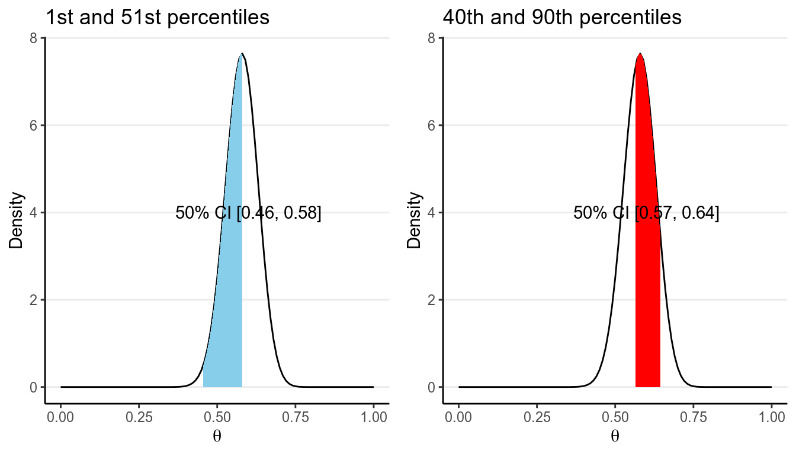
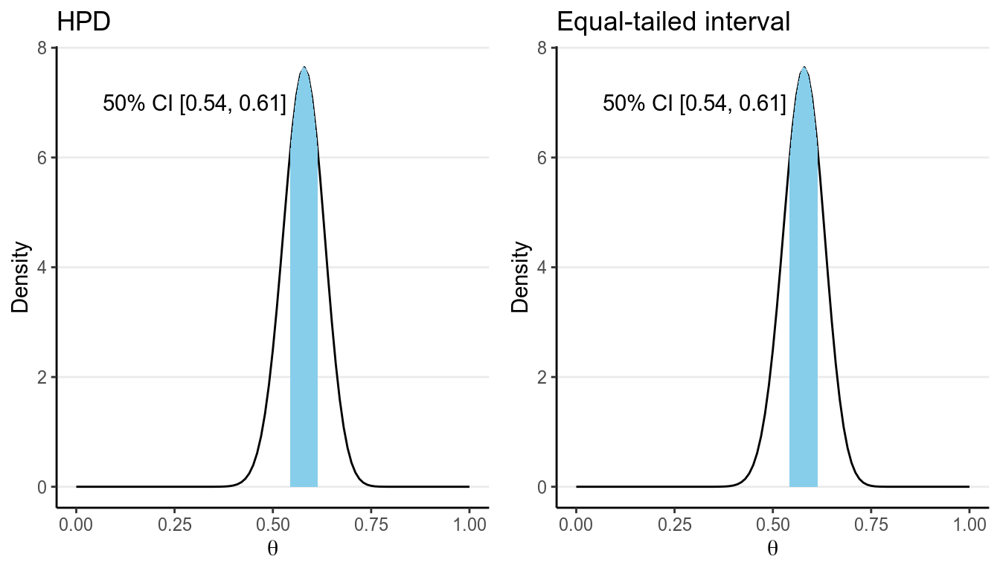
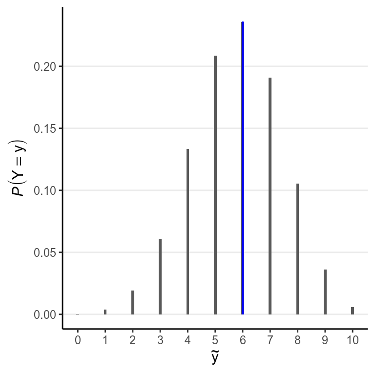

# Bayesian Inference

This lecture describes the steps to perform Bayesian data analysis. Some authors
described the process as "turning the Bayesian Crank," as the same work flow 
basically applies to every research questions, so unlike frequentist which
requires different procedures for different kinds of questions and data, 
Bayesian represents a generic approach for data analysis, and development in 
the area mainly involves development of new models (but still under the 
same work flow), invention of faster algorithms for bigger data sets, and 
evaluations of different choices of priors. 

## Steps of Bayesian Data Analysis

Adapted from @Kruschke2015 [p.25], I conceptualize Bayesian data analysis as
the following steps:

1. __Identify/Collect the data__ required to answer the research questions. 
    b. As a general recommendation, it is helpful to __visualize__ the data to 
    get a sense of how the data look, as well as to inspect for any potential 
    anomalies in the data collection. 
2. __Choose a statistical model__ for the data in relation to the research
questions. The model should have good theoretical justification and have 
parameters that are meaningful for the research questions. 
3. __Specify prior distributions__ for the model parameters. Although this is
a subjective endeavor, the priors chosen should be at least sensible to 
audience who are skeptical. 
4. __Obtain the posterior distributions__ for the model parameters. As 
described below, this can be obtained by analytical or various mathematical 
approximations. 
    b. For mathematical approximations, one should check the algorithms for 
    __convergence__ to make sure the results closely mimic the target posterior
    distributions 
5. Conduct a __posterior predictive check__ to examine the fit between the model
and the data, i.e., whether the chosen model with the estimated parameters
generate predictions that deviate form the data being analyzed on important
features.
    b. If the model does not fit the data, one should go back to step 2 to 
    specify a different model
6. If the fit between the model and the data is deemed satisfactory, one can 
proceed to __interpret the results__ in the context of the research questions. 
It is also important to __visualize the results__ in ways that are meaningful
for the analysis. 

## Real Data Example

We will be using a built-in data set in R about patients diagnosed with AIDS in
Australia before 1 July 1991. For this week we will only look at a tiny
subsample of 10 people. Here is a description of the variables (from the R
documentation):

+ `state`: Grouped state of origin: "NSW "includes ACT and "other" is WA, SA, NT
and TAS.
+ `sex`: Sex of patient.
+ `diag`:(Julian) date of diagnosis.
+ `death`: (Julian) date of death or end of observation.
+ `status`: "A" (alive) or "D" (dead) at end of observation.
+ `T.categ`: Reported transmission category.
+ `age`: Age (years) at diagnosis.

You should always first plot your data and get some summary statistics:


```r
data("Aids2", package = "MASS")
set.seed(15)
Aids2_sub <- Aids2 %>% sample_n(10)
Aids2_sub
```

```
>#    state sex  diag death status T.categ age
># 1    VIC   M 11386 11504      A      hs  36
># 2    NSW   M 10103 10297      D      hs  25
># 3    QLD   M 10874 11191      D      hs  36
># 4    NSW   M 11398 11504      A      hs  42
># 5    NSW   M  9598 10623      D      hs  40
># 6    NSW   M  9768  9945      D      hs  69
># 7    NSW   M 10828 11504      A      hs  37
># 8  Other   F 10519 11504      A      id  30
># 9    NSW   M 11054 11343      D      hs  30
># 10   NSW   M 10345 11054      D      hs  41
```

```r
# install.packages("psych")  # uncomment to install the `psych` package
library(psych)
pairs.panels(Aids2_sub, ellipses = FALSE)
```


## Choosing a Model

<!-- Consider the following yellow candy example,  -->

<!-- <span class="example"> -->
<!-- The instructor brings a large bag of candy, and each pieces of them are wrapped -->
<!-- in one of five different colors: <span style="color:red">`red`</span>, `black`, -->
<!-- <span style="color:brown">`yellow`</span>, <span -->
<!-- style="color:green">`green`</span>, and <span style="color:blue">`blue`</span>. -->
<!-- It is known that "yellow" candy is seen less often than other colors, although -->
<!-- the proportion is different across different bags. Let $\theta$ be the -->
<!-- proportion of "yellow" candy in this bag. On drawing 10 pieces of candy, one  -->
<!-- of them is yellow.  -->
<!-- </span> -->

<!-- The data is simple, but I will still plot the data to remind you that you should -->
<!-- do it for your analyses.  -->

<!-- ```{r plot_y, fig.align='center', fig.width=3.5, fig.height=3.5} -->
<!-- y <- factor(c("yellow", rep("others", 9)),  -->
<!--             levels = c("yellow", "others")) -->
<!-- ggplot(tibble(y), aes(x = y, fill = y)) +  -->
<!--   geom_bar() +  -->
<!--   guides(fill = FALSE) +  -->
<!--   scale_fill_manual(values = c("gold", "grey")) -->
<!-- ``` -->

We will be using the `status` variable, specifically the death rate of AIDS in
this data set. Our simple research question is:

    What is the death rate of AIDS in Australia when the data were collected?

Now let's go through the Bayesian Crank. 

If we assume that the outcome of the observations are exchangeable, meaning that
the observations can be reordered in any way and still gives the same inference,
then one can choose a model: $$y \sim \text{Bin}(n, \theta)$$

* $y$ = number of "D" in the observed data
* $n$ = number of patients in the data set
* $\theta$ = probability of "D"

The model states that: the sample $y$ is distributed as a binomial 
distribution with $n$ observations and with a rate parameter $\theta$. 

### Exchangeability*

Exchangeability is an important concept in Bayesian statistics, but for the 
purpose of this class it may be a bit beyond the scope. Instead of looking at
its mathematical definition, I will illustrate it in an example. Say we take
6 rows in our data set:


       state   sex     diag   death  status   T.categ    age
-----  ------  ----  ------  ------  -------  --------  ----
1      NSW     M      10905   11081  D        hs          35
31     NSW     F      10961   11504  A        id          30
1802   QLD     F       9495    9753  D        blood       66
1811   QLD     M      10770   11504  A        hsid        29
2129   VIC     M       8499    8568  D        hs          43
2137   VIC     M       9055    9394  D        hs          29

Now, when we reorder the column `status` to something like:


state   sex     diag   death  status   T.categ    age
------  ----  ------  ------  -------  --------  ----
NSW     M      10905   11081  D        hs          35
NSW     F      10961   11504  D        id          30
QLD     F       9495    9753  A        blood       66
QLD     M      10770   11504  D        hsid        29
VIC     M       8499    8568  D        hs          43
VIC     M       9055    9394  A        hs          29

if the results are expect to be the same then we say that the observations are
assumed exchangeable. This happens when we assume that all observations have 
one common mean. However, if we think that there is a mean for females and a
different mean for males, we cannot reorder the outcome randomly because they 
are no longer exchangeable (i.e., you cannot exchange a female score for a 
male score and expect to get the same results). 

> Exchangeability: A set of observations are said to be exchangeable if their
joint probability distribution stays the same under all permutations. Roughly
speaking, it means that the observations can be reordered and still provide the
same inferences. 

### Probability Distributions

Probability distributions are central in statistical modeling. You should've at
least hear about the normal distribution, where a variable follows a bell shape.
There are two groups of distributions, depending on whether the variable of
interest is discrete or continuous. For this example, the variable concerns the
count of death, so it is discrete. Each probability distribution has a
mathematical form called a _probability mass function (pmf)_ for a discrete
variable, and a _probability density function (pdf)_ for a continuous variable.
The pmf specifies the probability for each possible value. 

#### Binomial Distribution

For a binomial variable, the pmf is 
\begin{align}
  P(y) & = \binom{n}{y} \theta^y (1 - \theta)^{n - y} \\
\end{align}
The term $\binom{n}{y}$ is called a binomial coefficient. The mathematical form
is not the most important thing for this class as it is usually handled by 
the software. Here is a plot for a binomial distribution with $n = 10$ and
different values of $\theta$


```r
# par(mfrow = c(2, 2), mar = c(4, 4, 2, 0) + 0.1)
# for (th in c(0.1, 0.2, 0.5, 0.8)) {
#   plot(0:10, dbinom(0:10, 10, th), type = "h", xlab = "y", 
#        ylab = expression(italic(P)(Y == y)), bty = "L", 
#        lwd = 2)
#   pos <- "topright"
#   if (th > 0.6) pos <- "topleft"
#   legend(pos, legend = bquote(theta == .(th)))
# }
th <- c(0.1, 0.2, 0.5, 0.8)
plist <- vector("list", length = length(th))
for (i in 1:4) {
  label_xpos <- if (th[i] > .6) 2 else 8
  plist[[i]] <- ggplot(tibble(y = 0:10, 
                              prob = dbinom(0:10, 10, th[i])), 
       aes(x = y, y = prob)) + 
  geom_bar(stat = "identity", width = 0.1) + 
  labs(y = expression(italic(P)(Y == y)), 
       x = expression(y)) + 
  scale_x_continuous(breaks = 0:10) + 
  annotate("text", x = label_xpos, y = Inf, vjust = 1, 
           label = list(bquote(theta == .(th[i]))), 
           parse = TRUE)
}
gridExtra::grid.arrange(grobs = plist, nrow = 2)
```


Note in the above that the possible values of $y$ are $\{0, 1, \ldots, 10\}$, 
and one can get the probability of each value. 

You will see many other probability distributions in this class, for both
discrete and continuous variables. 

### The Likelihood

After observing the data $y$, we can obtain the likelihood for each value 
of $\theta$, $P(y | \theta)$. For example, for $\theta = 0.5$, I get
$$P(y | \theta = 0.5) = 0.205$$
This can be obtained in R using the following line:


```r
# Probability of y = 6 for 10 trials, with theta = 0.5
dbinom(6, 10, 0.5)
```

```
># [1] 0.205
```

As there are infinitely many possible $\theta$ values in the range $[0, 1]$, 
we cannot get $P(y | \theta)$ for every one of them. Here is a few typical 
values:


```r
th <- seq(0, 1, by = 0.1)
tibble(theta = th, 
       likelihood = dbinom(6, 10, prob = th))
```

```
># # A tibble: 11 x 2
>#    theta likelihood
>#    <dbl>      <dbl>
>#  1   0     0       
>#  2   0.1   0.000138
>#  3   0.2   0.00551 
>#  4   0.3   0.0368  
>#  5   0.4   0.111   
>#  6   0.5   0.205   
>#  7   0.6   0.251   
>#  8   0.7   0.200   
>#  9   0.8   0.0881  
># 10   0.9   0.0112  
># 11   1     0
```

And you can plot the likelihood function: 


```r
ggplot(tibble(x = c(0, 1)), 
       aes(x = x)) + 
  stat_function(fun = dbinom, args = list(x = 6, size = 10), col = "red") + 
  labs(x = expression(theta), 
       y = "likelihood")
```


## Specifying Priors

The previous model has one parameter, $\theta$, which is the probability of 
getting a target outcome (i.e., "D") in each observation. Because $\theta$ is 
a probability, its support is $[0, 1]$, meaning that it is continuous and can
take any value from 0 to 1. For a continuous parameter there are infinitely 
many possible values, and it is impossible to specify our beliefs for each 
value. We can specify something like:


to express a belief that $\theta$ is most likely to be in the range $[.40, .60)$
and is 5 times more likely than any values outside of that range. Bayesian 
analyses can handle such priors, although in general we prefer a prior
distribution that has a known form and is smooth. 

One thing to remember is:

> A good prior should give a non-zero probability/density for all possible 
values of a parameter

### Beta Distribution

A commonly used family of prior distribution for a binomial model is the _beta
distribution_, which has two parameters. We can write the prior as
$$P(\theta) \sim \text{Beta}(a, b)$$

$a$ and $b$ are the two parameters. Here are a few examples:


You will notice that when $a > b$, there will be more density closer to the 
right region (i.e., larger $\theta$), and vice versa. Also, when $a$ and $b$
become larger, the variance decreases. 

A nice interpretation of $a$ and $b$ in a beta prior distribution is to consider

- $a - 1$ = number of prior 'successes' (e.g., "D")
- $b - 1$ = number of prior 'failures' (e.g., "A")

Therefore, with $\text{Beta}(1, 1)$ one has seen 0 prior success and 0 failure, 
meaning that there are no prior information (i.e., *noninformative*). Therefore,
it makes sense that all $\theta$ values are equally likely. On the other hand,
if one chooses $\text{Beta}(10, 20)$, one has seen 9 prior successes and 19
prior failures, so one has quite a lot of prior information (indeed more than
the data with only 10 observations), so this is a *strong* prior.

> The smaller the variance of the prior distribution, the stronger one's 
belief before looking at the data, the more prior information

So by manipulating the parameters you can control the shape of the prior 
distribution as well as its strength, so it is quite flexible. Another 
advantage of using a beta prior is that it is a *conjugate prior* of the 
binomial model, which means that the posterior distribution of $P(\theta | y)$
is also a beta distribution, the same as the prior distribution, although
with different parameter values. 

> Conjugate Prior: For a specific model, conjugate priors yield posterior
distributions in the same distribution family as the priors

This greatly simplifies the computational burden for Bayesian analyses, so
conjugate priors are almost the only ones used in earlier literature. However,
this limited the applications of Bayesian methods, as for many problems no 
conjugate priors can provide a realistic representation of one's belief. 
Modern Bayesian analysis instead relies on *simulation-based* methods to
approximate the posterior distribution, which can accommodate almost any kind of
prior distributions. Aside from a few examples in this note and the next, mainly
for pedagogical purposes, we will be using simulation-based methods and will 
discuss it in Week 4. 

Now, I will formulate my prior based on the information provided by the CDC 
in the US (https://www.cdc.gov/mmwr/preview/mmwrhtml/mm5021a2.htm), which says 
that 

    As of December 31, 2000, 774,467 persons had been reported with AIDS in the
    United States; 448,060 of these had died.

If I believe this also applies to Australia in 1991, then I will use a
$\text{Beta}(448,061, 326,408)$ prior. However, because the time and location is
different, I don't want to use a prior that strong. Instead, I will divide the
information by 10,000 times (an arbitrary number; in practice you usually don't
scale by that much) so that the prior is $$P(\theta) = \text{Beta}(46, 34)$$
which is much weaker but still pretty strong. The prior represents an amount of 
information equaled to 78 observations. 

<!-- because I have prior information that $\theta$ should be somewhat smaller -->
<!-- than 0.2 (remember than yellow candy is rarer than others), but I don't want to -->
<!-- put too much weight for this prior, I will use a $\text{Beta}(1.1., 2)$ prior,  -->
<!-- which corresponds to having observed 0.1 success and 1 failure (so the  -->
<!-- prior success rate is 0.1 / 1.1 = 0.091), with an amount of information  -->
<!-- being equal to 1.1 data points.  -->


The business of choosing a suitable prior distribution is not trivial. Luckily, 
with more and more researchers and methodologists using Bayesian analyses, there
have been more and more recommendations for suitable prior distributions for
different commonly used models. Also, when the prior contains relatively few
information as compared to the data, different choices of prior hardly make a
difference in the posterior distributions. On the other hand, one can perform
*sensitivity analyses*, meaning that one can experiment with a few sensible
priors to see how the Bayesian inferences change; in the results stay pretty
much the same, one can be more confident that the results are mainly driven by
the data rather than the "subjectively chosen" priors.

> In general, one would worry more about choosing a model that does not fit
the data than about misspecifying a prior. 

## Obtain the Posterior Distributions

Remember again the relationship between the prior and the posterior:
$$P(\theta | y) \propto P(y | \theta) P(\theta)$$

The posterior distributions are mathematically determined once the priors and 
the likelihood are set. However, the mathematical form of the posterior is 
sometimes very difficult to deal with. Here are a few methods to make
sense of the posterior, with all of them sharing the goal of knowing the 
shape and some important properties of the posterior. 

### Grid Approximation

One straight forward, brute-force method is to compute the posterior density 
for a large number of values of the parameters. For example, by taking 
$\theta$ = 0, 0.01, 0.02, . . . , 0.98, 0.99, 1.00, which corresponds a grid of 
101 points, I can evaluate the posterior at these 21 points. 


```r
# Define a grid for the parameter
th_grid <- seq(0, 1, by = 0.01)
# Get the prior density for each value on the grid
prior <- dbeta(th_grid, 46, 34)
# Get the likelihood for each value on the grid
lik <- dbinom(6, 10, prob = th_grid)
# Multiply to get the posterior
post_raw <- prior * lik
# Scale it back to density so that the sum is 1
post_dens <- post_raw / sum(post_raw * 0.01)
# Print a table for a few values
grid_dat <- tibble(theta = th_grid, 
                   prior = prior, 
                   likelihood = lik, 
                   `prior x likelihood` = post_raw, 
                   posterior = post_dens) 
grid_dat[51:60, ]
```

```
># # A tibble: 10 x 5
>#    theta prior likelihood `prior x likelihood` posterior
>#    <dbl> <dbl>      <dbl>                <dbl>     <dbl>
>#  1 0.5    2.85      0.205                0.584      2.50
>#  2 0.51   3.57      0.213                0.760      3.25
>#  3 0.52   4.33      0.220                0.954      4.08
>#  4 0.53   5.09      0.227                1.16       4.94
>#  5 0.54   5.81      0.233                1.35       5.79
>#  6 0.55   6.42      0.238                1.53       6.54
>#  7 0.56   6.88      0.243                1.67       7.14
>#  8 0.57   7.14      0.246                1.76       7.52
>#  9 0.580  7.19      0.249                1.79       7.64
># 10 0.59   7.00      0.250                1.75       7.49
```


```r
# par(mfrow = c(1, 2), mar = c(4, 4, 2, 0) + 0.1)
# # Plot the prior
# plot(th_grid, prior, type = "o", col = "green3", ylim = c(0, 5), 
#      ylab = "density", cex = 0.7, xlab = expression(theta))
# # Plot the likelihood (need to scale it)
# lines(th_grid, lik / sum(lik) / 0.05, type = "o", col = "red", cex = 0.7)
# # Plot the post raw (need to scale it)
# lines(th_grid, post_dens, type = "o", col = "blue", cex = 0.7)
# legend("topright", c("Prior", "Likelihood", "Posterior"), 
#        lwd = 1, 
#        col = c("green3", "red", "blue"), cex = 0.7)
# curve(dbeta(x, 52, 38), ylim = c(0, 5), 
#       ylab = "density", xlab = expression(theta), col = "blue")
# text(0.6, 4, "Beta(52, 38)")
p1 <- ggplot(grid_dat, aes(x = theta)) + 
  geom_point(aes(y = prior, col = "Prior")) + 
  geom_line(aes(y = prior, col = "Prior")) + 
  geom_point(aes(y = likelihood / sum(likelihood) / 0.01, col = "Likelihood")) + 
  geom_line(aes(y = likelihood / sum(likelihood) / 0.01, col = "Likelihood")) + 
  geom_point(aes(y = posterior, col = "Posterior")) + 
  geom_line(aes(y = posterior, col = "Posterior")) + 
  labs(x = expression(theta), y = "Density", 
       col = "") + 
  ylim(0, 8) + 
  scale_color_manual("", values = c("red", "blue", "green3")) + 
  theme(legend.position = c(0.80, 0.80))
p2 <- ggplot(grid_dat, aes(x = theta)) + 
  stat_function(fun = dbeta, args = list(shape1 = 52, shape2 = 38), 
                col = "blue") + 
  geom_text(x = 0.2, y = 7, label = "Beta(52, 38)") + 
  labs(x = expression(theta), y = "Density", 
       col = "") + 
  ylim(0, 8)
gridExtra::grid.arrange(p1, p2, nrow = 1)
```


The blue line above on the left graph shows an approximation of the posterior
distribution.

### Using Conjugate Priors

As we're using a conjugate prior, the posterior is also a beta distribution.
It has been mathematically proven that 
$$P(\theta | y) \sim \text{Beta}(a + y, b + n - y),$$
which is a distribution for $a + y - 1$ successes and $b + n - y$ failures. 
This makes perfect sense as our prior information as $a - 1$ successes and 
$b - 1$ failures, and from our data we have $y$ successes and $n - y$ 
failures, so that our updated belief is based on adding up those successes and
failures. 

With $a = 46$, $b = 34$, we know that the posterior distribution will be 
a $\text{Beta}(52, 38)$ distribution, as shown in the graph above in the right 
panel. The one obtained by grid approximation is quite close to the true 
posterior distribution, and can be improved by increasing the number of 
points in the grid. 

***

#### Proof of Conjugacy*

To derive the form of the posterior, first recognize that the beta 
distribution has the form:

\begin{align}
  P(\theta) & = \mathrm{B}^{-1}(a, b) \theta^{a - 1} (1 - \theta)^{b - 1} \\
  & \propto \theta^{a - 1} (1 - \theta)^{b - 1}
\end{align}

Where $\mathrm{B}(\cdot)$ is the beta function which is not very important
for the class. As the density function is a function of $\theta$, it suffices
to write only the terms that involve $\theta$. 

Similarly, 

$$P(y | \theta) \propto \theta^y (1 - \theta)^{n - y}$$

with the binomial coefficient, which does not involve $\theta$, dropped. 
Therefore, 

\begin{align}
  P(\theta | y) & \propto P(y | \theta) P(\theta)  \\
                & \propto \theta^y (1 - \theta)^{n - y} 
                          \theta^{a - 1} (1 - \theta)^{b - 1}  \\
                & = \theta^{a + y - 1} (1 - \theta)^{b + n - y - 1}.
\end{align}

If we let $a^* = a + y$, $b^* = b + n - y$, we can see that $P(\theta | y)$ is
in the same form as the prior with $a$ and $b$ replaced by $a^*$ and $b^*$. 
Therefore, the posterior is also a beta distribution. So the beta distribution
is a conjugate prior for the binomial model. 

***

### Laplace Approximation with Maximum A Posteriori Estimation

The Laplace approximation is like the Bayesian version of the Central Limit
Theorem, where a normal distribution is used to approximate the posterior
distribution. Because the normal distribution is symmetric with the mean being
the point with highest density, with Laplace approximation the goal is to find
the maximum point in the posterior distribution, which is called the _maximum a
posteriori (MAP)_ estimate. Generally, finding the MAP is much easier then
deriving the whole posterior distribution. The following R code finds the MAP
of the posterior distribution using the `optim()` function. 


```r
log_prior <- function(th) dbeta(th, 46, 34, log = TRUE)
log_lik <- function(th) dbinom(6, 10, th, log = TRUE)
log_posterior <- function(th) log_prior(th) + log_lik(th)
# Find the MAP estimate with the Hessian
fit <- optim(runif(1, 0, 1), log_posterior, method = "L-BFGS-B", 
             lower = 1e-5, upper = 1 - 1e-5, 
             control = list(fnscale = -1), 
             hessian = TRUE)
fit$par  # MAP
```

```
># [1] 0.58
```

```r
1 / sqrt(-fit$hessian[1])  # estimate of posterior standard deviation
```

```
># [1] 0.0526
```

The graph below shows the normal approximation of the posterior distribution in
our AIDS example.


```r
# par(mar = c(4, 4, 2, 0) + 0.1)
# curve(dbeta(x, 52, 38), xlab = expression(theta), ylab = "density")
# curve(dnorm(x, fit$par, 1 / sqrt(-fit$hessian)), add = TRUE, 
#       col = "blue", lty = "dashed")
# legend("topright", c("Beta(52, 38)", "Normal approximation"), 
#        lty = c("solid", "dashed"), col = c("black", "blue"))
ggplot(tibble(x = c(0, 1)), aes(x = x)) + 
  stat_function(fun = dbeta, args = list(shape1 = 52, shape2 = 38), 
                aes(col = "Beta(52, 38)", linetype = "Beta(52, 38)"), 
                size = 2) + 
  stat_function(fun = dnorm, args = list(mean = fit$par, 
                                         sd = 1 / sqrt(-fit$hessian[1])), 
                aes(col = "Normal approximation", 
                    linetype = "Normal approximation")) + 
  labs(x = expression(theta), y = "Density", 
       col = "", linetype = "") + 
  scale_color_manual("", values = c("skyblue", "blue")) + 
  scale_linetype_manual("", values = c("dashed", "solid"))
```


The advantage of using Laplace approximation is mainly computational, as it is
generally much easier to obtain the maximum point of a function than to get the 
whole shape. 

### Markov Chain Monte Carlo (MCMC)

The _Markov Chain Monte Carlo (MCMC)_ simulation method is the modern way of
approximating complex forms of the posterior distribution. The idea is analogous
to treating the posterior distribution as the population, and then repeatedly 
draw samples from it. As you've learned in basic statistics, when you draw a
large enough sample (say 1,000), the sample distribution should be very close
to the population distribution. 

One tweak of MCMC from the above analogy is that the samples drawn are
_correlated_, so that if the first sample is high, the next one is more likely
to be high too. This is needed because we don't have a direct way to draw 
samples from the posterior distribution, which usually has a very complex form; 
instead we have some algorithms that can indirectly get us to the posterior. 
The correlation among samples usually is not a big problem, except that we need 
to draw more samples to compensate for it. We will devote a whole week for MCMC
in this course. 

Below is an example. The left panel is a _trace plot_ showing how the value of 
$\theta$ changed for each sample (up to 500), and the right panel shows the 
sample distribution of 8,000 samples using MCMC. As you can see, the shape of
the MCMC sample distribution closely approximates the true beta posterior 
distribution. 


```r
# This is called the Metropolis algorithm
log_prior_kernel <- function(th) (46 - 1) * log(th) + (34 - 1) * log(1 - th)
log_lik_kernel <- function(th, y = 6, n = 10) y * log(th) + 
  (n - y) * log(1 - th)
log_posterior_kernel <- function(th, y = 6, n = 10) {
  log_prior_kernel(th) + log_lik_kernel(th, y, n)
}
post <- rep(NA, 1e4 + 1)
post[1] <- runif(1)
for (i in seq_len(length(post) - 1)) {
  proposal <- rnorm(1, post[i], 0.1)
  if (proposal > 1 | proposal < 0) {
    post[i + 1] <- post[i]
    next
  }
  p_accept <- exp(log_posterior_kernel(proposal) - log_posterior_kernel(post[i]))
  post[i + 1] <- ifelse(runif(1) < p_accept, proposal, post[i])
}
# Discard the burn-in
post <- post[-(1:2000)]
# # Plot the posterior samples
# par(mfrow = c(1, 2), mar = c(4, 4, 2, 0) + 0.1)
# plot.ts(post[1:500], xlab = "iterations", ylab = expression(theta))
# plot(density(post, bw = "SJ"), xlab = expression(theta), main = "")
p1 <- ggplot(tibble(iter = 1:500, th = post[1:500]), 
       aes(x = iter, y = th)) + 
  geom_line() + 
  labs(x = "iterations", y = expression(theta))
p2 <- ggplot(tibble(th = post), aes(x = th)) + 
  geom_density(bw = "SJ") + 
  labs(x = expression(theta)) + 
  xlim(0, 1)
gridExtra::grid.arrange(p1, p2, nrow = 1)
```


With MCMC, one needs to check for _convergence_ to make sure that the samples
approximates the posterior well enough. We will discuss this in a later lecture.

## Summarizing the Posterior Distribution

Although the plot of the posterior is very useful and you should always plot it
for any Bayesian analyses, it would also help to have some concise ways to
summarize the posterior distribution, just like we tend to report the central
tendency and the dispersion of a distribution. Here I will list the most common
ways to summarize the posterior in research reports using Bayesian analyses.

### Posterior Mean, Median, and Mode

The first thing one can do to summarize the posterior distribution is to 
report some form of central tendency: 

- `Posterior Mean`: also called Bayesian estimate or expected a posteriori (EAP), 
is probably the most commonly used point estimate. 
- `Posterior Median`: Generally similar to the posterior mean as the posterior
distribution tends to be symmetric for the problems discussed in this course. 
It is, however, more robust to outliers and may be a better summary when the 
posterior is highly skewed. 
- `Posterior Mode`: also called maximum a posteriori (MAP), is the point with 
the highest posterior probability. It will be very similar to the maximum 
likelihood estimates in frequentist statistics when the prior is non-informative. 
However, it can be far away from the center when the distribution is skewed, or
when it is not unimodal. 


As you can see, when the distribution is highly skewed, the three central 
tendency measures can be quite different. In general, _it is recommended to
use the posterior mean, unless the posterior distribution is clearly skewed
where the posterior median would be more appropriate._

The code below shows the posterior point estimates using grid approximation, 
conjugate prior, Laplace approximation, and MCMC. 


```r
# Grid approximation:
median_llpt <- max(which(cumsum(post_dens) < sum(post_dens) / 2))
median_interplolate <- (sum(post_dens) / 2 - cumsum(post_dens)[median_llpt]) / 
  (diff(cumsum(post_dens)[median_llpt + 0:1]))
bayes_est_grid <- c(mean = mean(post_dens * th_grid), 
                    median = median_interplolate * 0.01 + 
                      th_grid[median_llpt], 
                    mode = th_grid[which.max(post_dens)])
# Conjugate prior
bayes_est_conj <- c(mean = 52 / (52 + 38), 
                    median = qbeta(.50, 52, 38), 
                    mode = (52 - 1) / (52 + 38 - 2))
# Laplace approximation
bayes_est_laplace <- c(mean = fit$par, 
                       median = fit$par, 
                       mode = fit$par)
# MCMC
mcmc_dens <- density(post, bw = "SJ")
bayes_est_mcmc <- c(mean = mean(post), 
                    median = median(post), 
                    mode = mcmc_dens$x[which.max(mcmc_dens$y)])
# Assemble the results to a table
tibble(grid = bayes_est_grid, conjugate = bayes_est_conj, 
       Laplace = bayes_est_laplace, MCMC = bayes_est_mcmc)
```

```
># # A tibble: 3 x 4
>#    grid conjugate Laplace  MCMC
>#   <dbl>     <dbl>   <dbl> <dbl>
># 1 0.572     0.578   0.580 0.579
># 2 0.573     0.578   0.580 0.580
># 3 0.580     0.580   0.580 0.589
```

### Uncertainty Estimates

One should never report just a point estimate as representing the whole
posterior distribution, just like you need a standard error for an estimated
regression coefficient in frequentist statistics. The simplest and most
common ways to obtain an uncertainty estimate is to get the standard deviation
of the posterior distribution, or the _posterior SD_. You can see in our 
example, the posterior mean of $\theta$ is 0.578, and the 
posterior _SD_ is 0.052.

Another uncertainty estimate is the mean absolute deviation from the median 
(*MAD*) of the posterior distribution, which is more robust than the posterior 
_SD_ when the distribution is long-tailed. It is, however, generally smaller 
than the posterior _SD_, and for a normal distribution, _MAD_ = 0.8
$\times$ _SD_.

The code below shows the posterior SD estimates using grid approximation, 
conjugate prior, Laplace approximation, and MCMC. 


```r
tibble(grid = sqrt(sum((th_grid - mean(post_dens * th_grid))^2 * post_dens) / 
                     sum(post_dens)), 
       conjugate = sqrt(52 * 38 / (52 + 38 + 1)) / (52 + 38), 
       Laplace = 1 / sqrt(-fit$hessian), 
       MCMC = sd(post))
```

```
># # A tibble: 1 x 4
>#     grid conjugate Laplace[,1]   MCMC
>#    <dbl>     <dbl>       <dbl>  <dbl>
># 1 0.0521    0.0518      0.0526 0.0512
```

### Credible Intervals

The credible interval is analogous to the confidence interval in frequentist
statistics, but with very different interpretations. For example, a 90% credible
interval is the interval that has 90% probability of containing the true value
of the parameter, an interpretation that is commonly and mistakenly associated
with the confidence interval. For frequentist, as the population parameter is
fixed, one cannot use probability for the parameter; instead, only the sample is
probabilistic, and one has to interpret a 90% confidence interval in the sense
that 90% of the intervals constructed with repeated sampling will contain the
true parameter. On the hand, for Bayesian one can directly say that there is a
90% probability for the true value to be in the credible interval, without any
reference to samples that could have been observed and were not.

For any given posterior distribution, there are infinitely many intervals that
have a C% (e.g., 90% or 95%) probability of containing the true parameter value.
For example, the blue region in both graphs below are 50% credible intervals of
the $\mathrm{Beta}(52, 38)$ distribution.



However, there are some principles to help us choose which interval to use. The
first one is to choose a interval such that every value included in the interval
have a posterior probability that is at least as high as those for the values
outside of the interval. There generally will only be one such interval for a
given posterior distribution, and such interval is called a _highest posterior
density interval (HPDI)_. The graph on the left below is the 50% HPDI for a
$\mathrm{Beta}(52, 38)$ distribution.



Because the posterior distribution is close to symmetric in the above example,
the HPDI and the equal-tailed CI are very similar. They can be quite different,
however, when the posterior distribution is skewed, like the following:


Another advantage of the HPDI is that among all credible intervals, it will
have the shortest length. On the other hand, the computation of HPDI is usually 
not easy, making it not very commonly used in real Bayesian research. 

Another approach is to compute what is called an *equal-tailed credible 
interval*. The idea is to have an interval such that the probability on the 
left tail outside of the interval is equal to the probability on the right tail
outside of the interval. For example, for a 50% equal-tailed interval, the 
lower limit will be the 25th percentile of the posterior distribution, whereas
the upper limit will be the 75th percentile, as shown in the graph on the right.

> Although ideally an HPDI should be preferred, in practice the posterior 
distribution is usually quite symmetric and so the HPDI and the equal-tailed
credible interval are similar. Also, the HPDI tends to be less stable for 
simulation-based methods to approximate the posterior distribution. So in
general, you should use the equal-tailed credible interval to summarize the
results. 

### Probability of $\theta$ Higher/Lower Than a Certain Value

Besides point and interval estimates and uncertainty estimates, one can answer
questions such as "What is the probability that $\theta < 0.5$?" In our example, 
we can find the posterior probability that $\theta < 0.5$ as


```r
pbeta(0.5, 52, 38)
```

```
># [1] 0.0687
```

In mathematical notation, $P(\theta < 0.5 | y) \approx 0.069$. So $\theta = 0.58$
is the most likely value, and it's unlikely that $\theta < 0.5$.

## Model Checking

In Bayesian statistics, a common way to check your model is to perform what is
called the _posterior predictive check_ [@gelman1996]. To understand this, we
need to discuss the _posterior predictive distribution_ first.

### Posterior Predictive Distribution

A purpose of statistical model is to to make future observations. For example,
with our binomial model and with an estimated $\theta$ of 0.578, if
we were to obtain 10 more observations, we expect the number of deaths to have
the following probability distribution:


Notation-wise, we can write this distribution as $P(\tilde y | \theta =  
\theta_1)$, where $\tilde y$ represents a new data point that is different from
the current data $y$, $\theta_1$ is the posterior mean. However, one thing
that is strongly emphasized in Bayesian statistics is to incorporate all the 
uncertainty in the results. Therefore, as $\theta_1$ is nothing but one 
possible value for $\theta$, we should include every value of $\theta$ for our
prediction. The following are a few more examples:


So to get the best prediction, we can "average" across the predictions across 
different values of $\theta$. However, we should not be treating each value of
$\theta$ as equally credible; instead, the posterior distribution of $\theta$ 
tells us which values are more likely to be true. Therefore, in getting the best
prediction, we should weight the prediction for each value of $\theta$ by the
corresponding posterior probability. The resulting distribution is the posterior
predictive distribution. In mathematical notation, it is

$$P(\tilde y | y) = \int_\theta p(\tilde y | \theta, y) p(\theta | y) \dd \theta$$
(See a video at https://www.youtube.com/watch?v=R9NQY2Hyl14)

The formula is for your reference only, as we will not be using the formula to 
obtain posterior prediction in this course. Instead, we will be using 
simulations to approximate the posterior predictive distribution of $\tilde y$,
which is just a straight-forward extension of the approximation of the posterior
distribution of $\theta$. We will discuss more in later chapters; for now, 
note that the posterior predictive distribution for our example is:



The bar in blue highlights the observed sample. 

## Posterior Predictive Check

After obtaining the posterior predictive distribution, the posterior predictive 
check simply compares the observed data with the prediction from the model, 
both graphically and mathematically. The above graph shows that $\tilde y = 6$
is the most likely among all options, which says that our model fits the data
well in that regard. Another common check is to plot a few simulated samples 
of the predicted data, and compared those to the data observed: 


The example is overly simple so there is not much to tell aside from checking
whether the graphs look similar, and in this case we don't see systematic
differences between the observed data and the predicted ones.

We will talk more about posterior predictive check in later weeks in the context
of different models.

## Summary

In this chapter we were introduced the work flow for conducting Bayesian data
analysis, with an example using the subsample of the AIDS data set. We talked
about choosing a statistical model that is assumed to have generated the
observed data, specifying a prior for the model parameter, and four ways to
obtain the posterior distributions. We also talked about ways to summarize the
posterior distribution, and the use of posterior predictive check to assess the
fit of the model to the observed data. You will see the same work flow and
concepts again and again for the remaining lectures; indeed, most of the
remaining lectures are merely some commonly used models for common problems in
the social sciences. That's why people describe the act of doing Bayesian
analyses as "turning the Bayesian crank."

### Key Concepts

|                       |                                 |                        |
|-----------------------|---------------------------------|------------------------|
|Model                  |  Laplace approximation          | credible interval      |
|Likelihood             |   posterior mean (EAP)          |  highest posterior density interval |
|binomial distribution&nbsp;&nbsp;  |   posterior median |  posterior predictive distribution |
|conjugate prior        |   posterior mode (MAP)          |  posterior predictive check |
| approximation |   posterior standard deviation&nbsp;&nbsp;  |          |  

