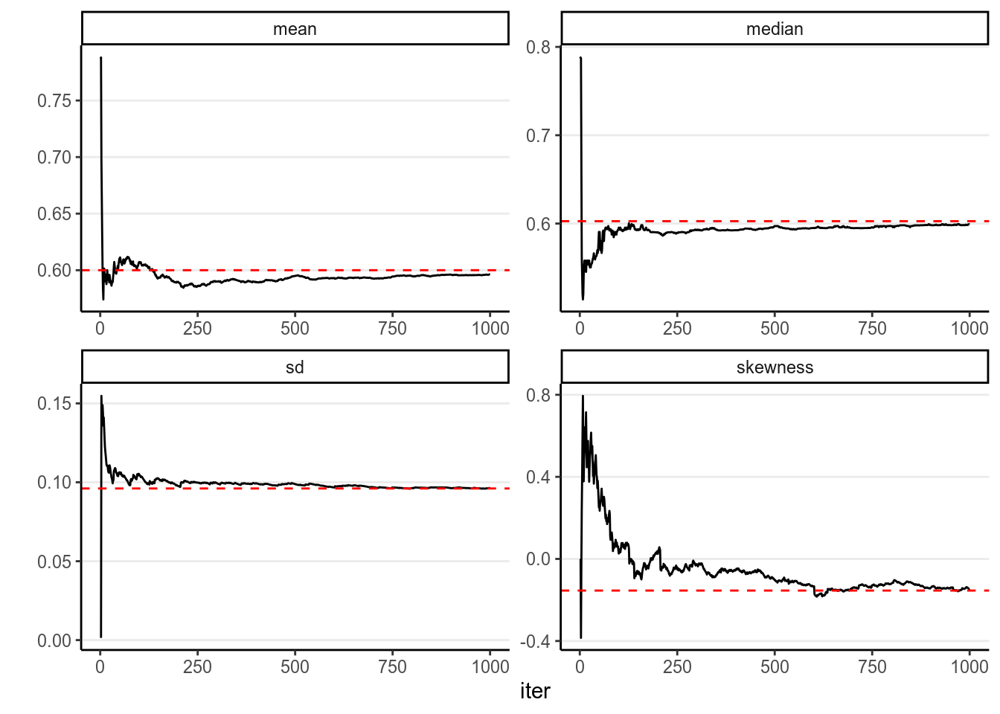
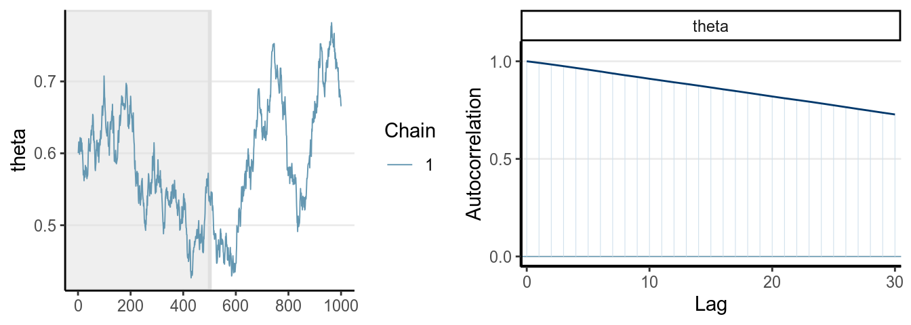
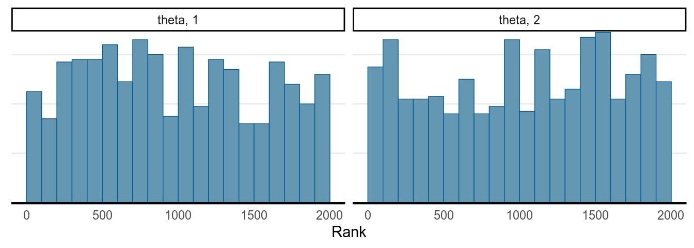

# Markov Chain Monte Carlo

So far in this class, we have seen a few examples with Bayesian inferences where
the posterior distribution concerns only one parameter, like the binomial and
the Poisson model, and also worked on some group comparison examples. We have
also discussed different approaches to obtain/approximate the posterior, and
worked on a few examples where we simulated posterior samples from the
posterior, including grid approximation and MCMC. In this lecture, we will
provide a more conceptual discussion on the simulation method, see why we need
special methods together called _Markov Chain Monte Carlo_, and extend it to
multiple parameter problems. We will specifically discuss four MCMC methods that
you will commonly see in Bayesian literature:

a. The Metropolis algorithm
b. The Metropolis-Hastings algorithm
c. The Gibbs sampler
d. Hamiltonian Monte Carlo
e. No U-turn sampler (and several variants)

But first, let's talk about what the Monte Carlo method is. 

## Monte Carlo Simulation With One Unknown

In a previous example, we see that with a conjugate prior (e.g., Beta), the 
posterior distribution is standard (Beta), and with R we can easily draw 
simulation samples from the posterior distribution. The more samples we draw, 
the better we can approximate the posterior distribution based on the simulation
samples. This is exactly the same reason that if we have a very large sample, we
can very precisely describe our population; here the true posterior distribution
is considered the population, and the simulation samples we draw are, well, a
sample from the population. With 10,000 or 100,000 samples, we can very
accurately describe our population.

For example, if using a conjugate prior we know that the posterior is a
$\mathrm{Beta}(15, 10)$ distribution, consider drawing 10, 100, 10,00, and
10,000 samples from it using the R function `rbeta`, and contrast the density
estimated from the samples (in the histogram) with that of the real
$\mathrm{Beta}$ distribution (in red).


```
># `stat_bin()` using `bins = 30`. Pick better value with `binwidth`.
```


The figure below shows the values when drawing 100 samples in time order:


So we can say that when the number of posterior samples is very large, the
sample distribution _converges_ to the population density. The Monte Carlo
method will work for many situations. Note, of course, the number of simulation
samples is controlled by the analysts; it is totally different from sample size,
which is fixed and is a property of the data.

In addition, most of the descriptive statistics (e.g., mean, _SD_) of the sample
will converge to the corresponding values of the true posterior distribution.
The graphs below showed how the mean, median, _SD_, and skewness converge to the
true value (red dashed lines) when the number of simulation samples increases.



## Markov Chain Monte Carlo (MCMC) With One Parameter 

However, the above Monte Carlo simulation works in the above example because (a)
we know exactly that the posterior distribution is a beta distribution, and (b)
R knows how to draw simulation samples form a beta distribution (with `rbeta`).
However, as we progress through the class, it is more of an exception that we
can use conjugate prior distribution, so in general neither (a) nor (b) would
hold. For example, if we instead use a normal distribution for the prior of
$\theta$, we may get something like

$$P(\theta | y) = \frac{\mathrm{e}^{-(\theta - 1 / 2)^2} 
                                     \theta^y (1 - \theta)^{n - y}}
                       {\int_0^1 \mathrm{e}^{-(t - 1 / 2)^2} 
                        t^y (1 - t)^{n - y} \dd t}$$
                       
and it would be very hard, if possible at all, to directly draw simulation
samples from the posterior. Luckily, we have a clever (sets of) algorithm called
_Markov Chain Monte Carlo_, which provides a way to draw samples from the
posterior distribution without the need to know everything about the posterior 
distribution. Indeed, for some algorithms they only require that we know, for 
every two possible values of $\theta$, the ratio of their corresponding 
densities.

### The Metropolis algorithm

The Metropolis algorithm can generally be used to draw samples from a 
distribution as long as the density ratio of any two points can be computed. 
Remember in Bayesian inference, for two values in the posterior distribution, 
$\theta_1$ and $\theta_2$, 
\begin{align*}
  P(\theta = \theta_1 | \bv y) & = 
  \frac{P(\bv y | \theta = \theta_1) P(\theta = \theta_1)}
       {P(y)} \\
  P(\theta = \theta_2 | \bv y) & = 
  \frac{P(\bv y | \theta = \theta_2) P(\theta = \theta_2)}
       {P(y)}
\end{align*}
Therefore, if we take the ratio of the posterior densities, we have 
$$\frac{P(\theta = \theta_2 | \bv y)}{P(\theta = \theta_1 | \bv y)} 
  = \frac{P(\bv y | \theta = \theta_2) P(\theta = \theta_2)}
         {P(\bv y | \theta = \theta_1) P(\theta = \theta_1)},$$
which does not involve $P(y)$. Therefore, even though we may not know 
$P(\theta = \theta_1 | \bv y)$ as it involves $P(y)$ as the denominator, we can
still compute the density ratio. 

In addition, the Metropolis algorithm requires the use of a <u>proposal
distribution</u>, which can be any symmetric distribution. Common choices are a
normal distribution or a uniform distribution. For example, let's assume we will
be using a $N(0, 1)$ proposal distribution.

The steps of a Metropolis algorithm are:

1. Randomly start from a certain point in the parameter space, and call that 
point $\theta_0$
2. Randomly generate a sampled value from a $N(\theta_0, 1)$ distribution. Call
this proposed value $\theta^\text{prop}$
3. Compute the density ratio $[P(\theta = \theta^\text{prop} | \bv y)] / 
                 [P(\theta = \theta_0 | \bv y)]$
4. If the ratio is larger than 1, accept $\theta^\text{prop}$ and include
   this value in the sample
5. If the ratio is smaller than 1, accept $\theta^\text{prop}$ with probability
equal to the density ratio. For example, if the ratio is 0.7, one first
generated a simulated value, $u$, from a uniform distribution between 0 and 1
(i.e., $U(0, 1)$). If $u$ is smaller than the ratio, accept $\theta^\text{prop}$
and include it in the sample. Otherwise, reject the proposed value, and include
$\theta_0$ (again) in the sample
6. After accepting $\theta^\text{prop}$ or $\theta_0$ in the sample, denote
the accepted value as $\theta_0$, and repeat steps 2 to 6. 

Under mild conditions, and after the chain runs for a while, the above algorithm
will generate representative samples from the target posterior distribution.

***

#### Shiny App:

To see a visual demonstration, you may run the shiny app I created by typing in R


```r
shiny::runGitHub("metropolis_demo", "marklhc")
```

***

Each step in MCMC is called an <u>iteration</u>. However, the sampled values are
not _independent_, which means they are different from those generated using
functions like `rbeta` or `rnorm`. Instead, the resulting sampled values will
form a <font color="red">Markov chain</font>, meaning that each sampled value is
correlated with the previous value. This is because each time we propose a new
value, the proposal distribution is centered at the previous value. As long as
the previous value affects which values are likely proposed, the two consecutive
values are not independent.

You can see a <u>trace plot</u> below, which is generally the first thing
you need to check after running an MCMC sampling. You will see that consecutive
samples tend to be closer or the same. Compare this with the one in a previous
section using `rbeta`.


The graph on the right panel is an autocorrelation plot, which shows the 
correlations between sampled values that are $l$ iterations apart. The table
below has three columns, the first one is the first 10 sampled values from the
chain, the second is the lag-1 behind, meaning values in the 2nd to the 11th
iterations, and the third column is the lag-2 values. A lag-1 autocorrelation is
the correlation between the first column and the second column, and a lag-2
autocorrelation is the correlation between the first column and the third
column. The graph above shows that the correlation between values from two 
consecutive iterations have a correlation of 
0.656.


```
># # A tibble: 10 x 3
>#     self  lag1  lag2
>#    <dbl> <dbl> <dbl>
>#  1 0.2   0.2   0.2  
>#  2 0.2   0.2   0.194
>#  3 0.2   0.194 0.194
>#  4 0.194 0.194 0.194
>#  5 0.194 0.194 0.194
>#  6 0.194 0.194 0.328
>#  7 0.194 0.328 0.328
>#  8 0.328 0.328 0.415
>#  9 0.328 0.415 0.515
># 10 0.415 0.515 0.515
```

### The Metropolis-Hastings Algorithm

The Metropolis-Hastings (MH) algorithm is a generalization of the Metropolis 
algorithm, where it allows a proposal distribution that is not symmetric, with 
some additional adjustment made. The MH algorithm can perform better for some 
cases where the target distribution is bounded and non-symmetric, but this is 
beyond the scope of this course. For multiparameter problems, the Gibbs sampler 
which we will talk about later in this note is actually also a special case of 
the MH algorithm.

## Markov Chain

A Markov chain is a chain of random samples, where the next sample depends on
where the previous sample(s) are at. Recall that in the Metropolis algorithm,
the proposal distribution is centered at the previous sample. This is called
_first order Markov chain_, as the current state only depends on just the
previous 1 state. 

Under a condition called _ergodicity_, a Markov chain will converge to a
_stationary distribution_. This means that, after a certain amount of samples,
when the chain arrives at the high density region of the posterior distribution,
all simulated samples after that can be considered a random (but correlated)
sample of the posterior distribution.

Like regular simulation, as long as you have enough samples, the sample density 
will converge to the population density. However, it takes thousands or tens of 
thousands Metropolis samples to make the sample density sufficiently close to 
the target posterior distribution, which is much more than what is required with
Monte Carlo simulation with independent samples. As you can see below, with
1,000 samples, the summary statistics are still not very close to the true
values.


## Effective Sample Size ($n_\text{eff}$)

The information contained in 1,000 simulated samples using the Metropolis 
algorithm in this example was approximately equivalent to 
207.517 samples if the simulated samples are 
independent. In other words, the _effective sample size_ of the 1,000 simulated
samples is only 207.517. Therefore, using MCMC
requires drawing much more samples than using techniques for drawing independent
samples like the `rbeta` function.

> If the proposal distribution is exactly the same as the posterior, then we 
can accept all proposed value. Why? Because each proposed value is already a
random sample from the posterior! This will be relevant when we talk about 
Gibbs sampling.

## MC Error

The Monte Carlo error or Monte Carlo standard error tells the margin of error
when using the MCMC samples to estimate the posterior mean. A simple method
to estimate the MC error is:
$$\SE_\mathrm{mc} = \sqrt{\frac{\widehat{\Var}(\theta | \bv y)}{n_\text{eff}}}$$
In the above example, $\SE_\mathrm{mc} = 
0.007$. So if the true 
posterior mean is 0.6, using 1,000 MCMC samples will likely give an estimated
posterior mean in the range [0.593, 0.607]. Generally, we 
would like to have something more precise, and it's better to get an 
$n_\text{eff}$ above 1,000. 

## Burn-in/Warmup

Every Markov chain needs a certain amount of iterations to reach the stationary
distribution. Whereas in the previous examples, the chain quickly get to the
regions with relative high density, for some situations, especially for
multiparameter problems, it usually takes hundreds or thousands of iterations to
get there, as shown in the graph below (for approximating a $N[15, 2]$
distribution).


Iterations obtained before a Markov chain reaches the stationary distribution
are called burn-in in WinBUGS and warmup in Stan. As they are not considered
samples of the posterior distribution, they should not be included when
approximating the posterior distribution. In Stan, the first half of the samples
(e.g., 1,000 out of 2,000) are discarded.

> When people say they get $8,000$ samples/iterations using MCMC, $8,000$ is 
the number \textcolor{red}{after} the burn-in/warmup.

> Warmup is the term used in STAN to tune the algorithm so it's not the same as
burn-in as discussed here. See the chapter by @mcelreath2016statistical. 

### Thinning

You will sometimes hear the term thinning, which means only saving every 
$t$th sample, where $t$ is the thinning interval. For example, based on the 
autocorrelation plot it appears that the samples are approximated uncorrelated
when they are 11 lag apart, so instead of using all 1,000 samples, we just
use the 1st, 12th, 23rd, $\ldots$ samples. However, this is generally not 
recommended unless you have a concern for not having enough storage space, 
which happens when, for example, using _multiple imputation_ to handle 
missing data. Otherwise, it is strongly recommended that you include all 
draws after burn-in/warmup, even if they are correlated. 

## Diagnostics of MCMC

### Mixing

One thing you should look at to diagnose the convergence of a Markov chain is
the trace plot. Look at the three examples below:




When multiple chains were run, each with a different initial value, it was
recently recommended that researchers examine the rank plot (see [this
paper](https://arxiv.org/abs/1903.08008)) as it is more robust. 

The first graph on the left shows good mixing behavior as it explores the region
with most of the density (bounded by the blue dashed line) smoothly and bounces
from one point to another quickly. For the middle graph, this is a chain where, 
although in every iteration it moves to a new place, the jump is relatively 
small, so it takes a long time to get from one end of the distribution to 
another end, and it never explores regions that are just within the blue lines
and outside of the blue lines. For the bottom graph, you can see it tends to
stay in one point for quite some time, and at some point it takes almost 100
iterations for it to move.

The first graph demonstrates _good mixing_, which will converge to a stationary
distribution (the posterior) pretty quickly. The middle and the bottom graph
demonstrates _poor mixing_, which takes a lot more iterations to converge; if
you stop the chain before that, you can get a biased representation of the
posterior distribution.

The autocorrelation plots on the right show the corresponding autocorrelations. 
You can see that whereas the autocorrelation dies out for the first chain 
pretty soon (at about the 10th lag), it remains high for the other two cases. 

### Acceptance Rate

If you're using the Metropolis/MH algorithm, you want to monitor the acceptance
rate and make sure it is within optimal range. If you accept almost every time,
that tells you that each time the chain only jumps a very small step (so that
the acceptance ratio is close to 1 every time), which will make the algorithm
slow in converging to the stationary distribution. On the other hand, if the
acceptance rate is very low, then that says that the chain got stuck to just a
few locations and it takes hundreds of iterations for it to make one jump. For
the Metropolis/MH algorithm, an optimal acceptance rate would be something
between 10% to 60%. <u>For Hamiltonian Monte Carlo and other newer method</u>,
which we will discuss later, <u>the optimal acceptance rate would be much
higher</u>, from 80% to 99%, or even higher.

### Diagnostics Using Multiple Chains

Another important thing to check is to see the convergence with multiple chains.
So far we've been just talking about one chain, but it is common practice to use
two or more chains (and 4 chains are generally recommended nowadays), each
starting at a different, preferably more extreme, place, and see whether they
explore a similar region.

The two plots below are called _rank plots_. The top one shows a relatively 
healthy chains, as the ranks are relatively uniformly distributed (meaning 
that one chain does not have higher values than another for a long period of 
time). The plot below, however, shows an unhealthy chain. 


```
># Warning: The following arguments were unrecognized and ignored: n_warmup
```



```
># Warning: The following arguments were unrecognized and ignored: n_warmup
```


#### $\hat{R}$, a.k.a Potential Scale Reduction Factor

A commonly used numerical index in diagnosing convergence is $\hat{R}$, also
called the potential scale reduction factor, proposed by Gelman and Rubin (1992)
and later an extension for multivariate distributions by Brooks and Gelman
(1997). $\hat{R}$ measures the ratio of the total variability combining multiple
chains to the within-chain variability. To understand this, remember in ANOVA,
the $F$-ratio is a measure of
$$F = \frac{\text{Between-group difference} + \text{error}}{\text{error}}$$

$\hat{R}$ has a very similar meaning conceptually, with `error` meaning the
within-chain variance. When the Markov chains converge, they reach the
stationary distribution. As each chain is based on the same posterior 
distribution, they should have the same variance, meaning that after the 
chains converge, there should be no differences between the chains, and so 
$\hat{R}$ should be very close to 1.0. Note that in Stan, $\hat{R}$ is computed
by splitting each chain into half. So if you have two chains, $\hat{R}$ will
be based on four groups. 

For the two graphs above, the first one has an $\hat{R}$ of 1.021,
and the second one has an $\hat{R}$ of 2.93. @Gelman2013
recommended an $\hat{R}$ less than 1.1 for acceptable convergence of the Markov
chains, but more recently a more stringent cutoff of 1.01 is proposed.

It should also be pointed out that there are many versions of $\hat R$ being
used in the literature, but researchers rarely discussed which version they 
used. In STAN, the version was mainly based on @Gelman2013, but in future 
upgrade it's likely going to use a newer and more robust $\hat R$ based on 
[this paper](https://arxiv.org/abs/1903.08008).

## Multiple Parameters

If you think about some of the statistical techniques you have learned, there
are generally more than one parameter. For example, with a linear regression,
you have at least one parameter for the intercept, $\beta_0$, and one parameter
for the slope, $\beta_1$. With two parameters, when we generate posterior 
samples, we want to get more points in the regions with higher density. 

It's helpful to understand this with an example. Look at the 3D plot below:


Another way to show the joint distribution of two variables is to use a
_contour plot_ to show the lines at different density levels:


With multiple parameters, one can still use the Metropolis/MH algorithm.
However, one will need a multidimensional proposal distribution, and it is
usually rather inefficient. Before 2010, a more efficient algorithm is the
_Gibbs sampling_, which relies on conditional distributions as proposal
distributions to sample each dimension the posterior distributions. The two
popular Bayesian language, BUGS and JAGS, both used Gibbs sampling. You likely
will still see it in a lot of articles doing Bayesian analyses. However, Gibbs
sampling is rather restrictive as it relies on conjugate priors, so your choices
of priors are rather limited. Also, it may run into convergence issues in more
complex models such as multilevel models. Given that STAN uses different and
usually more efficient sampling methods, I will not go into detail on Gibbs
sampling, and will just move on to the ones that STAN uses. To learn more, you
may see the following Shiny app. 

***

#### Shiny app:

Shiny app illustration by Jonah Gabry:


```r
shiny::runGitHub(repo = "jgabry/gibbs_shiny")
```

***

## Hamiltonian Monte Carlo

`Stan` is using something different than the Metropolis-Hastings algorithm or
the special case that is Gibbs sampling. Although its algorithms have gone
through multiple revision, and in the next few updates they may have some
changes as well, their basic algorithm is under the umbrella of _Hamiltonian
Monte Carlo_ or _hybrid Monte Carlo_ (HMC). The algorithm is a bit complex and I
will just try to help you develop some intuition of the algorithm, hopefully
enough to help you diagnose the Markov chains.

1. It produces simulation samples that are much less correlated, meaning that
if you get 10,000 samples from Gibbs and 10,000 samples from HMC, HMC generally
provides a much higher effective sample size. 
2. When there is a problem in convergence, HMC tends to raise a clear red flag, 
meaning it goes really really wrong.

So now, how does HMC work? First, consider a two-dimensional posterior below,
which is based on a real data example of a hierarchical model, with two of the
parameters $(\mu, \tau)$.


For illustration of HMC, let's turn it upside down:


HMC requires you to think of the inverted posterior density a park for ice
skating. Imagine if you stand on a certain point of a slope and does not move
your body, then you will soon fall down to the bottom point where the posterior
mode is located. However, if you have some jet engine or device to provide
thrust for you to resist the gravitational force, you will be able to explore
the surface of the park. In HMC, you will randomly choose a direction to go, 
and randomly choose an energy level for the engine. When you stop, your 
coordinate will be a sample value from the posterior distribution. It was shown
that, compared to Gibbs sampling or Metropolis algorithm, HMC is much more 
efficient in getting samples with lower autocorrelations. This means that,
the effective sample size for HMC is usually much higher than the other methods
we discussed when they have the same number of iterations. For example, with
Gibbs sampling researchers usually need 50,000 or 100,000 iterations, whereas
with STAN something around 2,000 would be enough for regression models. 

See https://chi-feng.github.io/mcmc-demo/app.html#HamiltonianMC,banana for a 
demonstration of HMC sampling. 

HMC will simulate the motion of gliding around the surface of the posterior by
breaking path into discrete segments, each called a _leapfrog step_. The
complexity of HMC lies in determining how many leapfrog steps to use in one
iteration, as well as how far to go along the trajectory (called _stepsize_), as
that varies a lot with different contour shapes, distributions, and dimensions,
and one needs to tune these effectively for HMC to work well. 

Building on HMC, currently STAN used a modified algorithm called the _No-U-Turn
Sampler (NUTS)_. The detail is beyond this note, but you should note the names
corresponding to the tuning parameters in STAN:

- `adapt_delta`: this parameter controls the target acceptance rate of the 
NUTS algorithm, with a default of .80. Increasing it with reduces the stepsize
so that the algorithm won't go two far away in each jump. When the default is
not enough, you will receive a warning asking you to increase the value, usually
to .95 or .99 or even higher. It will take longer time to one, but you should
_NEVER_ ignore such a warning. 
- `max_treedepth`: it controls the maximum number of leapfrog steps. When the
number of steps are too small, NUTS may be too slow in exploring the surface of
the posterior, especially when `adapt_delta` is large. Like `adapt_delta`, you
should increase it when receiving a warning message in the previous run. 

See [this page](https://mc-stan.org/misc/warnings.html) for some of the common
STAN warning messages. 
