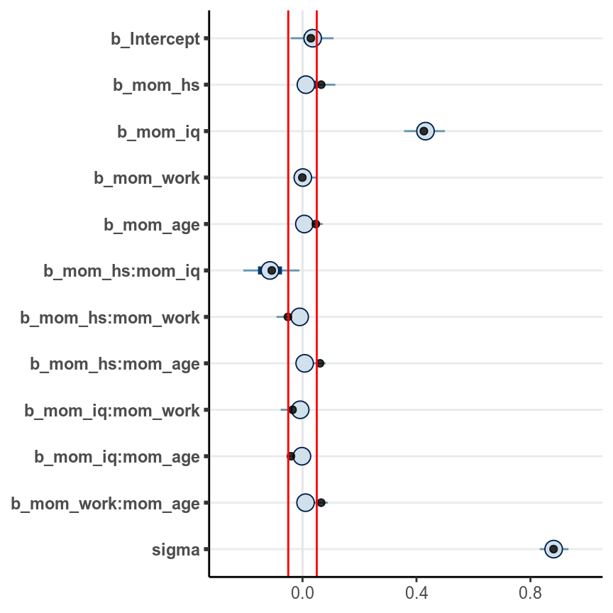
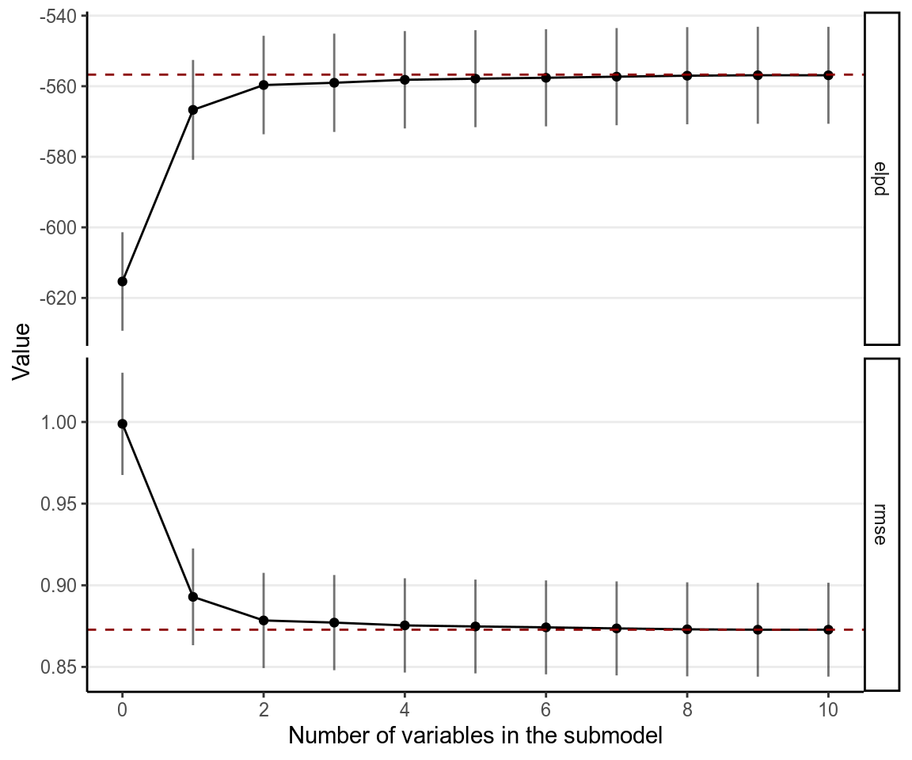

# Model Comparison and Regularization

## Overfitting and Underfitting

In statistical modeling, a more complex model almost always results in a better
fit to the data. Roughly speaking, a more complex model means one with more
parameters, although as you will see later, in Bayesian analyses, number of
parameters is sometimes not straight forward to find out. On the extreme side,
if one has 10 observations, one can has a model with 10 parameters that can
perfectly predict every single data point (by just having a parameter to predict
each data point). However, there are two problems with too complex a model.
First, an increasingly complex model also makes it increasingly hard to extract
useful information from the data. Instead of describing the relationship between
two variables, like `mom_iq` and `kid_score`, by a straight line, one ends up
with a crazy model that is difficult to make sense. Second, as you will also
see, the more complex a model, the more is the risk that it _overfit_ the
current data such that it does not work for future observations.

For example, let's randomly sample 10 cases in the `kidiq` data set, and build
some model from it.


```r
kidiq <- haven::read_dta("../data/kidiq.dta")
kidiq100 <- kidiq %>% 
  mutate(mom_iq = mom_iq / 100,  # divid mom_iq by 100
         kid_score = kid_score / 100,   # divide kid_score by 100
         mom_iq_c = mom_iq - 1, 
         mom_hs = factor(mom_hs, labels = c("no", "yes")))
```


```r
set.seed(1533)  # set the seed for reproducibility
# Sample 10 observations
train <- sample.int(nrow(kidiq), 10L)
kidiq_sub <- kidiq[train, ]
base <- ggplot(aes(x = mom_iq, y = kid_score), 
               data = kidiq_sub) + 
  geom_point(size = .9) + 
  coord_cartesian(ylim = c(-120, 180)) + 
  xlim(range(kidiq$mom_iq))
ggplot(aes(x = mom_iq, y = kid_score), data = kidiq) + 
  geom_point(size = .7, col = "lightblue") + 
  geom_point(size = 1.1, data = kidiq_sub, col = "red") + 
  xlim(range(kidiq$mom_iq))
```


When using `mom_iq` to predict `kid_score`, we can use beyond a linear
regression line by using higher order _polynomials_. For example, a second-order
polynomial assumes a quadratic effect (with one turning point), and it goes to
cubic, quartic, and more. The figure below shows the fit from a linear effect of
`mom_iq`, a quadratic effect, and increasingly complex to a six degree
polynomial. As you can see, as the model gets more complex, the fitted line
tries to capture all the 10 points really well, with an increasing $R^2$.
However, also note that the standard error around the fitted line gets, meaning
that there are more uncertainty when the model gets more and more complex.


```r
r2 <- function(object) {
  # Function for computing R^2
  z <- object
  f <- z$fitted.values
  r <- z$residuals
  mss <- if (attr(z$terms, "intercept")) 
    sum((f - mean(f))^2)
  else sum(f^2)
  rss <- sum(r^2)
  mss / (mss + rss)
}

p_list <- map(1:6, function(i) {
  mod <- lm(kid_score ~ poly(mom_iq, degree = i), data = kidiq_sub)
  base + 
    geom_smooth(method = "lm", formula = y ~ poly(x, i), level = .80, 
                fullrange = TRUE) +
    geom_text(x = 90, y = 170, 
              label = paste0("italic(R)^2 == ", round(r2(mod), 1)), 
              parse = TRUE) + 
    geom_text(x = 100, y = -100, 
              label = paste0("RMSE == ", round(sqrt(mean(residuals(mod)^2)), 1)), 
              parse = TRUE)
})
do.call(grid.arrange, c(p_list, nrow = 2))
```

<div class="figure">

<p class="caption">(\#fig:overfit-data)Fit of models on the 10 random cases. Top panel: linear, quadratic, and cubic; bottom panel: 4th, 5th, and 6th degree polynomials</p>
</div>

Another way to look at the accuracy of the model is to look at the _Root Mean 
Squared Error_ (RMSE), which is defined as the square root of the average 
squared prediction error. This is a measure of prediction error. The smaller the
RMSE, the better the prediction is. As you can see in the above figure, more 
complex models always reduce the RMSE in the data we use to fit the model
(also called training data).

However, if I take the estimated regression line/curve based on the subsample of
10 observations, and predict the remaining cases in the data set, things will be
different. As you can see in the figure below, whereas prediction error is
comparable for the linear and the quadratic model, polynomials of higher degrees
predict the data really badly. This is because when you use a complex model in a
data set, it tailors the coefficients to any sampling errors and noise in the
data such that it will not generalize to new observations. Therefore, our goal
in model comparison is to choose a model that is complex enough to capture the
essence of the data generation process (and thus avoid _underfitting_), but
avoid _overfitting_ as to make the model useless for predicting new
observations.


```r
base2 <- ggplot(aes(x = mom_iq, y = kid_score), data = kidiq[-train, ]) + 
  geom_point(size = .6) + 
  coord_cartesian(ylim = c(-120, 180)) + 
  xlim(range(kidiq$mom_iq))
p_list2 <- map(1:6, function(i) {
  mod <- lm(kid_score ~ poly(mom_iq, degree = i), data = kidiq_sub)
  f <- predict(mod, newdata = kidiq[-train, ])
  y <- kidiq$kid_score[-train]
  r <- y - f
  rmse_mod <- sqrt(mean(r^2))
  base2 + 
    geom_smooth(data = kidiq_sub, method = "lm", formula = y ~ poly(x, i), 
                fullrange = TRUE, level = .80) +
    geom_text(x = 100, y = -100, 
              label = paste0("RMSE == ", round(rmse_mod, 1)), 
              parse = TRUE)
})
do.call(grid.arrange, c(p_list2, nrow = 2))
```

<div class="figure">

<p class="caption">(\#fig:overfit-generalize)Using the regression lines based on 10 random cases to predict the remaining 424 cases. Top panel: linear, quadratic, and cubic; bottom panel: 4th, 5th, and 6th degree polynomials</p>
</div>

The goal of statistical modeling is to choose a model that is optimal
between the overfitting/underfitting dichotomy. In machine learning, this is
also commonly referred to as the bias-variance trade-off, as a model that is too
simple tends to produce biased predictions because it does not capture the
essence of the data generating process, whereas a model that is overly complex
is unbiased but results in a lot of uncertainty in the prediction, because
there are too many unnecessary components that can affect predictions, as
indicated in the confidence bands around the 6th degree polynomial line.

Polynomials of varying degrees are merely one example of comparing simple to 
complex models. You can think about:

- models with and without interactions, 
- models with a few predictors versus hundreds of predictors, 
- regression analyses versus multilevel models, etc. 

This lecture is about finding an optimal model that avoids overfitting and 
avoids underfitting. Whereas one can always avoid underfitting by fitting a more
and more complex model, a more practical problem is to have some tools to
refrain oneself from choosing a model that is too complex and predict future 
observations badly. In this note, you will learn to perform model comparison 
with information criteria to find a model that has better balance between 
overfitting and underfitting, while in the next note you will learn additional
tools that synthesize multiple models and perform variable selection. 

## Kullback-Leibler Divergence

When comparing models (e.g., linear vs. quadratic), we prefer models that are 
closer to the "true" data-generating process. A model that are closer to the 
"true" model is better than a model that are not as close. Therefore, we need 
some ways to quantify the degree of "closeness" to the true model. Note that in 
this context models refer to the distributional family as well as the parameter 
values. For example, the model $y_i \sim \norm(5, 2)$ is a different model than
$y_i \sim \norm(3, 2)$, which is a different model than $y_i \sim
\mathrm{Gamma}(2, 2)$. The first two have the same family but different
parameter values (different means, same $\SD$), whereas the last two have
different distributional families (Normal vs. Gamma).

To measure the degree of "closeness" between two models, $M_0$ and $M_1$, by far
the most popular metric in statistics is the _Kullback-Liebler Divergence_ (or 
Kullback-Liebler discrepancy; $\DKL$). By definition, 

\begin{align*}
\DKL(M_0 | M_1) & = \int_{-\infty}^\infty p_{M_0} (\bv y) 
                    \log \frac{p_{M_0}(\bv y)}{p_{M_1}(\bv y)} \dd \bv y \\
                & = \int_{-\infty}^\infty p_{M_0} (\bv y) 
                          \log p_{M_0}(\bv y) \dd \bv y - 
                    \int_{-\infty}^\infty p_{M_0} (\bv y) 
                          \log p_{M_1}(\bv y) \dd \bv y. 
\end{align*}

Note that strictly speaking, $\DKL$ cannot be called a "distance" between two 
models because in general, $\DKL(M_0 | M_1) \neq \DKL(M_1 | M_0)$. As an
example, assume that the data are generated by a true model $M_0$, and we have
two candidate models $M_1$ and $M_2$, where

- $M_0: y \sim \norm(3, 2)$
- $M_1: y \sim \norm(3.5, 2.5)$
- $M_2: y \sim \mathrm{Cauchy}(3, 2)$


```r
ggplot(data.frame(x = c(-3, 9)), aes(x = x)) + 
  stat_function(fun = dnorm, args = list(mean = 3, sd = 2), 
                aes(col = "M0"), linetype = 1) + 
  stat_function(fun = dnorm, args = list(mean = 3.5, sd = 2.5), 
                aes(col = "M1"), linetype = 2) + 
  stat_function(fun = dcauchy, args = list(location = 3, scale = 2), 
                aes(col = "M2"), linetype = 2) + 
  scale_color_manual("", values = c("black", "red", "blue"), 
                     labels = c("M0", "M1", "M2")) + 
  labs(x = "y", y = "density")
```

<div class="figure">

<p class="caption">(\#fig:divergence)Density for $M_0$, $M_1$, and $M_2$</p>
</div>


One can compute that $\DKL(M_0 | M_1) = 0.063$ and
$\DKL(M_0 | M_1) = 0.259$, and so $M_1$ is a better
model than $M_2$. 

Note that in the expression of $\DKL$, when talking about the same target model,
the first term is always the same and describes the "true" model, $M_0$.
Therefore, it is sufficient to compare models on the second term,
$\int_{-\infty}^\infty p_{M_0} (\bv y) \log p_{M_1}(\bv y) \dd \bv y$, which can
also be written as $\E=[\log p_{M_1} (\bv y)]$, i.e., the _expected log
predictive density_ (_elpd_). In other words, a model with a larger elpd is
preferred over a model with a smaller elpd.

However, in real data analysis, we don't know what $M_0$ is. If we knew, then we
would just need to choose $M_0$ as our model and there will be no problem about
model comparisons. In addition, even if we know that the true model is, e.g., a
normal model (which never happens in real data analysis), we still need to
estimate the parameter values, and the estimates will not be exactly the same as
the true parameter values. However, elpd is defined as the expected value over
the true predictive distribution, $p_{M_0}(y)$, which cannot be obtained without
knowing what $M_0$ is.

So instead, we need to estimate the elpd. A naive way to estimate it would be to
assume that the distribution of the data is the true model, but that will lead
to an overly optimistic estimate, and computing elpd this way will always favor
a more complex model. The best way to estimate elpd is to collect data on a new
independent sample that is believed to share the same data generating process as
the current sample, and estimate elpd on the new sample. This is called
_out-of-sample validation_. The problem, of course, is we usually do not have
the resources to collect a new sample.

Therefore, statisticians had worked hard to find ways to estimate elpd from the 
current sample, and there are two broad approaches:

- Information criteria: AIC, DIC, and WAIC, which estimate the elpd in 
the current sample, minus a correction factor
- Cross validation, which splits the current sample into $k$ parts, estimate the
parameters in $k - 1$ parts, and estimate the elpd in the remaining 1 part. A
special case is when $k$ = $N$ so that each time one uses $N$ - 1 data points to
estimate the model parameters, and estimate the elpd for the observation that
was left out. This is called _leave-one-out_ cross-validation (LOO-CV).

## Information Criteria

We will illustrate the computation of information criteria with `mom_iq` 
predicting `kid_score` (with centering):


```r
# mom_iq with centering
m1 <- brm(kid_score ~ mom_iq_c, data = kidiq100, 
          prior = c(prior(normal(0, 1), class = "Intercept"), 
                    prior(normal(0, 1), class = "b", coef = "mom_iq_c"), 
                    prior(student_t(4, 0, 1), class = "sigma")), 
          seed = 2302
)
```

Without going too deep into the underlying math, it can be shown that a good
estimate of elpd is 

$$\sum_{i = 1}^n \log p_{M_1}(y_i) - p,$$

where $p$ is some measure of the number of parameters in $M_1$. The first term
is the likelihood of the model in the current sample. The second term is an
adjustment factor so that the quantity above represents the average likelihood
of the model _in a new sample_. It is more common to work with _deviance_ by
multiplying the log-likelihood by $-2$, i.e.,

$$D = -2 \sum_{i = 1}^n \log p_{M_1}(y_i).$$

### Experiment on Deviance

Now, let's check the in-sample deviance and out-of-sample deviance of our 
`kidiq` data with different polynomial functions. Here is a sample function for 
computing elpd (with frequentist, just for speed purpose) for different degrees
of polynomial:


```r
# Function for computing deviance with different polynomial
deviance_kidiq <- function(degree = 1, 
                           train = 10, 
                           y = kidiq$kid_score, 
                           x = kidiq$mom_iq) {
  N <- length(y)
  # get training sample
  if (length(train) == 1) {
    train <- sample.int(N, train)
  }
  ntrain <- length(train)
  # Obtain design matrix
  X <- cbind(1, poly(x, degree, simple = TRUE))
  # Get elpd for training sample
  Xtrain <- X[train, ]
  ytrain <- y[train]
  betahat <- qr.solve(Xtrain, ytrain)  # estimated betas
  res_train <- ytrain - Xtrain %*% betahat
  sigmahat <- sqrt(sum(res_train^2) / 
                     (ntrain - 1 - degree))  # estimated sigma
  deviance_train <- -2 * sum(dnorm(res_train, sd = sigmahat, log = TRUE))
  res_test <- y[-train] - X[-train, ] %*% betahat
  deviance_test <- -2 * sum(dnorm(res_test, sd = sigmahat, log = TRUE))
  tibble(degree = degree, 
         sample = c('in-sample', 'out-of-sample'), 
         deviance = c(deviance_train / ntrain,
                      deviance_test / (N - ntrain))
  )
}
```

Below shows the in-sample and out-of-sample elpd for linear model:


```r
deviance_kidiq(degree = 1, train = train)
```

```
># # A tibble: 2 x 3
>#   degree sample        deviance
>#    <dbl> <chr>            <dbl>
># 1      1 in-sample         7.92
># 2      1 out-of-sample     8.88
```

And for quadratic:


```r
deviance_kidiq(degree = 2, train = train)
```

```
># # A tibble: 2 x 3
>#   degree sample        deviance
>#    <dbl> <chr>            <dbl>
># 1      2 in-sample         7.94
># 2      2 out-of-sample     8.84
```

As you can see, in general, the deviance is smaller for the current data than 
for the hold-out data. Note also because the data sets have different size, I
divide the deviance by the sample size so that they can be compared. 

Now let's run an experiment to check the elpd with different degrees polynomial, 
with a training sample size of 60:


```r
set.seed(1733)
# Use the `map` function to run different polynomials, and use the `rerun`
# function run the deviance 100 times. The code below runs `deviance_kidiq` by
# randomly sampling 30 training samples 100 times, and compute the in-sample and
# out-of-sample deviance for each.
# rerun(100, deviance_kidiq(degree = 1, train = 30L)) %>% 
#   bind_rows()
# Now run 1 to 8 degree polynomial, each 1000 times:
dev_df <- map_df(1:6, 
                 ~ rerun(1000, deviance_kidiq(degree = .x, train = 60L)) %>% 
                   bind_rows)
# Plot the results
dev_df %>% 
  ggplot(aes(x = degree, y = deviance, col = sample)) + 
  stat_summary() + 
  stat_summary(geom = "line")
```

```
># No summary function supplied, defaulting to `mean_se()
># No summary function supplied, defaulting to `mean_se()
```


As you can see, the in-sample deviance (red line) keeps decreasing, indicating
that a more complex model fit the data better, which is always the case. So if
one were to use deviance to determine what model is optimal, one will always
choose a model that is most complex, just like using $R^2$ (indeed, for linear
models deviance is basically the same as $R^2$).

Now, look at the blue line, which represents the deviance computed using the
coefficients obtained from the training set but applied to the remaining data.
As you can see, the deviance achieves its minimum around the linear and the
quadratic model, and starts to increase, meaning that more complex model does
not fit the hold out data. 

A statistical model is used to learn something from a data set that can 
generalize to other observations. Therefore, we should care about the blue line,
instead of the red one. The indices you will see in the remaining of this note
are all attempts to approximate the blue line. 

> More complex models always fit the current data better, but may not generalize
to other data. In other words, models that are too complex are not
generalizable.

## Information Criteria

### Akaike Information Criteria (AIC)

Multiplying the quantity of elpd - $p$ by $-2$, or deviance + 2$p$, with the
deviance obtained using the maximum likelihood estimates (MLEs) for the
parameters, gives you exactly the formula for AIC:

$$\textrm{AIC} = D(\hat \theta) + 2p,$$

and $p$ in AIC is taken to be just the number of parameters. As we have
multiplied by a negative number, maximizing the estimate of elpd is equivalent
to minimizing the AIC, so one would prefer a model with the smallest AIC.

The approximation of AIC works best when the probability distribution under 
the $M_1$ is normal, and that the sample size is much larger than the number of 
parameters. It is nothing Bayesian because there is no posterior distributions 
used, as $D$ is computed only based on the MLE. Also, it does not take into
account any prior information.


```r
# Frequentist model
m1_freq <- lm(m1$formula, data = m1$data)
AIC(m1_freq)
```

```
># [1] -240
```

### Deviance Information Criteria (DIC)

The definition of AIC assumes that the parameter estimates are known or are
maximum likelihood estimates. The DIC, instead, replaces those with the 
posterior distribution of the parameters. The general formula for DIC is

$$\textrm{DIC} = \E(D | \bv y) + 2 p_D,$$

where $p_D$ is the effective number of parameters estimated in the Markov chain.
Although DIC does take into account the prior distributions, and $\E(D | \bv
y)$ is based on a posterior distribution, it still works best when the posterior
distributions are multivariate normal, and that $N \gg p$.


```r
# Function to compute DIC
dic_brmsfit <- function(object) {
  Dbar <- -2 * mean(rowSums(log_lik(object)))
  coef_pmean <- unname(fixef(m1)[ , "Estimate"])
  X <- model.matrix(as.formula(object$formula), object$data)
  res <- res <- residuals(m1)[ , "Estimate"]
  N <- length(res)
  sigma <- posterior_summary(m1, pars = "sigma")[ , "Estimate"]
  Dhat <- -2 * sum(dnorm(res, sd = sigma, log = TRUE))
  p <- Dbar - Dhat
  elpd <- Dhat / -2 - p
  data.frame(elpd_dic = elpd, p_dic = p, dic = Dhat + 2 * p, 
             row.names = "Estimate")
}
dic_brmsfit(m1)
```

```
>#          elpd_dic p_dic  dic
># Estimate      120  2.92 -240
```

### Watanabe-Akaike Information Criteria (WAIC)

A further modification has been proposed to use the 
_log pointwise posterior predictive density_, with the effective number of 
parameters computed using the posterior variance of the likelihood. 

$$\textrm{WAIC} = -2 \sum_{i = 1}^n \log \E[p(y_i | \bv \theta, \bv y)] + 
                  2 p_\textrm{WAIC},$$

where $\E[p(y_i | \bv \theta, \bv y)]$ is the posterior mean of the likelihood 
of the $i$th observation. The WAIC incorporates prior information, and the use
of pointwise likelihood makes it more robust when the posterior distributions 
deviate from normality. In general, WAIC is a better estimate of the 
out-of-sample deviance than AIC and DIC.


```r
waic(m1)  # built-in function in brms
```

```
># 
># Computed from 4000 by 434 log-likelihood matrix
># 
>#           Estimate   SE
># elpd_waic    120.1 14.5
># p_waic         2.8  0.3
># waic        -240.3 29.0
```

### Leave-One-Out Cross Validation

The idea of cross-validation is to split the sample so that it imitates the 
scenario of estimating the parameters in part of the data and predicting the 
remaining part. The part that is used for estimation is called the _training 
set_, and the part that is used for prediction is called the _validation set_. 
Leave-one-out information criteria (LOO-IC) means that one uses $N - 1$ 
observations as the training set and 1 observation as the validation sample,
repeat the process $N$ times so that each time a different observation is being
predicted, and adding up the prediction results will give an estimate of elpd
that closely approximates the results that would be obtained by collecting new 
data and doing the validation. To make it more concrete, we can go back to the 
`kidiq` data with `mom_iq` predicting `kid_score`. We can do this for case #286, 
as an example:


```r
# Estimate the model without case #286
m1_no286 <- update(m1, newdata = kidiq100[-286, ])
```

```
># Start sampling
```


```r
# The log predictive density for case #286
mean(log_lik(m1_no286, newdata = kidiq100[286, ]))
```

```
># [1] -4.19
```

Because LOO-IC requires fitting the model $N$ times, it is generally very
computational intensive. There are, however, shortcuts for some common models
that make it computed faster. Otherwise, WAIC can be treated as a fast
approximation of LOO-IC, although LOO-IC is more robust and will be a better 
estimate of out-of-sample deviance. In STAN, it uses the so called Pareto 
smoothed importance sampling (PSIS) to make the process faster, without having 
to repeat the process $N$ times.

Here is the LOO-IC for the model:


```r
loo(m1)
```

```
># 
># Computed from 4000 by 434 log-likelihood matrix
># 
>#          Estimate   SE
># elpd_loo    120.1 14.5
># p_loo         2.8  0.3
># looic      -240.3 29.0
># ------
># Monte Carlo SE of elpd_loo is 0.0.
># 
># All Pareto k estimates are good (k < 0.5).
># See help('pareto-k-diagnostic') for details.
```

You can save the WAIC and the LOO-IC information to the fitted result:


```r
m1 <- add_criterion(m1, c("loo", "waic"))
```

See @Vehtari2016 for more discussions on WAIC and LOO-IC. 

***

### Example

Consider four potential models in predicting `kid_score`:

$$\texttt{kidscore}_i \sim \norm(\mu_i, \sigma)$$

\begin{align*}
  \mu_i & = \beta_0 + \beta_1 (\texttt{mom_iq}_i)  \\
  \mu_i & = \beta_0 + \beta_1 (\texttt{mom_iq}_i) +
            \beta_2 (\texttt{mom_hs}_i) \\
  \mu_i & = \beta_0 + \beta_1 (\texttt{mom_iq}_i) + 
            \beta_2 (\texttt{mom_hs}_i) + \beta_3 (\texttt{mom_iq}_i \times 
                                                    \texttt{mom_hs}_i)  \\
  \mu_i & = \beta_0 + \beta_1 (\texttt{mom_iq}_i) + 
            \beta_2 (\texttt{mom_hs}_i) + 
            \beta_3 (\texttt{mom_iq}_i \times \texttt{mom_hs}_i) + 
            \beta_4 (\texttt{mom_age}_i)
\end{align*}
                               


The first model only has `mom_iq` as  a predictor, which is equivalent to 
saying that the coefficients for `mom_hs` and `mom_age` are zero. The second
model added `mom_hs` as a predictor. The third model includes an additional
interaction term, whereas the fourth model also include `mom_age`. Now, 
we can compare the four models:


```r
loo_compare(m1, m2, m3, m4)
```

```
>#    elpd_diff se_diff
># m3  0.0       0.0   
># m4 -0.5       1.1   
># m2 -3.4       2.5   
># m1 -6.0       3.9
```

```r
# m3 is the best
```


```r
# show details
loo(m1, m2, m3, m4)
```

```
># Output of model 'm1':
># 
># Computed from 4000 by 434 log-likelihood matrix
># 
>#          Estimate   SE
># elpd_loo    120.1 14.5
># p_loo         2.8  0.3
># looic      -240.3 29.0
># ------
># Monte Carlo SE of elpd_loo is 0.0.
># 
># All Pareto k estimates are good (k < 0.5).
># See help('pareto-k-diagnostic') for details.
># 
># Output of model 'm2':
># 
># Computed from 4000 by 434 log-likelihood matrix
># 
>#          Estimate   SE
># elpd_loo    122.7 14.2
># p_loo         3.9  0.4
># looic      -245.3 28.4
># ------
># Monte Carlo SE of elpd_loo is 0.0.
># 
># All Pareto k estimates are good (k < 0.5).
># See help('pareto-k-diagnostic') for details.
># 
># Output of model 'm3':
># 
># Computed from 4000 by 434 log-likelihood matrix
># 
>#          Estimate   SE
># elpd_loo    126.1 14.3
># p_loo         4.8  0.5
># looic      -252.2 28.7
># ------
># Monte Carlo SE of elpd_loo is 0.0.
># 
># All Pareto k estimates are good (k < 0.5).
># See help('pareto-k-diagnostic') for details.
># 
># Output of model 'm4':
># 
># Computed from 4000 by 434 log-likelihood matrix
># 
>#          Estimate   SE
># elpd_loo    125.6 14.4
># p_loo         6.0  0.6
># looic      -251.1 28.9
># ------
># Monte Carlo SE of elpd_loo is 0.0.
># 
># All Pareto k estimates are good (k < 0.5).
># See help('pareto-k-diagnostic') for details.
># 
># Model comparisons:
>#    elpd_diff se_diff
># m3  0.0       0.0   
># m4 -0.5       1.1   
># m2 -3.4       2.5   
># m1 -6.0       3.9
```

Model 3 has the lowest LOO-IC, although if you compare the difference in LOO-IC
between Model 3 and Model 4 and the corresponding standard errors (in the column
`se_diff`), the difference is relatively small. Given that Model 3 achieves the
smallest LOO-IC and is simpler than Model 4, one may conclude that Model 3 is
the best model among the four.

***

## Stacking/Model Averaging

Sometimes it may not be a good practice to only choose one model with low WAIC
or LOO-IC, especially when several models have very similar WAIC/LOO-IC, but
they make somewhat different predictions. Instead, we can perform *stacking* or
*model averaging* by weighting the *predictions* from multiple models, using
weights that are based on their information criteria performance. Stacking 
approaches this by optimizing the leave-one-out mean squared error in the 
resulting prediction, whereas model averaging preserves the uncertainty and was
not optimized for that task. The technical details can be found in @Yao2018.
             
Note that the conventional Bayesian model averaging used the posterior model 
probability [@hoeting1999bayesian], which are approximated by the BIC. The 
discussion in this note is based on more recent discussion in, e.g., @Yao2018.

Let's run four models on some training data by randomly splitting the data into
half. First rescale some of the variables:

<!-- ```{r kidiq100, echo=TRUE} -->
<!-- kidiq <- haven::read_dta("../data/kidiq.dta") -->
<!-- kidiq100 <- kidiq %>%  -->
<!--   mutate(mom_iq = mom_iq / 100,  # divid mom_iq by 100 -->
<!--          kid_score = kid_score / 100,   # divide kid_score by 100 -->
<!--          mom_iq_c = mom_iq - 1,  -->
<!--          mom_hs = factor(mom_hs, labels = c("no", "yes")),  -->
<!--          mom_age_c = (mom_age - 18) / 10) -->
<!-- ``` -->

I will run four models, which is from the last note

$$\texttt{kidscore}_i \sim \norm(\mu_i, \sigma)$$

\begin{align*}
  \mu_i & = \beta_0 + \beta_1 (\texttt{mom_iq}_i)  \\
  \mu_i & = \beta_0 + \beta_1 (\texttt{mom_iq}_i) +
            \beta_2 (\texttt{mom_hs}_i) \\
  \mu_i & = \beta_0 + \beta_1 (\texttt{mom_iq}_i) + 
            \beta_2 (\texttt{mom_hs}_i) + \beta_3 (\texttt{mom_iq}_i \times 
                                                    \texttt{mom_hs}_i)  \\
  \mu_i & = \beta_0 + \beta_1 (\texttt{mom_iq}_i) + 
            \beta_2 (\texttt{mom_hs}_i) + 
            \beta_3 (\texttt{mom_iq}_i \times \texttt{mom_hs}_i) + 
            \beta_4 (\texttt{mom_age}_i)
\end{align*}


```r
# mom_iq with centering
m1 <- brm(kid_score ~ mom_iq_c, data = kidiq100, 
          prior = c(prior(normal(0, 1), class = "Intercept"), 
                    prior(normal(0, 1), class = "b"), 
                    prior(student_t(4, 0, 1), class = "sigma")), 
          seed = 2302, 
          chains = 2L, cores = 2L
)
m1 <- add_criterion(m1, c("loo", "waic"))
# Use `update` will sometimes avoid recompiling
m2 <- update(m1, kid_score ~ mom_iq_c + mom_hs, newdata = kidiq100)
m2 <- add_criterion(m2, c("loo", "waic"))
m3 <- update(m2, kid_score ~ mom_iq_c * mom_hs, 
             prior = c(prior(normal(0, 0.5), class = "b", 
                             coef = "mom_iq_c:mom_hsyes"))
)
m3 <- add_criterion(m3, c("loo", "waic"))
m4 <- update(m3, kid_score ~ mom_iq_c * mom_hs + mom_age_c, newdata = kidiq100)
m4 <- add_criterion(m4, c("loo", "waic"))
```

### Model Weights

We have seen that `m3` and `m4` gave the best LOO-IC and WAIC:


```r
loo_compare(m1, m2, m3, m4)
```

```
>#    elpd_diff se_diff
># m3  0.0       0.0   
># m4 -0.9       1.1   
># m2 -3.7       2.4   
># m1 -6.3       3.9
```

So it makes sense that if we're to assign weights, `m3` should get most weights.
Let's check the following:


```r
# Weights based on WAIC
waic_wts <- model_weights(m1, m2, m3, m4, weights = "waic")
# Weights based on Pseudo-BMA (with Bayesian bootstrap)
pbma_wts <- loo_model_weights(m1, m2, m3, m4, method = "pseudobma")
# Print out the weights
round(cbind(waic_wts, pbma_wts), 3)
```

```
>#    waic_wts pbma_wts
># m1    0.001    0.050
># m2    0.018    0.078
># m3    0.687    0.566
># m4    0.294    0.307
```

You can see `m3` would get the highest weight, but it's only 0.687 and
thus less than half of the weights when all four models are considered together.

In Bayesian, we want to preserve all the uncertainty in our analyses. Therefore,
if we're not certain which models to use and have tried multiple ones, it would
make sense to use all of them to get the best information. So unlike what is 
commonly done in practice where a researcher would test multiple models and 
present the best model *as if* they intended only to test this model, Bayesian
analysts should do the honest thing and use all models. The reward is usually
better prediction!

### Model Averaging

I will not go deep into averaging, as there are many ways to do it, but at this
moment it requires some programming to perform averaging with `STAN` and `brms`.
Averaging highlight the Bayesian spirit of incorporating all information for
prediction and propagating the uncertainty, which is a key element that unifies
a lot of Bayesian methods.

In STAN, currently it implements the pseudo-Bayesian Model Averaging (BMA) with
Bayesian bootstrap

I've written a very basic averaging function, `bma_brm_lm` for `brms` with
linear models. Whereas averaging of predictions can be done for any models,
generally it only makes sense to average the coefficients
Here is an example of using it for the four models and output posterior draws
of the parameters that are weighted averages from the original models. 


```r
source("../codes/pbma_brm_lm.R")
pbma_draws <- pbma_brm_lm(m1, m2, m3, m4)
```

```
># Method: pseudo-BMA+ with Bayesian bootstrap
># ------
>#    weight
># m1 0.043 
># m2 0.067 
># m3 0.577 
># m4 0.313
```

```r
# Coefficients for pseudo-BMA
posterior_summary(pbma_draws)
```

```
>#                    Estimate Est.Error     Q2.5   Q97.5
># Intercept            0.8443    0.0144  0.81614  0.8718
># mom_iq_c             0.8738    0.0966  0.68313  1.0595
># mom_hsyes            0.0320    0.0156  0.00227  0.0625
># mom_iq_c:mom_hsyes  -0.3725    0.1043 -0.57323 -0.1658
># mom_age_c            0.0106    0.0106 -0.01000  0.0318
```

```r
# Coefficients for M3
fixef(m3)
```

```
>#                    Estimate Est.Error    Q2.5   Q97.5
># Intercept            0.8488    0.0215  0.8070  0.8891
># mom_iq_c             0.9060    0.1440  0.6291  1.1745
># mom_hsyes            0.0336    0.0235 -0.0104  0.0804
># mom_iq_c:mom_hsyes  -0.4126    0.1563 -0.7138 -0.1130
```

```r
# Coefficients for M4
fixef(m4)
```

```
>#                    Estimate Est.Error    Q2.5   Q97.5
># Intercept            0.8375    0.0250  0.7881  0.8856
># mom_iq_c             0.9165    0.1490  0.6424  1.2135
># mom_hsyes            0.0276    0.0246 -0.0194  0.0762
># mom_age_c            0.0340    0.0338 -0.0319  0.1014
># mom_iq_c:mom_hsyes  -0.4288    0.1599 -0.7433 -0.1186
```

As you can see, the coefficients from the pseudo-BMA is smaller (i.e., being
shrunk to closer to zero) as compared to `m3` and `m4`. However, we also had 
a smaller posterior *SD* of the estimates. Simulation studies have generally 
shown that the prediction based on BMA tends to outperform many other methods, 
especially when overfitting is suspected to be a problem. 

<!-- ### Predictive Errors -->

<!-- Let's check the prediction error for the individual models: -->

<!-- ```{r rmse-m1-m2-m3-m4} -->
<!-- # Define function to compute RMSE -->
<!-- rmse_validate <- function(brmsfit, newdata = kidiq100[-train, ]) { -->
<!--   res_brm <- residuals(brmsfit, newdata = newdata) -->
<!--   sqrt(mean(res_brm[ , "Estimate"]^2)) -->
<!-- } -->
<!-- tibble(model = c("m1", "m2", "m3", "m4"),  -->
<!--        RMSE = map_dbl(list(m1, m2, m3, m4), rmse_validate)) -->
<!-- ``` -->

<!-- In this case, `m3` had the best prediction error on the test data. -->

### Stacking

Stacking is another way to combine the predictions of different models. The 
technical details can be found in @Yao2018, but you can obtain the predictions
using the `pp_average` function:


```r
# Prediction from stacking by Yao et al. (2018)
pred_stacking <- pp_average(m1, m2, m3, m4, method = "predict")
# Prediction from pseudo BMA
# 1. Obtain predictions from each model
pred_m1234 <- map(list(m1, m2, m3, m4), posterior_predict)
# 2. Obtain model weights (pbma_wts as previously obtained)
# 3. Obtain weighted predictions
pred_pbma <- map2(pred_m1234, pbma_wts, `*`) %>% 
  reduce(`+`) %>% 
  posterior_summary()
# Compare the weights
ggplot(tibble(stacking = pred_stacking[ , "Estimate"], 
              pbma = pred_pbma[ , "Estimate"]), aes(x = pbma, y = stacking)) + 
  geom_point() + 
  geom_abline(intercept = 0, slope = 1)
```


As can be seen, in this example the two methods give very similar predictions.

#### Prediction example

Consider a kid whose mother's IQ is 120 (`mom_iq` = .2), mother's age is 40, 
(`mom_age_c` = 2.2), mother does not have a high school degree, and mother 
did not work in first three years of child's life (`mom_work` = 1). Then the 
prediction based on the various models are:


Check out this blog post https://mc-stan.org/loo/articles/loo2-weights.html for 
more information on stacking and BMA. 

## Shrinkage Priors

When the number of parameters to be estimated is large relative to the amount of
data available, ordinary least square (in frequentist) and estimation using
non-informative or weakly informative priors tend to overfit. For example,
fitting a 6th degree polynomial (with 8 parameters) on a data set with only 10
observations will severely overfit the data, making the results not
generalizable. One way to avoid overfitting is to perform *regularization*, that
is, to shrink some of the parameters to closer to zero. This makes the model fit
less well to the existing data, but will be much more generalizable to an
independent data set. 

### Number of parameters

In Bayesian analyses, the concept of number of parameters is a little vague. 
This is because the posterior distribution is a function of both the prior and
the data. For non-informative priors, it would make sense to simply count the 
number of parameters. However, say one put a very strong prior on one of the 
regression coefficients, which has about 9 times the weights of the information
contributed by the data:


Then the posterior for the parameter only uses 1/10 of the information from the 
data! Therefore, it would make more sense to count this as 0.1 parameter, 
instead of 1 full parameter. 

The concept of regularization is essentially to introduce a stronger prior so 
that the posterior is less likely to overfit the data, and the resulting model 
will have lower *effective number of parameters*, which, when done 
appropriately, would find a model that is more likely to generalize to external
data sets. 

In Bayesian methods, regularization can be done by choosing a prior on the
coefficient that has a sharp peak at 0, but also has a heavy tail. One such 
prior is what is called the *horseshoe* prior. The discussion here is based on 
the blog pot by Michael Betancourt: https://betanalpha.github.io/assets/case_studies/bayes_sparse_regression.html

It should first be pointed out that these priors were based on the assumption
that the predictors and the outcome has been scaled to have a standard deviation
of one. So we will do this here:


```r
# For variable selection, scale the predictor and outcome to have unit variance
kidiq_std <- scale(kidiq)
head(kidiq_std)
```

```
>#      kid_score mom_hs  mom_iq mom_work mom_age
># [1,]   -1.0679  0.522  1.4078   0.9342    1.56
># [2,]    0.5489  0.522 -0.7092   0.9342    0.82
># [3,]   -0.0881  0.522  1.0295   0.9342    1.56
># [4,]   -0.1860  0.522 -0.0367   0.0878    0.82
># [5,]    1.3818  0.522 -0.4836   0.9342    1.56
># [6,]    0.5489 -1.913  0.5268  -1.6051   -1.77
```

### Sparsity-Inducing Priors

The *horseshoe* prior [@carvalho2009] is a type of hierarchical prior for
regression models by introducing a global scale, $\tau$, and local scale,
$\lambda_m$, parameters on the priors for the regression coefficients.
Specifically, with $p$ predictors,
\begin{align*}
  Y_i & \sim \norm(\mu_i, \sigma^2) \\
  \mu_i & = \beta_0 + \sum_{m = 1}^p \beta_m X_m \\
  \beta_0 & \sim \norm(0, 1) \\
  \beta_m & \sim \norm(0, \tau \lambda_m) \\
  \lambda_m & \sim \textrm{Cauchy}^+(0, 1)  \\
  \tau & \sim \textrm{Cauchy}^+(0, \tau_0)
\end{align*}

The local scale, $\lambda_m$, can flexibly shrink the coefficient to close to 
zero. Below is the implication of the prior on the shrinkage of $\beta$:


```
># Warning: Removed 1 rows containing missing values (geom_path).
```


The U-shape here means that, for coefficients that are weakly supported by the
data, the horseshoe will shrink it to very close to zero, whereas for
coefficients that are more strongly supported by the data, the horseshoe will
not shrink it much.

The red curve in the following is one example for the resulting prior 
distribution on $\beta$:


```r
dhs <- Vectorize(
  function(y, df = 1) {
  ff <- function(lam) dnorm(y, 0, sd = lam) * dt(lam, df) * 2
  if (y != 0) integrate(ff, lower = 0, upper = Inf)$value
  else Inf
  }
)
ggplot(data.frame(x = c(-6, 6)), aes(x = x)) +
  stat_function(fun = dhs, args = list(df = 3), n = 501,
                aes(col = "HS"), linetype = 1) +
  stat_function(fun = dnorm, n = 501, 
                aes(col = "norm"), linetype = 2) +
  scale_color_manual("", values = c("red", "black"),
                     labels = c("horseshoe(3)", "N(0, 1)")) +
    xlab("y") + ylab("density") + ylim(0, 0.75)
```

<div class="figure">

<p class="caption">(\#fig:unnamed-chunk-2)Density for the Finnish horseshoe prior with 3 degrees of freedom</p>
</div>

Such a prior has more density at 0, but also more density for extreme values, as
compared to a normal distribution. Thus, for coefficients with very weak
evidence, the regularizing prior will shrink it to zero, whereas for
coefficients with strong evidence, the shrinkage will be very small. This is
called a horseshoe prior. In `brms`, one can specify it with `horseshoe()`,
which is a stabilized version of the original horseshoe prior [@carvalho2009].

### Finnish Horseshoe

The Finnish horseshoe (https://projecteuclid.org/euclid.ejs/1513306866) prior is
\begin{align*}
  \beta_m & \sim \norm(0, \tau \tilde \lambda_m) \\
  \tilde \lambda_m & = \frac{c \lambda_m}{\sqrt{c^2 + \tau^2 \lambda^2_m}} \\
  \lambda_m & \sim \textrm{Cauchy}^+(0, 1)  \\
  c^2 & \sim \textrm{Inv-Gamma}(\nu / 2, nu / 2 s^2) \\
  \tau & \sim \textrm{Cauchy}^+(0, \tau_0)
\end{align*}

The additional parameters are chosen in the code below. First, fit a model 
without shrinkage:


```r
# A model with all main and interaction effects
m5 <- brm(kid_score ~ (.)^2, data = kidiq_std,
          prior = c(prior(normal(0, 1), class = "Intercept"), 
                    prior(normal(0, 1), class = "b"), 
                    prior(student_t(4, 0, 1), class = "sigma")), 
          iter = 1000,  # just to save time
          chains = 2L,
          cores = 2L,
          seed = 2217)
```


```r
# A model with all main and interaction effects
m_hs <- brm(kid_score ~ (.)^2, data = kidiq_std,
            prior = c(prior(normal(0, 1), class = "Intercept"), 
                      # Prior guess of 20% of the terms are non-zero
                      prior(horseshoe(par_ratio = 2 / 8), class = "b"),
                      prior(student_t(4, 0, 1), class = "sigma")), 
            iter = 1000,  # just to save time
            chains = 2L,
            cores = 2L,
            # Need higher adapt_delta
            control = list(adapt_delta = .99),
            seed = 2217)
```

We can plot the coefficients:


```r
stanplot(m_hs) + 
  # Show the shrinkage as black, transparent dots
  geom_point(data = posterior_summary(m5) %>% 
               as_tibble(rownames = "parameter") %>% 
               filter(parameter != "lp__"), 
             aes(x = Estimate, y = parameter), alpha = 0.8) + 
  geom_vline(xintercept = c(-.05, .05), col = "red")
```



An arbitrary cutoff is to select only coefficients with posterior means 
larger than .05, in which case only `mom_iq` and `mom_hs` and their interaction
were supported by the data. 

You can also double check that the regularized version has better LOO-IC:


```r
loo(m5, m_hs)
```

```
># Output of model 'm5':
># 
># Computed from 1000 by 434 log-likelihood matrix
># 
>#          Estimate   SE
># elpd_loo   -567.8 14.3
># p_loo        13.3  1.4
># looic      1135.5 28.7
># ------
># Monte Carlo SE of elpd_loo is 0.1.
># 
># Pareto k diagnostic values:
>#                          Count Pct.    Min. n_eff
># (-Inf, 0.5]   (good)     429   98.8%   265       
>#  (0.5, 0.7]   (ok)         5    1.2%   1378      
>#    (0.7, 1]   (bad)        0    0.0%   <NA>      
>#    (1, Inf)   (very bad)   0    0.0%   <NA>      
># 
># All Pareto k estimates are ok (k < 0.7).
># See help('pareto-k-diagnostic') for details.
># 
># Output of model 'm_hs':
># 
># Computed from 1000 by 434 log-likelihood matrix
># 
>#          Estimate   SE
># elpd_loo   -565.1 14.4
># p_loo         8.4  1.0
># looic      1130.3 28.9
># ------
># Monte Carlo SE of elpd_loo is 0.1.
># 
># All Pareto k estimates are good (k < 0.5).
># See help('pareto-k-diagnostic') for details.
># 
># Model comparisons:
>#      elpd_diff se_diff
># m_hs  0.0       0.0   
># m5   -2.6       2.3
```

And also that the effective number of parameters was smaller in `m_hs`. 

## Variable Selection

One way to identify variables that are relevant to predict a certain outcome is
to use the projection-based method, as discussed in  https://cran.r-project.org/web/packages/projpred/vignettes/quickstart.html and 
in @Piironen2016. 

Building from the full model with shrinkage priors, we first identify the 
importance of various variables in terms of their importance for prediction:


```r
library(projpred)
# Variable selection:
vs <- varsel(m_hs)
vs$vind  # variables ordered as they enter during the search
```

```
>#           mom_iq    mom_hs:mom_iq  mom_hs:mom_work mom_work:mom_age 
>#                2                5                6               10 
>#           mom_hs  mom_iq:mom_work          mom_age   mom_hs:mom_age 
>#                1                8                4                7 
>#   mom_iq:mom_age         mom_work 
>#                9                3
```

```r
# plot predictive performance on training data
varsel_plot(vs, stats = c("elpd", "rmse"))
```



We then use the `cv_varsel` method to perform cross-validation to see how many
variables should be included:


```r
# With cross-validation
cvs <- cv_varsel(m_hs, 
                 verbose = FALSE)  # not printing progress
# model size suggested by the program
suggest_size(cvs)
```

```
># [1] 2
```

```r
# plot the validation results, this time relative to the full model
varsel_plot(cvs, stats = c("elpd", "rmse"), deltas = TRUE)
```


Here it suggests to include only `mom_iq` and its interaction with `mom_hs`. 
However, we generally prefers to also include the main effect of `mom_hs`. 

### Projection-Based Method

The projection-based method will obtain the posterior distributions based on 
a projection from the full model on the simplified model. In other words, we're
asking the question:

> If we want a model with only `mom_iq`, `mom_hs`, and their interactions in 
the model, what coefficients should be obtained so that the resulting prediction
accuracy is as closed to the full model as possible?

Note that the coefficients will be different from if you were to directly 
estimate the model using the three predictors (i.e., `m3`). In this case, 
simulation results showed that the projection-based method will yield a model 
with better predictive performance. 


```r
# Fit m3 with the standardized data
m3_std <- brm(kid_score ~ mom_hs * mom_iq, data = kidiq_std, 
              prior = c(prior(normal(0, 1), class = "Intercept"), 
                        prior(normal(0, 1), class = "b"), 
                        prior(normal(0, 0.5), class = "b", 
                              coef = "mom_hs:mom_iq"), 
                        prior(student_t(4, 0, 1), class = "sigma")), 
              seed = 2302, 
              chains = 2L, cores = 2L
)
```


```r
# Visualise the projected three most relevant variables
proj <- project(vs, vind = vs$vind[c("mom_iq", "mom_hs:mom_iq", "mom_hs")])
mcmc_intervals(as.matrix(proj)) + 
  # Show the non-projection version as black, transparent dots
  geom_point(data = 
               fixef(m3_std, pars = c("Intercept", "mom_iq", 
                                      "mom_hs", "mom_hs:mom_iq")) %>% 
               as_tibble(rownames = "parameter"), 
             aes(x = Estimate, y = parameter), alpha = 0.8)
```

```
># Warning: Removed 1 rows containing missing values (geom_point).
```


