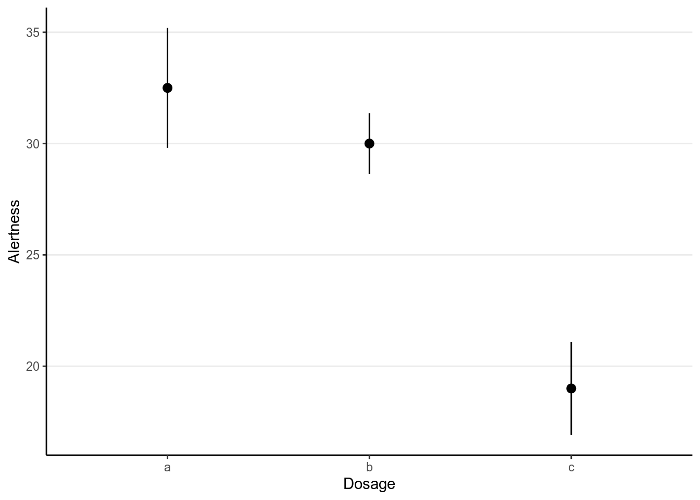
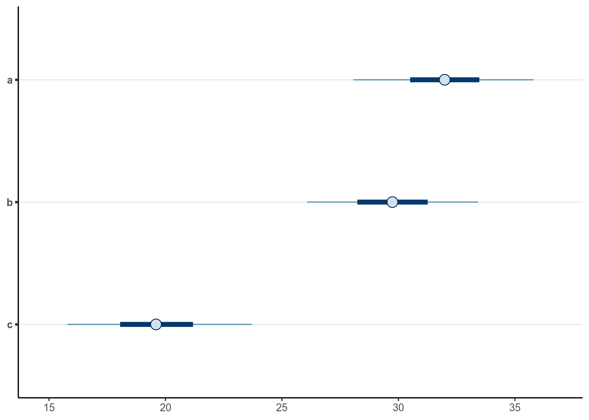
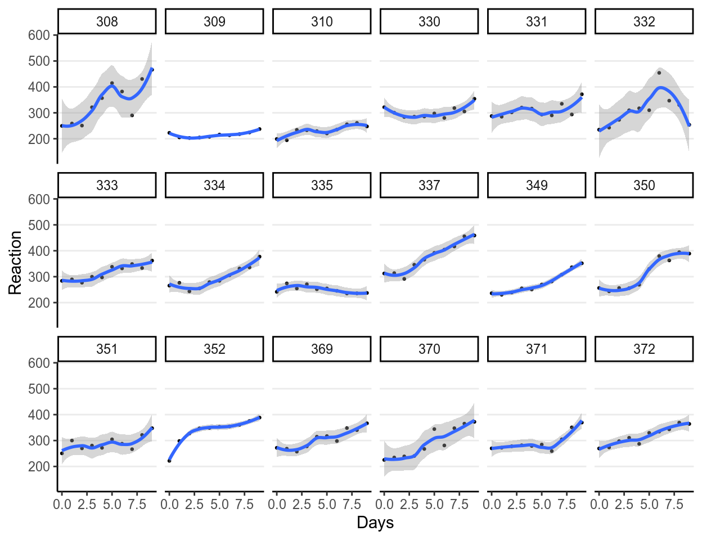
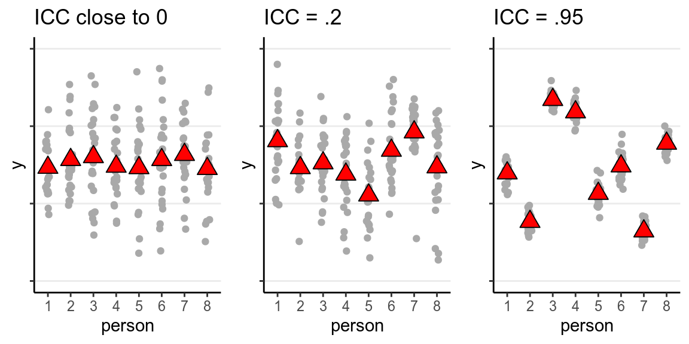
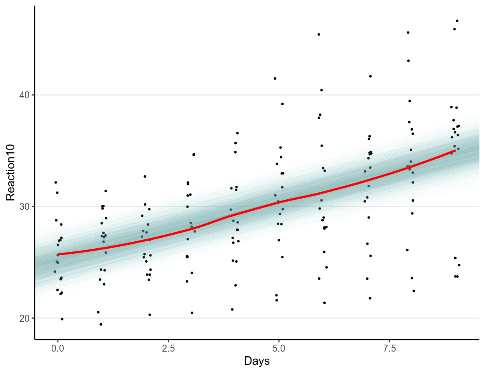
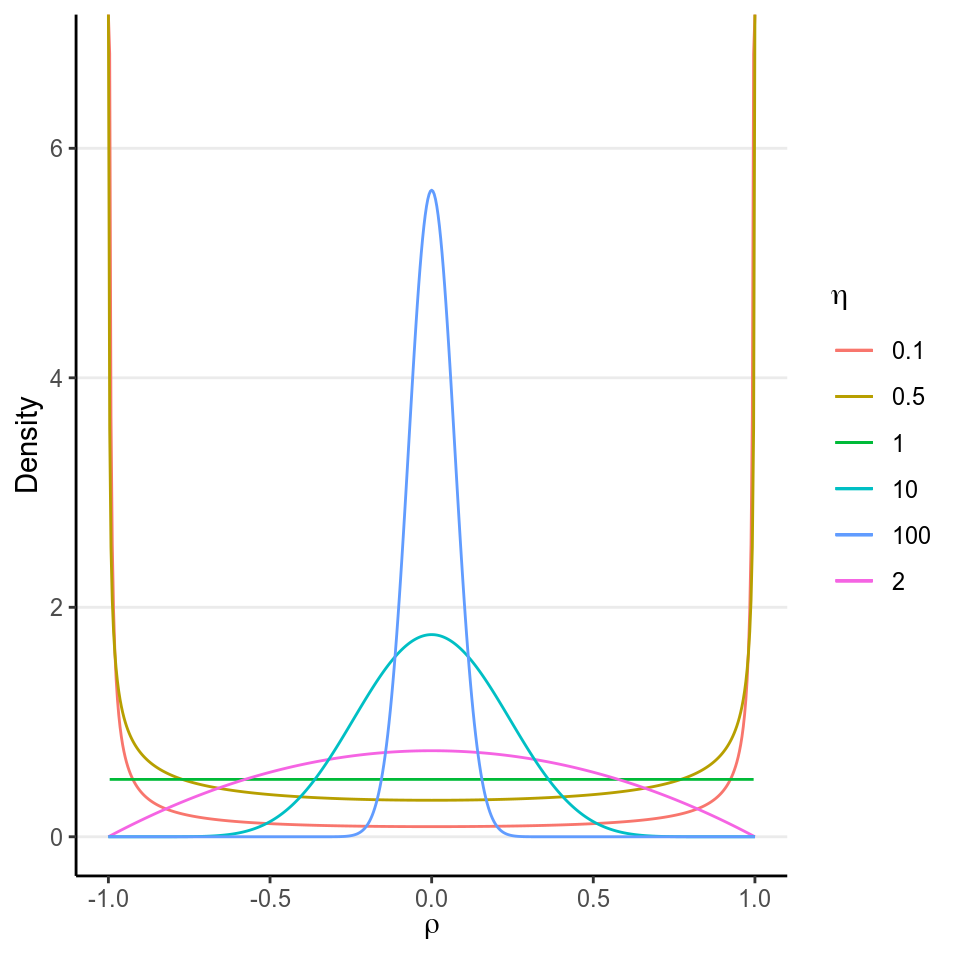
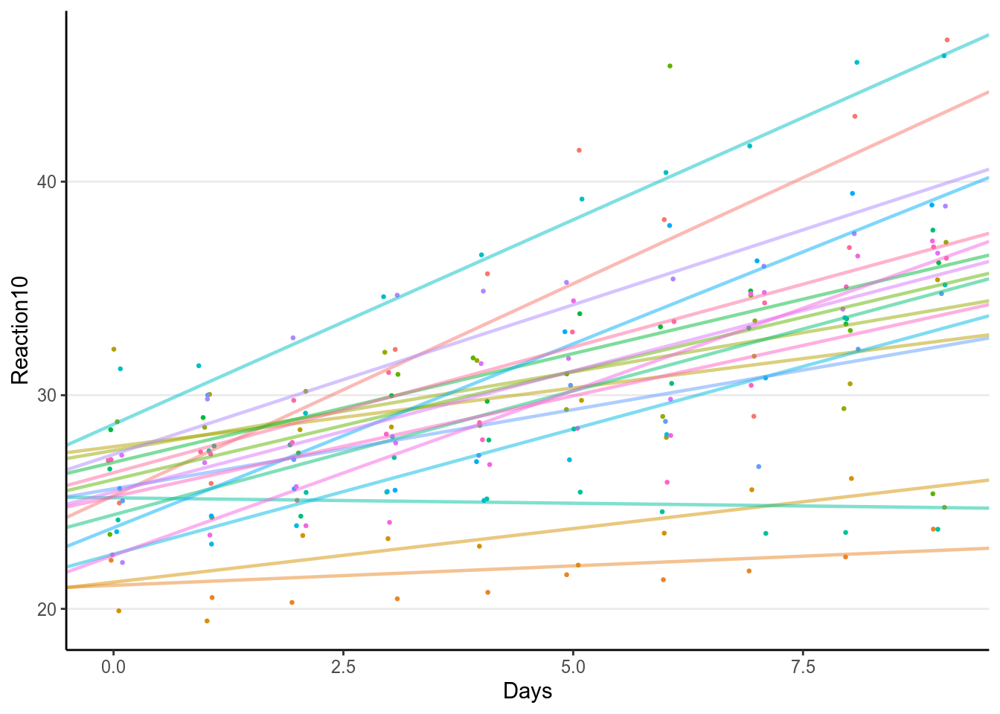
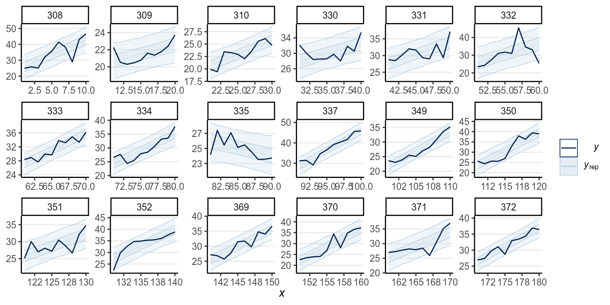

# Hierarchical & Multilevel Models

In this note we'll talk about hierarchical models, starting with the Bayesian
analogue of ANOVA. While the results of Bayesian regression are usually similar
to the frequentist counterparts, at least with weak priors, Bayesian ANOVA is
usually represented as a hierarchical model, which corresponds to random-effect
ANOVA in frequentist. We'll then build on that to discuss multilevel regression
models with varying intercepts and slopes.

## ANOVA

We'll use some demonstration data that usually corresponds to a typical 
psychological experiment that uses one-way ANOVA:


```r
# From http://personality-project.org/R/datasets/R.appendix1.data
alert <- tibble(Dosage = factor(rep(c("a", "b", "c"), each = 6)), 
                Alertness = c(30, 38, 35, 41, 27, 24, 32, 26, 31, 
                              29, 27, 35, 21, 25, 17, 21, 20, 10))
# Show barplot
ggplot(alert, aes(x = Dosage, y = Alertness)) + 
  # Mean + SE
  stat_summary()
```

```
># No summary function supplied, defaulting to `mean_se()
```



As can be seen, Dosage `c` has lower mean than others. 

### "Frequentist" ANOVA

In frequentist analyses, we generally first perform an omnibus test:


```r
summary(aov(Alertness ~ Dosage, data = alert))
```

```
>#             Df Sum Sq Mean Sq F value  Pr(>F)    
># Dosage       2    619   309.5    11.5 0.00094 ***
># Residuals   15    404    26.9                    
># ---
># Signif. codes:  0 '***' 0.001 '**' 0.01 '*' 0.05 '.' 0.1 ' ' 1
```

And then there will be post hoc comparisons with adjustment on $p$ values


```r
# Use Holm's procedure by default
pairwise.t.test(x = alert$Alertness, g = alert$Dosage)
```

```
># 
># 	Pairwise comparisons using t tests with pooled SD 
># 
># data:  alert$Alertness and alert$Dosage 
># 
>#   a     b    
># b 0.417 -    
># c 0.001 0.005
># 
># P value adjustment method: holm
```

which shows that `c` was lower than both `a` and `b`. 

### Bayesian ANOVA

In Bayesian, it is more common to treat grouping variables, especially with 
more than three or four categories, as clusters in hierarchical modeling. 
Specifically, we start with the normal model:
$$\texttt{Alertness}_{ij} \sim \norm(\mu_j, \sigma)$$
but in the priors, we assume that the $\mu_j$s are exchangeable and have a 
common prior distribution such that
$$\mu_j \sim \norm(\gamma, \tau)$$
This means that we believe the group means themselves are from a normal
distribution with mean $\gamma$ and *SD* $\tau$. $\gamma$ is the grand mean of
`Alertness` averaged across the conditions, and $\tau$ is the between-condition
*SD*. They are called hyperparameters, and they also need priors (i.e.,
hyperpriors). Because the prior for $\mu_j$ consists of hyperparameters that 
themselves have prior (hyperprior) distributions, this is also called 
*hierarchical priors*. We'll use:
\begin{align*}
  \gamma & \sim \norm(0, 50) \\
  \tau & \sim \textrm{Gamma}(2, 1 / 8)
\end{align*}
Note that the Gamma prior was recommended in previous papers for hierarchical 
models, with the 8 in 1/8 being the prior belief of what the maximum value of 
$\tau$ can be. 


```r
m1 <- brm(Alertness ~ 1 + (1 | Dosage), data = alert, 
          prior = c(# for gamma
            prior(normal(0, 50), class = "Intercept"),
            # for sigma
            prior(student_t(4, 0, 10), class = "sigma"), 
            # for tau
            prior(gamma(2, 0.125), class = "sd", coef = "Intercept", 
                  group = "Dosage")
          ), 
          # Hierarchical models generally require smaller stepsize
          control = list(adapt_delta = .99))
```


```r
broom::tidy(m1) %>% 
  knitr::kable()
```


term                     estimate   std.error    lower    upper
----------------------  ---------  ----------  -------  -------
b_Intercept                 26.45        7.04    14.69    37.28
sd_Dosage__Intercept        10.97        6.05     4.29    22.68
sigma                        5.58        1.15     4.04     7.70
r_Dosage[a,Intercept]        5.62        7.24    -5.21    17.93
r_Dosage[b,Intercept]        3.28        7.14    -7.77    15.14
r_Dosage[c,Intercept]       -6.77        7.20   -18.15     4.91
lp__                       -66.93        1.98   -70.63   -64.35

From the results, the posterior mean for $\gamma$ is 
26.455 (*SD* = 
7.045), which was the grand mean `Alertness`
level. The between-group *SD* was estimated to be $\tau$ = 
10.973, whereas the within-group
*SD* was estimated to be $\sigma$ = 
5.575. 

You can get the posterior mean for the mean of each group (i.e., $\mu_j$) using


```r
coef(m1)$Dosage[ , , "Intercept"]
```

```
>#   Estimate Est.Error Q2.5 Q97.5
># a     32.1      2.31 27.4  36.7
># b     29.7      2.27 25.4  34.2
># c     19.7      2.32 15.3  24.4
```

#### Shrinkage

Note that in the above model, the Bayes estimates of the group means are
different from the sample group means, as shown in the following graph:


```r
ggplot(alert, aes(x = Dosage, y = Alertness)) + 
  # Mean + SE
  stat_summary(aes(col = "sample means")) + 
  geom_pointrange(data = as_tibble(coef(m1)$Dosage[ , , "Intercept"], 
                                   rownames = "Dosage"), 
                  aes(x = Dosage, y = Estimate, 
                      ymin = Estimate - Est.Error, 
                      ymax = Estimate + Est.Error, 
                      col = "Bayes means"), 
                  position = position_nudge(x = 0.1))
```

```
># No summary function supplied, defaulting to `mean_se()
```


If you look more carefully, you can see that the Bayes estimates are closer to
the middle. This *shrinkage* effect may seem odd at first, but it has a good 
reason. The hierarchical assumes that there are something in common for 
observations in different groups, so it performs *partial pooling* by borrowing
information from other groups. 

To illustrate the strength of partial pooling, I went through a thought
experiment with my students in my multilevel modeling class. Imagine it's your
first time visiting Macau, my hometown, and you are about to go to a McDonald's
there. You've never been to any restaurants in Macau. So what do you expect? You
probably will use your experience of eating at McDonald's in the US as a
reference. The Bayesian hierarchical model here is the same: it assumes that
even though participants received different Dosage, there are something similar
among them, so information from one group should provide some information for
another group. And for many of our problems in research, hierarchical models
have been shown to make better predictions and inferences, compared to 
traditional ANOVA. See @Kruschke2018 for some more discussion. 

#### Notes on multiple comparisons

With hierarchical models, the common recommendation is that no further control
for multiple comparison is needed [see @Gelman2012]. For one, we don't use $p$
values in Bayesian. For the other, by shrinking the group means closer to the
grand mean in a hierarchical model, the comparisons in some sense have already
been adjusted. You can plot the estimated group means by:


```r
mcmc_intervals(coef(m1, summary = FALSE)$Dosage[ , , "Intercept"])
```



And below it shows the posterior of the differences:


```r
ranef_draws <- coef(m1, summary = FALSE)$Dosage[ , , "Intercept"]
# Find all comparisons:
m1_cont <- combn(colnames(ranef_draws), 2, simplify = FALSE)
# Compute mean differences
m1_cont_draws <- map_dfc(m1_cont,
                         ~ tibble(ranef_draws[, .x[1]] -
                                    ranef_draws[, .x[2]]) %>% 
                           `names<-`(paste(.x[1], .x[2], sep = "-")))
# Plot the contrasts
mcmc_areas(m1_cont_draws, prob = .95, bw = "SJ")
```


And the results in this example are similar to the post hoc comparisons. 

## Multilevel Modeling (MLM)

Multilevel modeling is the set of techniques that built on the previous 
hierarchical model. It is proposed kind of separately in multiple disciplines, 
including education and other social sciences, and so historically it has been
referred to by many different names, such as:

- Mixed/Mixed-effect models
- Hierarchical linear models
- Variance component models

It allows us to build models on different groups/clusters, and allows the 
parameters to be different across clusters. However, it does *partial pooling*
by borrowing information from one cluster to another, which is especially 
beneficial when some groups have only a few people, where borrowing information
from other clusters would help stabilize the parameter estimates. 

### Examples of clustering

There are many different forms of clustering in data across different 
disciplines. We've seen the example of people clustered in experimental 
conditions. Other examples include:

- Students in schools
- Clients nested within therapists within clinics
- Employees nested within organizations
- Citizens nested within employees
- Repeated measures nested within persons

They can be represented in network graphs like the following (students within
schools):

{width=360px}

Sometimes there are more than one level of clustering, like students clustered 
by both middle schools and high schools. This is called a *crossed* structure as
shown in the following, where we say that students are cross-classified by both
middle and high schools. Another example commonly happened in psychological 
experiments is when participants see multiple stimuli, each as an item, so the 
observations are cross-classified by both persons and items. 

{width=360px}

The repeated measures nested within persons one is particularly relevant as that
means essentially all longitudinal data are multilevel data and should be
modelled accordingly. It allows one to build individualized model to look at
within-person changes, as well as between-person differences of those changes.
Techniques such as dependent-sample $t$-test, repeated-measures ANOVA, growth
curve modeling, and time-series analyses, can all be represented in the
multilevel modeling framework. Therefore, some authors, such as
@mcelreath2016statistical, would suggest that MLM should be the default model
that we use for analyses, rather than regression.

### Data

We will use the data set `sleepstudy` from the `lme4` package, which is the
package for frequentist multilevel modeling. The data set contains 18
participants, each with 10 observations. It examines the change in average
reaction time per day with increasing sleep deprivation. See `?lme4::sleepstudy`
for more of the description. Here is a plot of the data:


```r
data(sleepstudy, package = "lme4")  # call the data
psych::pairs.panels(sleepstudy[1:2])
```


This data set has clustering because it is repeated measures nested within 
persons. It is more useful to plot the change in the outcome:


```r
ggplot(sleepstudy, aes(x = Days, y = Reaction)) + 
  geom_point(size = 0.5) + 
  geom_smooth() + 
  # presented by person
  facet_wrap(~ Subject, ncol = 6)
```

```
># `geom_smooth()` using method = 'loess' and formula 'y ~ x'
```



As you can see, most people experience increases in reaction time, although 
there are certainly differences across individuals. 

### Intraclass correlation

With multilevel data, the first question to ask is how much variation in the 
outcome is there at each level. This is quantified by the 
*intraclass correlation*, which, for a two-level model, is defined by 
$$\rho = \frac{\tau^2}{\tau^2 + \sigma^2}$$
where $\tau$ is the between-level *SD*, which is the *SD* of the cluster means 
(i.e., the variability of mean response time across persons in this example), 
and $\sigma$ is the within-level *SD* (i.e., variability within a person, which
is assumed constant across persons). 

> The ICC represents the proportion of variance of the outcome that are due to
between-level (e.g., between-group, between-person) differences

Here is a graph from my MLM class showing how the data would be like with
different ICC levels:


As you can see, the higher the ICC, the higher the variations in the 
cluster means, relative to the within-cluster variations. Below is the graph
for the `sleepstudy` data:


```r
ggplot(sleepstudy, aes(x = Subject, y = Reaction)) + 
  geom_jitter(width = 0.1, col = "darkgrey") + 
  stat_summary(geom = "point", fun.y = mean, 
               size = 4, shape = 24, fill = "red")
```


Which has substantial between-person variations. 

#### Computing ICC

To compute the ICC, we need to first fit a multilevel model, which in this case
is the *varying intercept* model:
\begin{align*}
  \texttt{Reaction}_{ij} & \sim \norm(\mu_j, \sigma)  \\
  \mu_j & \sim \norm(\gamma, \tau)
\end{align*}
where $\mu_j$ is the mean reaction for the $j$th person, and $i$ indexes 
measurement occasions. 

We'll rescale `Reaction` by 10:


```r
sleepstudy <- sleepstudy %>% 
  mutate(Reaction10 = Reaction / 10)
```

To use weakly informative priors, we will set 
\begin{align*}
  \gamma & \sim \norm(0, 50)  \\
  \sigma & \sim t^+(4, 0, 5)  \\
  \tau & \sim \textrm{Gamma}(2, 1 / 5)
\end{align*}


```r
m2 <- brm(Reaction10 ~ (1 | Subject), data = sleepstudy, 
          prior = c(# for intercept 
            prior(normal(0, 50), class = "Intercept"), 
            # for tau
            prior(gamma(2, 0.2), class = "sd"), 
            # for sigma
            prior(student_t(4, 0, 5), class = "sigma")), 
          control = list(adapt_delta = .95), 
          cores = 2L, 
          seed = 2107)
```


Now use the posterior draws of $\tau$ and $\sigma$ to compute the posterior for
the ICC:


```r
# Computing ICC
# 1. Obtain posterior draws of tau and sigma
sd_m2 <- VarCorr(m2, summary = FALSE)
draws_tau <- sd_m2$Subject$sd[ , "Intercept"]  # tau
draws_sigma <- sd_m2$residual__$sd[ , 1]  #sigma
# 2. Compute draws for ICC
draws_icc <- draws_tau^2 / (draws_tau^2 + draws_sigma^2)
# Plot the ICC
qplot(draws_icc, geom = "density", xlab = "ICC", bw = "SJ")
```


```r
# Summarize the ICC distribution
psych::describe(draws_icc)
```

```
>#    vars    n mean  sd median trimmed mad  min  max range skew kurtosis se
># X1    1 4000 0.43 0.1   0.43    0.43 0.1 0.16 0.78  0.62  0.2    -0.21  0
```

#### Interpretations


```r
broom::tidy(m2, parameters = c("b_Intercept", "sd", "sigma")) %>% 
  knitr::kable()
```


term                     estimate   std.error   lower   upper
----------------------  ---------  ----------  ------  ------
b_Intercept                 29.90       1.016   28.20   31.58
sd_Subject__Intercept        3.93       0.838    2.75    5.45
sigma                        4.46       0.248    4.06    4.88


> The model suggested that the average reaction time across individuals and 
measurement occasions was 
298.988 ms, 95% CI [278.958, 319.692]. It was estimated 
that 43.007%, 95% CI 
[24.463%, 
63.909%] of the variations in reaction time was 
attributed to between-person differences. 

### Is MLM needed?

This is a commonly asked question. Based on @Lai2015, you can compute the design
effect index, which shows the inflation in variability of the estimates due to
clustering. It is recommended to account for clustering if the design effect is
larger than 1.1. It is defined as:
$$\Deff = 1 + (n - 1) \rho$$
where $n$ is the (average) number of observations in each cluster, and in our
case it is 10. Therefore, the design effect in `sleepstudy` for `Reaction` is 
$$\Deff = 1 + (10 - 1) (0.43)$$
which is 4.871, so we do need to account for the 
clustering.

## Varying Coefficients

The strength of a multilevel model is that it can allow researchers to build
models that allow for cluster-specific coefficients. In our example data this 
is analogous to fitting separate models for each person, but instead of only 
using 10 data points for each model, MLM pools information from other people as
it believes that we can learn something about one person by looking at data 
from other people. 

For example, for each person, we'll fit a regression model using `Days` to 
predict `Reaction10`. Using our previous notations, 
\begin{align}
  \texttt{Reaction10}_i & \sim \norm(\mu_i, \sigma)  \\
  \mu_i & = \beta_0 + \beta_1 \texttt{Days}_i
\end{align}
However, because we have more than one person, we'll use the subscript $j$ to 
denote the person, so that the model becomes
\begin{align}
  \texttt{Reaction10}_{ij} & \sim \norm(\mu_{ij}, \sigma_j)  \\
  \mu_{ij} & = \beta_{0j} + \beta_{1j} \texttt{Days}_{ij}
\end{align}
which suggests that all three of $\beta_0$, $\beta_1$, and $\sigma$ can be 
different across persons. We'll first start with varying $\beta_0$, or 
*varying intercepts*.

### Varying Intercepts

With varying intercepts model, we assumed that only $\beta_0$ is different 
across persons, but $\beta_1$ and $\sigma$ are common parameters that do not 
change across persons. This is also referred to as a *random intercept model* 
in (frequentist) MLM literature. Specifically, the model and priors are:
\begin{align}
\text{Repeated-measure level:}  \\
  \texttt{Reaction10}_{ij} & \sim \norm(\mu_{ij}, \sigma)  \\
  \mu_{ij} & = \beta_{0j} + \beta_{1} \texttt{Days}_{ij}  \\
\text{Person level:}  \\
  \beta_{0j} & \sim \norm(\mu^{[\beta_0]}, \tau^{[\beta_0]})  \\
\text{Priors:}  \\
  \mu^{[\beta_0]} & \sim \norm(0, 50) \\
  \tau^{[\beta_0]} & \sim \mathrm{Gamma}(2, 0.2) \\
  \beta_1 & \sim \norm(0, 10) \\
  \sigma & \sim t^+(4, 0, 5)
\end{align}
where the $\beta_{0j}$s follow a common normal distribution with hyperparameters
$\mu^{[\beta_0]}$ and $\tau^{[\beta_0]}$. Thus, $\mu^{[\beta_0]}$ is the *grand 
intercept*, or the average intercept across persons, and $\tau^{[\beta_0]}$ is the
*SD* of those intercepts. 

The model can be fitted in `brms`:


```r
m3 <- brm(Reaction10 ~ Days + (1 | Subject), data = sleepstudy, 
          prior = c(# for intercept 
            prior(normal(0, 50), class = "Intercept"), 
            # for slope
            prior(normal(0, 10), class = "b"), 
            # for tau
            prior(gamma(2, 0.2), class = "sd"), 
            # for sigma
            prior(student_t(4, 0, 5), class = "sigma")), 
          control = list(adapt_delta = .95), 
          cores = 2L, 
          seed = 2107)
```

Below is a summary table of the results


```r
broom::tidy(m3, parameters = c("b_", "sd", "sigma")) %>% 
  knitr::kable()
```


term                     estimate   std.error    lower   upper
----------------------  ---------  ----------  -------  ------
b_Intercept                 25.11       1.043   23.297   26.80
b_Days                       1.04       0.084    0.909    1.19
sd_Subject__Intercept        4.08       0.831    2.953    5.65
sigma                        3.12       0.178    2.845    3.43

Let's check the fit of the model to the data, first to the overall data and then
to each individual specifically. 

#### Fit of Overall data


```r
# Posterior mean of slope
coef_post <- fixef(m3, summary = FALSE)
ggplot(sleepstudy, aes(x = Days, y = Reaction10)) + 
  geom_jitter(size = 0.5, width = 0.1) + 
  geom_abline(data = as_tibble(coef_post), 
              aes(intercept = Intercept, slope = Days), 
              color = "skyblue", size = 0.2, alpha = 0.01) + 
  geom_smooth(se = FALSE, col = "red")
```

```
># `geom_smooth()` using method = 'loess' and formula 'y ~ x'
```



As can be seen, the estimated coefficient for `Days`, which was assumed 
constant for everyone, fit the overall data. However, does it fit each 
individual?

#### Fit of Individuals


```r
# Posterior mean of slope
coef_post <- coef(m3, summary = FALSE)
df_lines <- tibble(Subject = colnames(coef_post$Subject), 
                   Intercept = colMeans(coef_post$Subject[ , , "Intercept"]), 
                   Days = colMeans(coef_post$Subject[ , , "Days"]))
ggplot(sleepstudy, aes(x = Days, y = Reaction10)) + 
  geom_point(size = 0.5) + 
  geom_abline(data = df_lines, 
              aes(intercept = Intercept, 
                  slope = Days),
              color = "blue", size = 0.8, alpha = 0.5) +
  geom_smooth(se = FALSE, col = "red", size = 0.8, alpha = 0.5) + 
  # Uncomment the following to show the uncertainty on the line
  # geom_abline(data = as_tibble(coef_post), 
  #             aes(intercept = Intercept, slope = Days), 
  #             color = "skyblue", size = 0.2, alpha = 0.01) + 
  # presented by person
  facet_wrap(~ Subject, ncol = 6)
```

```
># `geom_smooth()` using method = 'loess' and formula 'y ~ x'
```


Obviously it only fit a few individuals, but not all. So let's also allow 
$\beta_1$ to vary. 

### Varying Slopes

We'll now also allow $\beta_1$ to vary across clusters, with the following 
model:

\begin{align}
\text{Repeated-measure level:}  \\
  \texttt{Reaction10}_{ij} & \sim \norm(\mu_{ij}, \sigma)  \\
  \mu_{ij} & = \beta_{0j} + \beta_{1j} \texttt{Days}_{ij}  \\
\text{Person level:}  \\
  \begin{bmatrix}
    \beta_{0j} \\
    \beta_{1j} \\
  \end{bmatrix} & \sim \norm_2\left(
    \begin{bmatrix} 
      \mu^{[\beta_0]} \\
      \mu^{[\beta_1]} \\
    \end{bmatrix}, \bv T
    \right)
\end{align}
where 
$$\bv T = \begin{bmatrix}
      {\tau^{[\beta_0]}}^2 & \\
      \tau^{\beta{10}} & {\tau^{[\beta_1]}}^2 \\
    \end{bmatrix}$$

Note that $\norm_2$ denotes a bivariate normal (i.e., 2-dimensional 
multivariate normal) distribution, because now we can talk about how $\beta_0$
and $\beta_1$ are associated at the person level. Generally I don't interpret
the covariance between them because it largely depends on how the variables 
were centered, but nevertheless we should allow them to be correlated. The 
parameter $\tau^{\beta{10}}$ thus denotes the covariance of them. 

Programs using Gibbs sampling, such as `MCMCglmm`, uses an inverse-Wishart
distribution as a prior for the covariance matrix $\bv T$, but it has been
shown to usually leading to biased and inefficient estimates. More recent 
recommendation is to decompose $\bv T$ into a correlation matrix and the 
scaling matrices, and use an LKJ prior on the correlation matrix. We'll explain
the LKJ prior below, but first let's do the decomposition:
$$\bv T = \diag(\bv \tau) \bv \Omega \diag(\bv \tau),$$
where $\bv T$ = $[\tau_1, \tau_2, \ldots]$ is a vector containing the scale
parameters (i.e., *SD*) of the varying coefficients, and $\bv \Omega$ is the
correlation matrix of the varying coefficients.

#### LKJ Prior

The LKJ Prior is a probability distribution for correlation matrices. A
correlation matrix has 1 on all the diagonal elements. For example, a 2 $\times$
2 correlation matrix is
$$\begin{bmatrix}
    1 & \\
    0.35 & 1
  \end{bmatrix}$$
where the correlation is 0.35. Therefore, with two variables, there is one 
correlation; with three or more variables, the number of correlations will be
$q (q - 1) / 2$, where $q$ is the number of variables. 

For a correlation matrix of a given size, the LKJ prior has one shape parameter,
$\eta$, where $\eta = 1$ corresponds to a uniform distribution of the 
correlations such that any correlations are equally likely, $\eta \geq 1$ 
favors a matrix closer to an identity matrix so that the correlations are 
closer to zero, and $\eta \leq 1$ favors a matrix with larger correlations. For
a 2 $\times$ 2 matrix, the distribution of the correlation, $\rho$, with 
different $\eta$ values are shown in the graph below:


```r
dlkjcorr2 <- function(rho, eta = 1, log = FALSE) {
  # Function to compute the LKJ density given a correlation
  out <- (eta - 1) * log(1 - rho^2) - 
    1 / 2 * log(pi) - lgamma(eta) + lgamma(eta + 1 / 2)
  if (!log) out <- exp(out)
  out
}
ggplot(tibble(rho = c(-1, 1)), aes(x = rho)) + 
  stat_function(fun = dlkjcorr2, args = list(eta = 0.1), 
                aes(col = "0.1"), n = 501) + 
  stat_function(fun = dlkjcorr2, args = list(eta = 0.5), 
                aes(col = "0.5"), n = 501) + 
  stat_function(fun = dlkjcorr2, args = list(eta = 1), 
                aes(col = "1"), n = 501) + 
  stat_function(fun = dlkjcorr2, args = list(eta = 2), 
                aes(col = "2"), n = 501) + 
  stat_function(fun = dlkjcorr2, args = list(eta = 10), 
                aes(col = "10"), n = 501) + 
  stat_function(fun = dlkjcorr2, args = list(eta = 100), 
                aes(col = "100"), n = 501) + 
  labs(col = expression(eta), x = expression(rho), y = "Density")
```

```
># Warning: Removed 2 rows containing missing values (geom_path).
```



As you can see, when $\eta$ increases, the correlation is more concentrated to
zero. 

The default in `brms` is to use $\eta$ = 1, which is non-informative. If you 
have a weak but informative belief that the correlations shouldn't be very
large, using $\eta$ = 2 is reasonable. 

The resulting model and priors are:

\begin{align}
\text{Repeated-measure level:}  \\
  \texttt{Reaction10}_{ij} & \sim \norm(\mu_{ij}, \sigma)  \\
  \mu_{ij} & = \beta_{0j} + \beta_{1j} \texttt{Days}_{ij}  \\
\text{Person level:}  \\
  \begin{bmatrix}
    \beta_{0j} \\
    \beta_{1j} \\
  \end{bmatrix} & \sim \norm_2\left(
    \begin{bmatrix} 
      \mu^{[\beta_0]} \\
      \mu^{[\beta_1]} \\
    \end{bmatrix}, \bv T
    \right)  \\
  \bv T & = \diag(\bv \tau) \bv \Omega \diag(\bv \tau) \\
\text{Priors:}  \\
  \mu^{[\beta_0]} & \sim \norm(0, 50) \\
  \mu^{[\beta_1]} & \sim \norm(0, 10) \\
  \tau^{[\beta_m]} & \sim \mathrm{Gamma}(2, 0.2), \; m = 0, 1 \\
  \bv \Omega & \sim \mathrm{LKJ}(1) \\
  \sigma & \sim t^+(4, 0, 5)
\end{align}


```r
m4 <- brm(Reaction10 ~ Days + (Days | Subject),  
          data = sleepstudy, 
          prior = c(# for intercept
            prior(normal(0, 50), class = "Intercept"),
            # for slope
            prior(normal(0, 10), class = "b"),
            # for tau_beta0 and tau_beta1
            prior(gamma(2, 0.2), class = "sd", group = "Subject"),
            # for correlation
            prior(lkj(1), class = "cor"), 
            # for sigma
            prior(student_t(4, 0, 5), class = "sigma")),
          control = list(adapt_delta = .95), 
          cores = 2L, 
          seed = 2107)
```

Below is a summary table of the results


```r
broom::tidy(m4, parameters = c("b_", "sd", "sigma")) %>% 
  knitr::kable()
```


term                     estimate   std.error    lower    upper
----------------------  ---------  ----------  -------  -------
b_Intercept                 25.14       0.781   23.894   26.413
b_Days                       1.04       0.183    0.751    1.339
sd_Subject__Intercept        2.83       0.721    1.812    4.138
sd_Subject__Days             0.69       0.167    0.462    0.996
sigma                        2.59       0.153    2.351    2.860

#### Fit of Individuals


```r
# Posterior mean of slope
coef_post <- coef(m4, summary = FALSE)
df_lines <- tibble(Subject = colnames(coef_post$Subject), 
                   Intercept = colMeans(coef_post$Subject[ , , "Intercept"]), 
                   Days = colMeans(coef_post$Subject[ , , "Days"]))
ggplot(sleepstudy, aes(x = Days, y = Reaction10)) + 
  geom_point(size = 0.5) + 
  geom_abline(data = df_lines, 
              aes(intercept = Intercept, 
                  slope = Days),
              color = "blue", size = 0.8, alpha = 0.5) +
  geom_smooth(se = FALSE, col = "red", size = 0.8, alpha = 0.5) + 
  # presented by person
  facet_wrap(~ Subject, ncol = 6)
```

```
># `geom_smooth()` using method = 'loess' and formula 'y ~ x'
```


You can see that the fit is better. You can also visualize the varying 
regression lines:


```r
ggplot(sleepstudy, aes(x = Days, y = Reaction10, col = Subject)) + 
  geom_jitter(size = 0.5, width = 0.1) + 
  geom_abline(data = df_lines,
              aes(intercept = Intercept, slope = Days, col = Subject), 
              size = 0.8, alpha = 0.5) +
  # Suppress legend
  guides(col = FALSE)
```



Or using the `sjPlot` package:


```r
sjPlot::plot_model(m4, type = "pred", 
                   # Put in the predictor first, and then grouping variable
                   terms = c("Days", "Subject"), 
                   pred.type = "re", 
                   # Grayscale color
                   colors = "gs") + 
  guides(col = FALSE)
```

```
># Note: uncertainty of error terms are not taken into account. You may want to use `rstantools::posterior_predict()`.
```


#### Fixed Effect Model

You can compare the previous model with one where have different slopes for
different person, which can be modelled by including an interaction with the
categorical `Subject` predictor. This is referred to as the *fixed-effect*
model, as opposed to *random-effect* model used to describe hierarchical models
with partial pooling. Below is an example:


```r
m4_fixed <- brm(Reaction10 ~ Days * I(factor(Subject)),  
          data = sleepstudy, 
          prior = c(# for intercept
            prior(normal(0, 50), class = "Intercept"),
            # for slope
            prior(normal(0, 10), class = "b"),
            # for sigma
            prior(student_t(4, 0, 5), class = "sigma")),
          control = list(adapt_delta = .95), 
          cores = 2L, 
          seed = 2107)
```

You can compare the two models using LOO-IC:


```r
loo(m4, m4_fixed)
```

```
># Warning: Found 3 observations with a pareto_k > 0.7 in model 'm4'. It is
># recommended to set 'reloo = TRUE' in order to calculate the ELPD without the
># assumption that these observations are negligible. This will refit the model 3
># times to compute the ELPDs for the problematic observations directly.
```

```
># Warning: Found 5 observations with a pareto_k > 0.7 in model 'm4_fixed'. It is
># recommended to set 'reloo = TRUE' in order to calculate the ELPD without the
># assumption that these observations are negligible. This will refit the model 5
># times to compute the ELPDs for the problematic observations directly.
```

```
># Output of model 'm4':
># 
># Computed from 4000 by 180 log-likelihood matrix
># 
>#          Estimate   SE
># elpd_loo   -445.9 22.1
># p_loo        33.6  8.1
># looic       891.8 44.1
># ------
># Monte Carlo SE of elpd_loo is NA.
># 
># Pareto k diagnostic values:
>#                          Count Pct.    Min. n_eff
># (-Inf, 0.5]   (good)     170   94.4%   887       
>#  (0.5, 0.7]   (ok)         7    3.9%   545       
>#    (0.7, 1]   (bad)        3    1.7%   25        
>#    (1, Inf)   (very bad)   0    0.0%   <NA>      
># See help('pareto-k-diagnostic') for details.
># 
># Output of model 'm4_fixed':
># 
># Computed from 4000 by 180 log-likelihood matrix
># 
>#          Estimate   SE
># elpd_loo   -448.9 23.1
># p_loo        38.7  9.1
># looic       897.8 46.3
># ------
># Monte Carlo SE of elpd_loo is NA.
># 
># Pareto k diagnostic values:
>#                          Count Pct.    Min. n_eff
># (-Inf, 0.5]   (good)     167   92.8%   357       
>#  (0.5, 0.7]   (ok)         8    4.4%   711       
>#    (0.7, 1]   (bad)        4    2.2%   20        
>#    (1, Inf)   (very bad)   1    0.6%   15        
># See help('pareto-k-diagnostic') for details.
># 
># Model comparisons:
>#          elpd_diff se_diff
># m4        0.0       0.0   
># m4_fixed -3.0       2.6
```

As you can see, in this case the hierarchical approach yields a lower LOO (but
there was a warning message, so be careful), and estimated less number of 
parameters. With more clusters and with lower ICC, hierarchical models will have
even stronger advantage. 

So far we have not talked about including person-level predictors. If there 
are such predictors available, such as gender, we can use those to predict 
individual differences in intercepts (main effect) and in slopes (i.e., 
interaction with `Days`). Just add those predictors to the model by:
\begin{align}
  \begin{bmatrix}
    \beta_{0j} \\
    \beta_{1j} \\
  \end{bmatrix} & \sim \norm_2\left(
  \begin{bmatrix} 
      \mu_{{\beta_0}j} \\
      \mu_{{\beta_1}j} \\
    \end{bmatrix}, \bv T
    \right)  \\
  \bv T & = \diag(\bv \tau) \bv \Omega \diag(\bv \tau) \\
  \mu_{{\beta_0}j} & = \gamma_{00} + \gamma_{01} X_j \\
  \mu_{{\beta_1}j} & = \gamma_{10} + \gamma_{11} X_j
\end{align}
where $X_j$ is a person-level predictor.

#### Interpretations


```r
tau_m4 <- VarCorr(m4)$Subject$sd
```

> Based on the model, at Day 0, the average reaction time across individuals was 
251.417 ms, 95% CI [236.109, 266.954], and the *SD* at Day 0 
was 28.278ms, 95% CI 
[16.561ms, 
44.749ms]. 

> The average growth rate per day in reaction time across individuals was 
10.427 ms, 95% CI [6.789, 14.064], and the *SD* at Day 0 
was 6.904ms, 95% CI 
[4.272ms, 10.769ms], as 
shown in the figure. 

### Varying $\sigma$

Finally, you can also allow $\sigma$ to be different across individuals. This is
typically used to relax the homogeneity of variance assumption, but recently 
there is also some interest in treating varying $\sigma$ as an important
outcome. Examples include fluctuations in mood, as two people with the same 
mean level of mood may fluctuate very differently, and mood swing can be an 
important outcome to assess. There has been some interesting applications in 
health research using ecological momentary assessment data. For an overview, 
see the paper by @Hedeker2008. 

Without going into the details, here is the model and the priors:

\begin{align}
\text{Repeated-measure level:}  \\
  \texttt{Reaction10}_{ij} & \sim \norm(\mu_{ij}, \sigma_j)  \\
  \mu_{ij} & = \beta_{0j} + \beta_{1j} \texttt{Days}_{ij}  \\
\text{Person level:}  \\
  \begin{bmatrix}
    \beta_{0j} \\
    \beta_{1j} \\
    \log(\sigma_j) 
  \end{bmatrix} & \sim \norm_2\left(
    \begin{bmatrix} 
      \mu^{[\beta_0]} \\
      \mu^{[\beta_1]} \\
      \mu^{[s]}
    \end{bmatrix}, \bv T
    \right)  \\
  \bv T & = \diag(\bv \tau) \bv \Omega \diag(\bv \tau) \\
\text{Priors:}  \\
  \mu^{[\beta_0]} & \sim \norm(0, 50) \\
  \mu^{[\beta_1]} & \sim \norm(0, 10) \\
  \mu^{[s]} & \sim t^+(4, 0, 1.6) \\
  \tau^{[\beta_m]} & \sim \mathrm{Gamma}(2, 0.2), \; m = 0, 1 \\
  \tau^{[s]} & \sim \mathrm{Gamma}(2, 0.625) \\
  \bv \Omega & \sim \mathrm{LKJ}(1)
\end{align}


```r
# Use |c| to estimate the covariance between the sigma and beta random effects
m5 <- brm(bf(Reaction10 ~ Days + (Days |c| Subject), 
             sigma ~ (1 |c| Subject)), 
          data = sleepstudy, 
          prior = c(# for intercept
            prior(normal(0, 50), class = "Intercept"),
            # for slope
            prior(normal(0, 10), class = "b"),
            # for tau_beta0
            prior(gamma(2, 0.2), class = "sd", coef = "Intercept", 
                  group = "Subject"),
            # for tau_beta1
            prior(gamma(2, 0.2), class = "sd", coef = "Days", 
                  group = "Subject"),
            # for correlation
            prior(lkj(1), class = "cor"), 
            # for sigma
            prior(student_t(4, 0, 1.6), class = "Intercept", dpar = "sigma"), 
            # for tau_sigma
            prior(gamma(2, 0.625), class = "sd", coef = "Intercept", 
                  group = "Subject", dpar = "sigma")),
          control = list(adapt_delta = .95), 
          cores = 2L, 
          seed = 2107)
```

Below is a summary table of the results


```r
broom::tidy(m5, parameters = c("b_", "sd_Subject", "cor")) %>% 
  knitr::kable()
```


term                                       estimate   std.error    lower    upper
----------------------------------------  ---------  ----------  -------  -------
b_Intercept                                  25.156       0.839   23.773   26.553
b_sigma_Intercept                             0.734       0.138    0.511    0.965
b_Days                                        1.042       0.179    0.747    1.332
sd_Subject__Intercept                         3.184       0.722    2.187    4.499
sd_Subject__Days                              0.708       0.159    0.493    1.019
sd_Subject__sigma_Intercept                   0.512       0.124    0.340    0.739
cor_Subject__Intercept__Days                  0.000       0.280   -0.465    0.463
cor_Subject__Intercept__sigma_Intercept       0.243       0.297   -0.278    0.706
cor_Subject__Days__sigma_Intercept            0.444       0.263   -0.044    0.810

And the posterior predictive check:


```r
pp_check(m5, type = "ribbon_grouped", group = "Subject", 
         facet_args = list(ncol = 6))
```

```
># Using all posterior samples for ppc type 'ribbon_grouped' by default.
```



## Model Comparisons

We can compare the previous models from `m3` to `m5`, with `m3` being least 
complex and `m5` being most complex. However, it should be noted that, because
of the way how STAN computes LOOIC and WAIC, 

> The LOOIC and WAIC computed in STAN (including `brms`) generally cannot be 
used to compare models with different level-2 predictors. 

The problem is illustrated in this blog post: https://deepthoughtsandsilliness.blogspot.com/2007/12/focus-on-dic.html in the
context of DIC. 

Here's the table for the several models:


```r
source("../codes/extract_brmsfit.R")
ext_m3 <- extract_brmsfit(m3)
ext_m3@gof.names[1] <- "SD(Intercept): Subject"
ext_m4 <- extract_brmsfit(m4)
```

```
># Warning: Found 3 observations with a pareto_k > 0.7 in model 'model'. It is
># recommended to set 'reloo = TRUE' in order to calculate the ELPD without the
># assumption that these observations are negligible. This will refit the model 3
># times to compute the ELPDs for the problematic observations directly.
```

```r
ext_m4@gof.names[1:3] <- c("SD(Intercept): Subject", 
                           "SD(Days): Subject", 
                           "Cor(Intercept,Days): Subject")
ext_m5 <- extract_brmsfit(m5)
```

```
># Warning: Found 14 observations with a pareto_k > 0.7 in model 'model'. With this
># many problematic observations, it may be more appropriate to use 'kfold' with
># argument 'K = 10' to perform 10-fold cross-validation rather than LOO.
```

```r
ext_m5@gof.names[1:6] <- c("SD(Intercept): Subject", 
                           "SD(Days): Subject", 
                           "SD(log[sigma]): Subject", 
                           "Cor(Intercept,Days): Subject", 
                           "Cor(Intercept,log[sigma]): Subject", 
                           "Cor(Days,log[sigma]): Subject")
texreg::htmlreg(list(ext_m3, ext_m4, ext_m5), 
                custom.model.names = c("Varying Intercepts + Days", 
                                       "Varying Intercepts and Slopes", 
                                       "Varying Variances"), 
                reorder.gof = c(1, 6, 8, 7, 9, 10, 2:5), 
                doctype = FALSE)
```


<table cellspacing="0" align="center" style="border: none;">
<caption align="bottom" style="margin-top:0.3em;">Statistical models</caption>
<tr>
<th style="text-align: left; border-top: 2px solid black; border-bottom: 1px solid black; padding-right: 12px;"><b></b></th>
<th style="text-align: left; border-top: 2px solid black; border-bottom: 1px solid black; padding-right: 12px;"><b>Varying Intercepts + Days</b></th>
<th style="text-align: left; border-top: 2px solid black; border-bottom: 1px solid black; padding-right: 12px;"><b>Varying Intercepts and Slopes</b></th>
<th style="text-align: left; border-top: 2px solid black; border-bottom: 1px solid black; padding-right: 12px;"><b>Varying Variances</b></th>
</tr>
<tr>
<td style="padding-right: 12px; border: none;">Intercept</td>
<td style="padding-right: 12px; border: none;">25.11<sup style="vertical-align: 0px;">*</sup></td>
<td style="padding-right: 12px; border: none;">25.14<sup style="vertical-align: 0px;">*</sup></td>
<td style="padding-right: 12px; border: none;">25.16<sup style="vertical-align: 0px;">*</sup></td>
</tr>
<tr>
<td style="padding-right: 12px; border: none;"></td>
<td style="padding-right: 12px; border: none;">[22.99; 27.08]</td>
<td style="padding-right: 12px; border: none;">[23.60; 26.67]</td>
<td style="padding-right: 12px; border: none;">[23.55; 26.91]</td>
</tr>
<tr>
<td style="padding-right: 12px; border: none;">Days</td>
<td style="padding-right: 12px; border: none;">1.05<sup style="vertical-align: 0px;">*</sup></td>
<td style="padding-right: 12px; border: none;">1.04<sup style="vertical-align: 0px;">*</sup></td>
<td style="padding-right: 12px; border: none;">1.04<sup style="vertical-align: 0px;">*</sup></td>
</tr>
<tr>
<td style="padding-right: 12px; border: none;"></td>
<td style="padding-right: 12px; border: none;">[0.89; 1.21]</td>
<td style="padding-right: 12px; border: none;">[0.68; 1.41]</td>
<td style="padding-right: 12px; border: none;">[0.70; 1.39]</td>
</tr>
<tr>
<td style="padding-right: 12px; border: none;">sigma_Intercept</td>
<td style="padding-right: 12px; border: none;"></td>
<td style="padding-right: 12px; border: none;"></td>
<td style="padding-right: 12px; border: none;">0.73<sup style="vertical-align: 0px;">*</sup></td>
</tr>
<tr>
<td style="padding-right: 12px; border: none;"></td>
<td style="padding-right: 12px; border: none;"></td>
<td style="padding-right: 12px; border: none;"></td>
<td style="padding-right: 12px; border: none;">[0.45; 1.00]</td>
</tr>
<tr>
<td style="border-top: 1px solid black;">SD(Intercept): Subject</td>
<td style="border-top: 1px solid black;">4.08</td>
<td style="border-top: 1px solid black;">2.83</td>
<td style="border-top: 1px solid black;">3.18</td>
</tr>
<tr>
<td style="padding-right: 12px; border: none;">SD(Days): Subject</td>
<td style="padding-right: 12px; border: none;"></td>
<td style="padding-right: 12px; border: none;">0.69</td>
<td style="padding-right: 12px; border: none;">0.71</td>
</tr>
<tr>
<td style="padding-right: 12px; border: none;">SD(log[sigma]): Subject</td>
<td style="padding-right: 12px; border: none;"></td>
<td style="padding-right: 12px; border: none;"></td>
<td style="padding-right: 12px; border: none;">0.51</td>
</tr>
<tr>
<td style="padding-right: 12px; border: none;">Cor(Intercept,Days): Subject</td>
<td style="padding-right: 12px; border: none;"></td>
<td style="padding-right: 12px; border: none;">0.06</td>
<td style="padding-right: 12px; border: none;">-0.00</td>
</tr>
<tr>
<td style="padding-right: 12px; border: none;">Cor(Intercept,log[sigma]): Subject</td>
<td style="padding-right: 12px; border: none;"></td>
<td style="padding-right: 12px; border: none;"></td>
<td style="padding-right: 12px; border: none;">0.24</td>
</tr>
<tr>
<td style="padding-right: 12px; border: none;">Cor(Days,log[sigma]): Subject</td>
<td style="padding-right: 12px; border: none;"></td>
<td style="padding-right: 12px; border: none;"></td>
<td style="padding-right: 12px; border: none;">0.44</td>
</tr>
<tr>
<td style="padding-right: 12px; border: none;">R<sup style="vertical-align: 0px;">2</sup></td>
<td style="padding-right: 12px; border: none;">0.70</td>
<td style="padding-right: 12px; border: none;">0.79</td>
<td style="padding-right: 12px; border: none;">0.80</td>
</tr>
<tr>
<td style="padding-right: 12px; border: none;">Num. obs.</td>
<td style="padding-right: 12px; border: none;">180</td>
<td style="padding-right: 12px; border: none;">180</td>
<td style="padding-right: 12px; border: none;">180</td>
</tr>
<tr>
<td style="padding-right: 12px; border: none;">loo IC</td>
<td style="padding-right: 12px; border: none;">941.42</td>
<td style="padding-right: 12px; border: none;">891.80</td>
<td style="padding-right: 12px; border: none;">839.34</td>
</tr>
<tr>
<td style="border-bottom: 2px solid black;">WAIC</td>
<td style="border-bottom: 2px solid black;">940.93</td>
<td style="border-bottom: 2px solid black;">890.66</td>
<td style="border-bottom: 2px solid black;">828.38</td>
</tr>
<tr>
<td style="padding-right: 12px; border: none;" colspan="5"><span style="font-size:0.8em"><sup>*</sup> 0 outside the confidence interval</span></td>
</tr>
</table>

As can be seen, the last model had the best predictive performance. 
