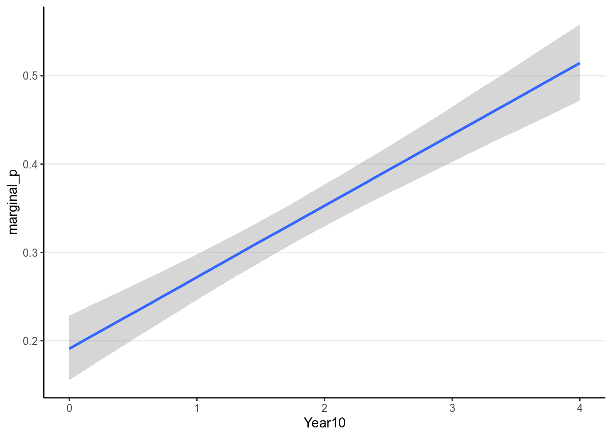
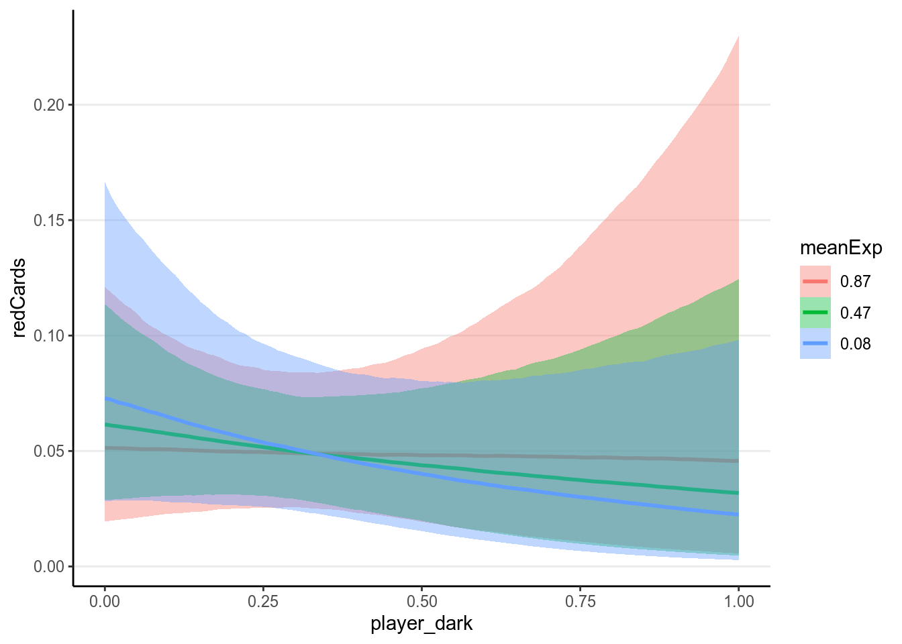
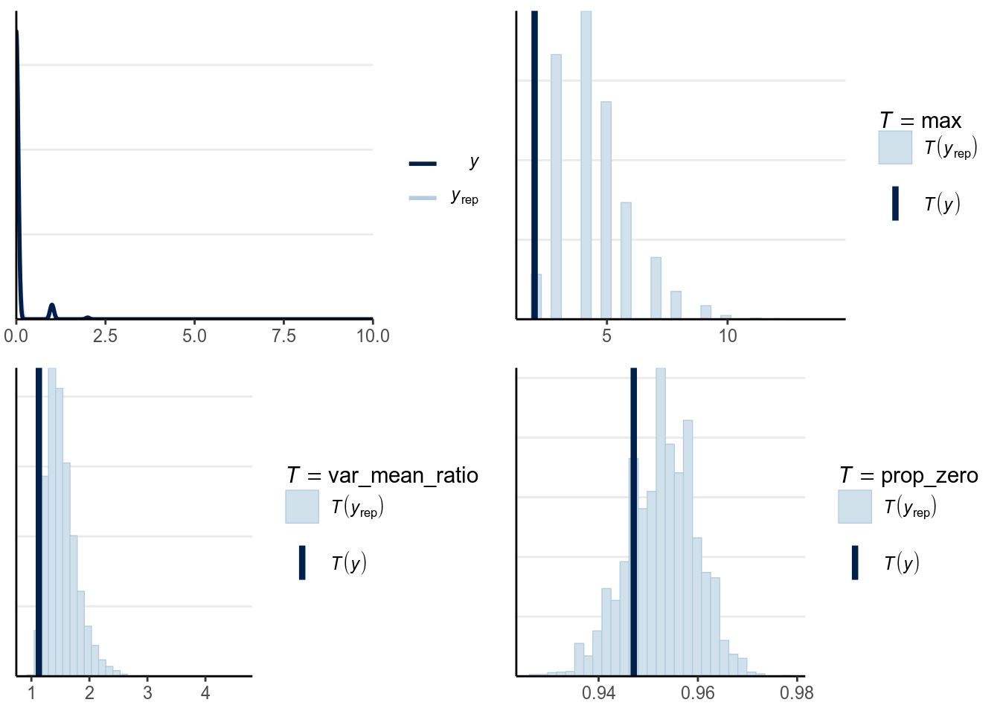

# Generalized Linear Models

GLM (generalized linear model) is a generalization of the linear model (e.g., 
multiple regression) we discussed a few weeks ago. Just to be careful, some 
scholars also use the abbreviation GLM to mean the *general* linear model,
which is actually the same as the linear model we discussed and not the one we
will discuss here. Here we discuss GLM (the generalized one) that is especially 
popular for modeling binary and count outcomes.

Like the linear model, the generalized linear model is concerned about the 
conditional mean of an outcome variable $Y$; the conditional mean is usually
denoted as $\mu$. Indeed, the linear model we have discussed is a special 
case of GLM. To see what's different in other GLMs, let's apply the normal 
regression model to categorical outcomes, and see what problems there are. 

We will use an example from @pritschet2016marginally, which examines how common
it was for researchers to report marginal $p$ values (i.e., .05 < $p$ $\leq$
.10). The outcome is whether a study reported one or more marginal $p$ values
(1 = Yes, 0 = No). The researchers also categorized the studies into three 
subfields (Cognitive Psychology, Developmental Psychology, Social Psychology), 
and there were a total of 1,535 studies examined from 1970 to 2010. 

Let's read in the data and plot the proportions:


```r
# readxl package can be used to import excel files
marginalp <- readxl::read_excel("../data/marginals psych science revision_corrections.xlsx")
# Recode `Field` into a factor
marginalp <- marginalp %>% 
  # Filter out studies without any experiments
  filter(`Number of Experiments` >= 1) %>% 
  mutate(Field = factor(Field, 
                        labels = c("Cognitive Psychology", 
                                   "Developmental Psychology", 
                                   "Social Psychology"))) %>% 
  # Rename the outcome
  rename(marginal_p = `Marginals Yes/No`)
# Proportion of marginal p in each subfield across Years
marginalp %>% 
  ggplot(aes(x = Year, y = marginal_p)) + 
  stat_summary(aes(fill = Field), geom = "ribbon", alpha = 0.3) + 
  stat_summary(aes(col = Field), geom = "line") + 
  stat_summary(aes(col = Field), geom = "point") + 
  coord_cartesian(ylim = c(0, 0.7)) + 
  facet_wrap(~ Field)
```

```
># No summary function supplied, defaulting to `mean_se()`
># No summary function supplied, defaulting to `mean_se()`
># No summary function supplied, defaulting to `mean_se()`
># No summary function supplied, defaulting to `mean_se()`
># No summary function supplied, defaulting to `mean_se()`
># No summary function supplied, defaulting to `mean_se()`
># No summary function supplied, defaulting to `mean_se()`
># No summary function supplied, defaulting to `mean_se()`
># No summary function supplied, defaulting to `mean_se()`
```


The error bar is pretty high for Cognitive Psychology, because only 
5.922% of the articles in 
the data set were from that field. 

We can first try a normal linear model to use `Year` to predict `marginal_p`.
First recode year into 0 to 4 so that every unit corresponds to 10 years, and 
0 means 1970:


```r
marginalp <- marginalp %>% 
  mutate(Year10 = (Year - 1970) / 10)
# Check the recode
distinct(marginalp, Year, Year10)
```

```
># # A tibble: 5 x 2
>#    Year Year10
>#   <dbl>  <dbl>
># 1  1980      1
># 2  1970      0
># 3  2000      3
># 4  1990      2
># 5  2010      4
```

Now fit a normal linear model:


```r
m1_norm <- brm(marginal_p ~ Year10, 
               data = marginalp, 
               prior = c(# for intercept 
                 prior(normal(0, 1), class = "Intercept"), 
                 # for slope
                 prior(normal(0, 1), class = "b"), 
                 # for sigma
                 prior(student_t(4, 0, 1), class = "sigma")), 
               seed = 1340)
```

Now let's check the model. First a posterior predictive check:


```r
pp_check(m1_norm, nsamples = 100)
```

<div class="figure">

<p class="caption">(\#fig:ppc_normal_hist)Posterior predictive graphical check with the normal regression model of Year predicting whether a marginal $p$ value was reported.</p>
</div>

Then the marginal model plot:


```r
mmp_brm(m1_norm, x = "Year10", plot_pi = TRUE, jitter = TRUE, 
        smooth_method = "loess")
```

```
># `geom_smooth()` using formula 'y ~ x'
># `geom_smooth()` using formula 'y ~ x'
># `geom_smooth()` using formula 'y ~ x'
># `geom_smooth()` using formula 'y ~ x'
```

<div class="figure">

<p class="caption">(\#fig:pi_m1)Marginal model plot of the normal regression model of Year predicting whether a marginal $p$ value was reported.</p>
</div>

There are two problems with a normal regression model for a binary outcome.
First, clearly the outcome cannot be normally distributed as it can only take
two values. Second, the predicted regression line is *unbounded*, meaning that
it can go from $-\infty$ to $\infty$. It is probably not a problem for this
example, as the fitted line is not too way off from the non-parametric smoother,
and the predicted mean is still positive. However, it is easy to imagine
situations where the predicted mean is smaller than 0 or greater than 1, which
is clearly undesirable and leads to insensible predictions.

## Basics of Generalized Linear Models

Now, consider how we can fix the two problems previously identified concerning 
fitting a normal regression model to a binary outcome. First, we want to allow 
for the possibility of conditional distributions other than normal for $Y$.
As you recall, for binary outcome we may consider the Bernoulli distribution. 
Second, we want to model $\mu$ as a non-linear function of the predictors,
as modeling $\mu$ as a linear function of the predictors will imply that $\mu$
can go from $-\infty$ to $\infty$, which does not work for categorical outcomes.

Note, however, even when the outcome can only take two values, 0 and 1, the mean
across multiple observations can be a fraction. In a Bernoulli model, $\mu$ is
the probability of getting a "1". Similar discrepancy (i.e., mean can be
continuous even though the outcome is discrete) is also present in some other
GLMs.

Under the GLM framework, we have models in the form
\begin{align*}
  Y_i & \sim \mathrm{Dist}(\mu_i, \tau)  \\
  g(\mu_i) & = \eta_i \\
  \eta_i & = \beta_0 + \beta_1 X_{1i} + \beta_2 X_{2i} + \ldots
\end{align*}
where one can choose distributions like Dist = Normal, Poisson, Binomial,
Bernoulli, etc. Strictly speaking, GLM requires distributions that are in the
*exponential family*, which will not include distributions like the $t$
distribution. However, this is relatively minor detail as the exponential family
is broad and subsumes most of the commonly used models. The distributions will
have a mean parameter $\mu_i$ and may have a dispersion parameter, $\tau$.

An intermediate step in GLM is to transform $\mu_i$ to $\eta_i$. $\eta_i$ 
is called the *linear predictor*, which is the linear function of the 
predictors. In linear models we directly models the conditional mean, $\mu_i$ as
the same as $\eta_i$. However, to allow for the possibility of $\mu_i$ being a 
non-linear function of the predictors, in GLM we transform $\mu_i$ by applying a
*link function*, $g(\cdot)$, so that, even though we $\eta_i$ to be linear in 
the coefficients, $\mu_i = g^{-1}(\eta_i)$ will be a non-linear function of the 
coefficients as long as the link function is not linear. This step is
needed to make sure that the predicted values will not be out of range.

## Binary Logistic Regression

To make things more concrete, consider a binary logistic regression example for
our example of predicting marginal $p$ being reported using Year of publication.
First, we need a model equation of the conditional mean of $Y$, which will be
$$\texttt{marginal_p}_i \sim \mathrm{Bernoulli}(\mu_i).$$

As you should know, the mean of a Bernoulli distribution is also the 
probability of a "success" (e.g., if one flips a coin 100 times, and gets 
50 heads, the mean of the data is 50 / 100 = 0.5, which is also the probability
of getting a head). 

### The logit link

With `Year10` being the predictor, we have a linear equation $\eta_i = \beta_0 +
\beta_1 \texttt{Year10}_i$. Now, we will need to specify the link function to
map $\mu_i$ to $\eta_i$. There are many possible choices, but for binary
outcomes a common choice is the *logit link*, meaning $\eta_i = g(\mu_i) =
\logit(\mu_i) = \log [\mu_i / (1 - \mu_i)]$. The logit link convert
probabilities to log odds. You can see the logit link in the left figure below:


```r
p1 <- ggplot(data.frame(x = c(0, 1)), aes(x)) + 
  stat_function(fun = qlogis, n = 501) + 
  xlab(expression(mu)) + ylab(expression(eta))
p2 <- ggplot(data.frame(x = c(-6, 6)), aes(x)) + 
  stat_function(fun = plogis, n = 501) + 
  ylab(expression(mu)) + xlab(expression(eta))
grid.arrange(p1, p2, nrow = 1)
```

<div class="figure">

<p class="caption">(\#fig:logit_link)(Left) Logit link of $\eta = \logit(\mu)$; (Right) inverse logit link of $\mu = \logit^{-1}(\eta)$.</p>
</div>

For example, when $\mu = .50$, $\eta = 0$; when $\mu = 0.9$, $\eta = 
2.197$. Therefore, even when the predicted value for $\eta$ is very
large or small, one can always ensure that $\mu$ is between 0 and 1. 

The right hand side shows the same relationship, but with $\eta$ in the x-axis 
and $\mu$ in the y-axis, so that we are plotting $\mu_i = g^{-1}(\eta_i)$. 
$g^{-1}(\cdot)$ is called the *inverse link function*. For a logit link, the
inverse link function is called the standard *logistic* function, and thus the
name logistic regression. The logistic function is defined as
$$ \mu_i = g^{-1}(\eta_i) = \frac{\exp(\eta_i)}{1 + \exp(\eta_i)}. $$
Generally, people either present the model using the link function or the 
inverse link function. For our example I can also write
\begin{align*}
  \texttt{marginal_p}_i & \sim \mathrm{Bernoulli}(\mu_i)  \\
  \mu_i & = \mathrm{logistic}(\beta_0 + \beta_1 \texttt{Year10}_i).
\end{align*}

### Choice of Priors

There has been previous literature on what choices of prior on the $\beta$
coefficients for logistic regressions would be appropriate [see
@gelman2008weakly]. $\beta$ coefficients in logistic regression can be
relatively large, unlike in normal regression. Therefore, it's pointed out that
a heavy tail distribution, like Cauchy and $t$, would be more appropriate.
Recent discussions have settled on priors such as $t$ distributions with a small
degrees of freedom as a good balance between heavy tails and efficiency for MCMC
sampling, so I will use $t(4, 0, .875)$, where .875 is chosen to be the 1.25
divided by the standard deviation of the predictor, for the priors for logistic
regression.

To run this model, we can specify the `family` argument in `stan_glm`:


```r
m1_bern <- brm(marginal_p ~ Year10, 
               data = marginalp, 
               family = bernoulli(link = "logit"), 
               prior = prior(student_t(4, 0, .875), class = "b"), 
               # Note: no sigma 
               seed = 1340)
```


```r
plot(m1_bern)
```


Note that in `brms` we used `family = bernoulli()`. In other R functions, such
as `glm`, they do not distinguish between bernoulli and Binomial and only
recognize `family = binomial()`, as a Bernoulli variable is a binomial variable
with $n = 1$.

### Interpreting the coefficients

Any non-linear relationships will involve more work in interpretations, and 
the coefficients in logistic regressions are no exceptions.

#### Intercept

From the equation, when all predictors are zero, we have
$$\logit(\mu_i) = \beta_0.$$
Therefore, the intercept is the log odds that a study reported a marginally
significant $p$ value when `Year10` = 0 (i.e, in 1970), which was estimated to
be -1.348 , 95% CI [-1.552, -1.150]. As log odds are not as
intuitive as probability, it is common to instead interpret $\hat{\mu} =
\logistic(\beta_0)$, which is the conditional probability of being `marginal_p`
= 1 in 1970. For Bayesian, that means obtaining the posterior distribution of
$\logistic(\beta_0)$, which can be done by


```r
draws_beta0 <- as.matrix(m1_bern, pars = "b_Intercept")
logistic_beta0 <- plogis(draws_beta0)
# Summarize the posterior distribution
psych::describe(logistic_beta0)
```

```
>#    vars    n mean   sd median trimmed  mad  min  max range skew kurtosis se
># X1    1 4000 0.21 0.02   0.21    0.21 0.02 0.15 0.27  0.12 0.13        0  0
```

The `bayesplot` package allow you to plot transformed parameters quickly:


```r
mcmc_areas(m1_bern, pars = "b_Intercept", 
           transformations = list("b_Intercept" = "plogis"), bw = "SJ")
```

```
># Warning: `expand_scale()` is deprecated; use `expansion()` instead.
```


A simpler but not precise method is to directly obtain an estimate of 
$\logistic(\beta_0)$ as $\logistic(-1.348) = 
0.206$ by directly transforming the posterior
mean and the credible interval of $\beta_0$. This usually is okay for large 
sample sizes and probability close to 0.5, but can give big discrepancies 
otherwise. Generally I recommend directly obtaining the posterior distribution 
of $\logistic(\beta_0)$ instead. 

Below illustrates the discrepancy: 


```r
# Directly from the posterior of logistic(beta0):
quantile(logistic_beta0, probs = c(.05, .95))
```

```
>#    5%   95% 
># 0.180 0.235
```

```r
# Transform the credible interval limits of beta0:
plogis(posterior_interval(m1_bern, pars = "Intercept"))
```

```
>#              2.5% 97.5%
># b_Intercept 0.175  0.24
```

#### Interpreting $\exp(\beta_1)$ As Odds Ratio

The slope, $\beta_1$, represents the difference in the predicted log odds 
between two observations with 1 unit difference in the predictor of interest, 
while having matching values on all other predictors. For example, for 
two individuals with 1 unit difference in `Year10` (i.e., 10 years), we have
$$\logit(\mu_{\textrm{marginal_p} = 1}) - 
  \logit(\mu_{\textrm{marginal_p} = 0}) = \beta_1.$$
  
Again, difference in log odds are hard to interpret, and so we will exponentiate
to get

$$\frac{\mathrm{odds}_{\textrm{marginal_p} = 1}}
       {\mathrm{odds}_{\textrm{marginal_p} = 0}} = \exp(\beta_1).$$
       
The fraction on the left hand side is the *odds ratio* of reporting a marginal
$p$ value associated with a one unit difference in `Year10` (i.e., 10 years). An
odds of 1.0 means that the probability of success and failure is equal; an odds
$> 1$ means success is more likely than failures; and an odds $< 1$ means
success is less likely than failures. Again, for Bayesian, we need to obtain the
posterior distribution of $\exp(\beta_1)$ by


```r
draws_beta1 <- as.matrix(m1_bern, pars = "b_Year10")
exp_beta1 <- exp(draws_beta1)
# Summarize the posterior distribution
psych::describe(exp_beta1)
```

```
>#    vars    n mean   sd median trimmed  mad  min  max range skew kurtosis se
># X1    1 4000 1.43 0.06   1.43    1.43 0.06 1.21 1.63  0.41  0.1    -0.03  0
```

Using the posterior mean, we predict that the odds of reporting a marginal $p$
value for a study that is 10 years later is multiplied by 
1.428 times. 

And we can again compute a 90% credible interval by:


```r
# Directly from the posterior of exp(beta):
quantile(exp_beta1, probs = c(.05, .95))
```

```
>#   5%  95% 
># 1.34 1.53
```

```r
# Or you can exponentiate the credible interval of beta:
exp(posterior_interval(m1_bern, pars = "Year10"))
```

```
>#          2.5% 97.5%
># b_Year10 1.32  1.54
```

Odds ratio (OR) is popular as the multiplicative effect is constant, thus making
interpretations easier. Also, in medical research and some other research areas,
OR can be an excellent approximation of the relative risk, which is the
probability ratio of two groups, of some rare disease or events. However, odds
and odds ratio are never intuitive metrics for people, and in many situations a
large odds ratio may be misleading as it corresponds to a very small effect.
Therefore, in general I would recommend you to interpret coefficients in
probability unit, even though that means more work.

#### Interpreting Coefficients in Probability Units

Another way to interpret the results of logistic regression that requires more
work but is more intuitive is to examine the change in probability. Because the
predicted probability is a non-linear function of the predictors, a one unit
difference in the predictor has different meanings depending on the values on
$X$ you chose for interpretations. Take a look on the predicted values based on
our model below:


```r
mmp_brm(m1_bern, x = "Year10", plot_pi = FALSE, jitter = TRUE, smooth_method = "loess")
```

```
># `geom_smooth()` using formula 'y ~ x'
># `geom_smooth()` using formula 'y ~ x'
```

<div class="figure">

<p class="caption">(\#fig:pi_m1_bern)Marginal model plot of the binary logistic regression model of Year predicting whether a marginal $p$ value was reported.</p>
</div>

Now, consider the change in the predicted probability of reporting a marginal
$p$ value with `Year10` = 0 (1970) and `Year10` = 1 (1980) respectively:

- When `Year10` = 0, $P$(`marginal_p` = 1) = $\logistic(\beta_0)$, 
posterior mean = 0.207.
- When `Year10` = 1, $P$(`marginal_p` = 1) = $\logistic(\beta_0 + \beta_1)$, 
posterior mean = 0.271.

So between 1970 to 1980, 10 years of time is associated with an increase in the
predicted probability of reporting marginal $p$ by
0.064.

On the other hand, if we look at the change in predicted probability for
`Year10` = $3$ and `Year10` = $4$,

- When `Year10` = $3$, $P$(`marginal_p` = 1) = $logistic(\beta_0 + 3 \beta_1)$,
posterior mean = 0.43.
+ When `Year10` = $4$, $P$(`marginal_p` = 1) = $\logistic(\beta_0 + 4 \beta_1)$,
posterior mean = 0.518.

So for higher values of \texttt{Year10}, one unit increase in `Year10` is 
associated with an increase in the predicted probability of reporting marginal
$p$ by 
0.088.

##### The "divide by 4 rule"

A quick approximation is to divide the coefficient by 4 to get an upper bound
on the change in probability associated with a one unit change in the
predictor. In our example, this corresponds to 0.356 / 4 = 
0.089, which is very close to the predicted increase in 
probability from `Year10` = 3 to `Year10` = 4 (i.e., 
0.088.

#### Model Comparison

##### Identity Link

Although logistic regression is popular, it is generally hard to interpret. 
Also, the logit link is not the only link function that is available. There is 
also the probit link which is commonly used in some areas, which works mostly
similar to the logit link. Another possibility is to use the *identity link*, 
which just means that
$$\eta_i = g(\mu_i) = \mu_i,$$
so that the probability is directly a linear function of the predictor(s). This
will be problematic because it may lead to out of bound probabilities, but when
the probabilities are mostly within 20% to 80%, it is generally a pretty good 
approximation. The nice thing is it gives direct interpretation on probability
unit. Without going into details of the priors, below is how it's fitted:


```r
m1_bern_id <- brm(marginal_p ~ Year10, 
                  data = marginalp, 
                  family = bernoulli(link = "identity"), 
                  prior = c(prior(normal(0, 0.5), class = "b", 
                                  lb = -1, ub = 1), 
                            prior(uniform(0, 1), class = "Intercept")), 
                  # Note: no sigma 
                  seed = 1340)
```


```r
loo(m1_bern, m1_bern_id)
```

```
># Output of model 'm1_bern':
># 
># Computed from 4000 by 1469 log-likelihood matrix
># 
>#          Estimate   SE
># elpd_loo   -910.0 13.8
># p_loo         2.0  0.1
># looic      1820.1 27.6
># ------
># Monte Carlo SE of elpd_loo is 0.0.
># 
># All Pareto k estimates are good (k < 0.5).
># See help('pareto-k-diagnostic') for details.
># 
># Output of model 'm1_bern_id':
># 
># Computed from 4000 by 1469 log-likelihood matrix
># 
>#          Estimate   SE
># elpd_loo   -908.1 14.1
># p_loo         2.0  0.1
># looic      1816.3 28.2
># ------
># Monte Carlo SE of elpd_loo is 0.0.
># 
># All Pareto k estimates are good (k < 0.5).
># See help('pareto-k-diagnostic') for details.
># 
># Model comparisons:
>#            elpd_diff se_diff
># m1_bern_id  0.0       0.0   
># m1_bern    -1.9       0.7
```

As you can see, the identity link actually fits better. The model estimates are


```r
summary(m1_bern_id)
```

```
>#  Family: bernoulli 
>#   Links: mu = identity 
># Formula: marginal_p ~ Year10 
>#    Data: marginalp (Number of observations: 1469) 
># Samples: 4 chains, each with iter = 2000; warmup = 1000; thin = 1;
>#          total post-warmup samples = 4000
># 
># Population-Level Effects: 
>#           Estimate Est.Error l-95% CI u-95% CI Rhat Bulk_ESS Tail_ESS
># Intercept     0.19      0.02     0.16     0.23 1.00     4013     2924
># Year10        0.08      0.01     0.06     0.10 1.00     2917     2479
># 
># Samples were drawn using sampling(NUTS). For each parameter, Bulk_ESS
># and Tail_ESS are effective sample size measures, and Rhat is the potential
># scale reduction factor on split chains (at convergence, Rhat = 1).
```

So it suggested that every 10 years, the proportion of studies reporting 
marginal $p$ values increases by 8.078%. If this model 
fits close to or better than the logistic model, it may be useful for 
interepretation as opposed to odds ratio or non-linear effects. 

Here is the model implied relationship:


```r
mmp_brm(m1_bern_id, x = "Year10", plot_pi = FALSE, jitter = TRUE, smooth_method = "loess")
```

```
># `geom_smooth()` using formula 'y ~ x'
># `geom_smooth()` using formula 'y ~ x'
```

<div class="figure">

<p class="caption">(\#fig:pi_m1_id)Marginal model plot of the Bernoulli regression model with identity link of Year predicting whether a marginal $p$ value was reported.</p>
</div>

Also using marginal effects in `brms`:


```r
marginal_effects(m1_bern_id)
```

```
># Warning: Method 'marginal_effects' is deprecated. Please use
># 'conditional_effects' instead.
```



It should be pointed out that, whereas you can compare Bernoulli models with
different link functions, you CANNOT compare the normal model with the logistic
model using AIC/WAIC/LOO-IC. Even though they use the same outcome, they treat
the outcome variables differently: a normal model treats it as an unbounded
continous variable, whereas logistic model treats it a binary discrete variable.
In mathematical term, they have densitites with respect to different dominating
measures. Generally, you cannot use ICs to compare models with respect to
different families, except for some special cases.

### Model Checking

The assumptions of GLM is similar to the normal GLM, with correct 
specification (of the predictors and $\eta$), linearity (on the $\eta$ 
scale), independence, and correct specification of the distribution of the 
outcome. For normal GLM, the last one involves equal error variance, which
is not needed for logistic regression, because error variance is not a parameter
for the Bernoulli distribution. Instead, logistic regression assumes constant 
probability ($\mu$) given the same predictor values.

To check for the correct specification and linearity assumptions, one can
look at the marginal model plots above.

For logistic regression, there are a few specific diagnostics one should 
examine. The following shows three binned residual plots, with each point
showing $\tilde y - y$, where $\tilde y$ is based on simulated data from the 
posterior predictive distributions, and $y$ is the observed data. Note that we 
need the binned residuals or predictive errors, as the prediction error is 
either 0 or 1, as shown in the Figure below.


```r
pp_check(m1_bern_id, type = "error_binned", nsamples = 9)
```

<div class="figure">

<p class="caption">(\#fig:ppc_m1_bern_id)Binned residual plots in replicated data of $\tilde y - y$.</p>
</div>

In the above, the binned margins were based on the observed data, whereas the 
dots were predictive errors from replicated data. As can be seen, with the 
replicated data, it generally had an underestimate of the proportions in Year
2000 but an oeverestimate of the proportions in Year 2010. It might be 
reasonable to consider non-linear models of including Year. 

#### Classification Error

Another way to evaluate a logistic regression model is to look at classification
error, which is analogous to $R^2$ for normal regression. (Note: there are also
other pseudo $R^2$ measures that can be computed with Bayesian logistic
regression, which I will leave for your own study on other sources.) The
simplest measure is to assign observations with predicted probabilities larger
than $\pi_0$ to have a value of 1, and to assign observations with predicted
probabilities smaller than $\pi_0$ to have a value of 0, where $\pi_0$ is some
chosen cutoff, and is usually chosen as the proportion of 1s in the sample. For
example, for our model,


```r
m1_pred <- predict(m1_bern_id, type = "response")[ , "Estimate"]
m1_pred <- as.numeric(m1_pred > mean(marginalp$marginal_p))
# Classification table
(classtab_m1 <- table(predicted = m1_pred, observed = marginalp$marginal_p))
```

```
>#          observed
># predicted   0   1
>#         0 522 157
>#         1 436 354
```

```r
# Average classification accuracy
(acc_m1 <- sum(diag(classtab_m1)) / sum(classtab_m1))
```

```
># [1] 0.596
```

```r
# so the classification is not particularly impressive.
```

So from a $2 \times 2$ contingency table, the prediction is correct when the 
predicted and the observed values are the same (i.e., the two cells in 
the diagonal), and the prediction is incorrect otherwise. In this example, the
classification accuracy is 59.632%.
We can consider adding more predictors and re-evaluate the classification error
again:


```r
# We can add more predictors (interaction with Field), and use a hierarchical 
# model:
m2_bern <- brm(marginal_p ~ (1 | Field) + (1 | Year10), 
               data = marginalp, 
               family = bernoulli(link = "logit"), 
               # Just default priors for quickness
               control = list(adapt_delta = .995, max_treedepth = 12), 
               seed = 1340)
```


```r
m2_pred <- predict(m2_bern, type = "response")[ , "Estimate"]
m2_pred <- as.numeric(m2_pred > mean(marginalp$marginal_p))
# Classification table
(classtab_m2 <- table(predicted = m2_pred, observed = marginalp$marginal_p))
```

```
>#          observed
># predicted   0   1
>#         0 603 177
>#         1 355 334
```

```r
# Average classification accuracy
(acc_m2 <- sum(diag(classtab_m2)) / sum(classtab_m2))
```

```
># [1] 0.638
```

Note that unlike information criteria, as the classification error is evaluated
on the same sample, you should not be choosing models based on which model has
the smallest classification error, as that would generally choose the most 
complex one that is most prone to overfitting (just like using $R^2$ to choose
models in normal regression). One should use information criteria to compare
models instead:


```r
# Classification now improves; however, one should be interested in 
# out-of-sample prediction. Let's check the LOO-IC too:
loo(m2_bern)
```

```
># 
># Computed from 4000 by 1469 log-likelihood matrix
># 
>#          Estimate   SE
># elpd_loo   -885.8 15.1
># p_loo         7.1  0.2
># looic      1771.7 30.3
># ------
># Monte Carlo SE of elpd_loo is 0.0.
># 
># All Pareto k estimates are good (k < 0.5).
># See help('pareto-k-diagnostic') for details.
```

```r
# So adding predictors helps
```

Finally, one can consider varying the cutoff $\pi_0$, and plots the true
positive and true negative rates to obtain an ROC curve. This is beyond the
scope of this note, but see, for example,
https://www.r-bloggers.com/roc-curves-in-two-lines-of-r-code/. Below I will 
show you the code for getting the ROC curve:


```r
# Using the pROC package
pROC::roc(response = marginalp$marginal_p, 
          predictor = predict(m2_bern, type = "response")[ , "Estimate"], 
          plot = TRUE, print.auc = TRUE)
```

```
># Setting levels: control = 0, case = 1
```

```
># Setting direction: controls < cases
```


```
># 
># Call:
># roc.default(response = marginalp$marginal_p, predictor = predict(m2_bern,     type = "response")[, "Estimate"], plot = TRUE, print.auc = TRUE)
># 
># Data: predict(m2_bern, type = "response")[, "Estimate"] in 958 controls (marginalp$marginal_p 0) < 511 cases (marginalp$marginal_p 1).
># Area under the curve: 0.683
```

### Complete Separation

Another issue in logistic regression is separation, i.e., when all cases with $y
= 1$ have certain $X$ values that do not overlap with those $X$ values when $y =
0$. In the following example, when $X_1 \geq 4$ or when $X_1 = 3$ and $X_2 = 1$,
all of the $Y$ values are 1. If you run frequentist logistic regression, you
will get warning messages with crazy coefficients and extremely large standard
errors:


```r
sep_dat <- tibble(y = c(0, 0, 0, 0, 1, 1, 1, 1, 1, 1), 
                  x1 = c(1, 2, 3, 3, 3, 4, 5, 6, 10, 11), 
                  x2 = c(3, 0, -1, 4, 1, 0, 2, 7, 3, 4))
# Scale the predictors to SD 1
sep_dat <- sep_dat %>% 
  mutate_at(vars(x1, x2),  ~ . / sd(.))
m_freq <- glm(y ~ x1 + x2, data = sep_dat, family = binomial)
```

```
># Warning: glm.fit: fitted probabilities numerically 0 or 1 occurred
```


```r
summary(m_freq)
```

```
># 
># Call:
># glm(formula = y ~ x1 + x2, family = binomial, data = sep_dat)
># 
># Deviance Residuals: 
>#     Min       1Q   Median       3Q      Max  
># -1.0042  -0.0001   0.0000   0.0000   1.4689  
># 
># Coefficients:
>#             Estimate Std. Error z value Pr(>|z|)
># (Intercept)   -58.08   17511.90     0.0     1.00
># x1             63.80   19418.72     0.0     1.00
># x2             -0.29       1.47    -0.2     0.84
># 
># (Dispersion parameter for binomial family taken to be 1)
># 
>#     Null deviance: 13.4602  on 9  degrees of freedom
># Residual deviance:  3.7792  on 7  degrees of freedom
># AIC: 9.779
># 
># Number of Fisher Scoring iterations: 21
```

On the other hand, use of priors, even relatively weak priors, can *regularize*
the coefficients so that they are more sensible. See the results below, and note
the more reasonable coefficients with smaller posterior standard deviations:


```r
# Weakly informative priors can help in Bayesian
m_bayes <- brm(y ~ x1 + x2, data = sep_dat, 
               family = bernoulli, 
               prior = prior(student_t(4, 0, 1.25), class = "b"), 
               seed = 1340)
```

```
># Compiling the C++ model
```

```
># Start sampling
```


```r
m_bayes
```

```
>#  Family: bernoulli 
>#   Links: mu = logit 
># Formula: y ~ x1 + x2 
>#    Data: sep_dat (Number of observations: 10) 
># Samples: 4 chains, each with iter = 2000; warmup = 1000; thin = 1;
>#          total post-warmup samples = 4000
># 
># Population-Level Effects: 
>#           Estimate Est.Error l-95% CI u-95% CI Rhat Bulk_ESS Tail_ESS
># Intercept    -3.00      2.27    -8.67     0.49 1.00     2053     1491
># x1            2.94      2.11     0.21     8.28 1.00     1701     1254
># x2            0.15      0.79    -1.34     1.77 1.00     2033     1996
># 
># Samples were drawn using sampling(NUTS). For each parameter, Bulk_ESS
># and Tail_ESS are effective sample size measures, and Rhat is the potential
># scale reduction factor on split chains (at convergence, Rhat = 1).
```

## Binomial Logistic Regression

In binary logistic regression, the outcome for each observation is either 0 or
1. However, if your predictors are discrete so that there are multiple
observations with each predictor value, then an equivalent but more concise way
of analyzing the data is to do *binomial logistic regression*. For example,
consider using `Year10` as a predictor for `marginal_p`. If we keep the original
data, we have the binary logistic model:

\begin{align*}
  \texttt{marginal_p}_i & \sim \mathrm{Bernoulli}(\mu_i)  \\
  \mu_i & = \mathrm{logistic}(\beta_0 + \beta_1 \texttt{Year10}_i).
\end{align*}

However, sometimes the data may come in the form:


```r
marginalp_agg <- 
  summarise(group_by(marginalp, Year10), 
            marginal_p = sum(marginal_p), n = n())
head(marginalp_agg)
```

```
># # A tibble: 5 x 3
>#   Year10 marginal_p     n
>#    <dbl>      <dbl> <int>
># 1      0         56   321
># 2      1         76   304
># 3      2        129   318
># 4      3        120   229
># 5      4        130   297
```

The above data set is grouped. So instead of writing out each observation, 
one actually only has the possible values of each predictor with the 
corresponding counts of "successes." Such form of data is not uncommon, and you 
may check out built-in data sets like `UCBAdmissions` for more examples. 

With data in this form, the outcome is no longer 0 or 1, but instead counts 
with a maximum of $n_j$, where $j$ is the index for the group. Therefore, we 
will be using a binomial distribution for the outcome, instead of Bernoulli:

\begin{align*}
  \texttt{marginal_p}_j & \sim \mathrm{Bin}(n_j, \mu_j)  \\
  \mu_j & = \mathrm{logistic}(\beta_0 + \beta_1 \texttt{Year10}_j).
\end{align*}


```r
m1_bin <- brm(marginal_p | trials(n) ~ Year10, 
              data = marginalp_agg, 
              family = binomial(link = "logit"), 
              prior = prior(student_t(4, 0, .875), class = "b"), 
              # Note: no sigma 
              seed = 1340)
```

The results are essentially the same, as in this case the binomial and the
Bernoulli model are the same model. And we can look at the good at the
goodness-of-fit by comparing the predicted and observed counts in groups. Now,
because there are multiple observations for each level of \texttt{Year10}, we
can naturally use the five \texttt{Year10} groups:


```r
pp_check(m1_bin, type = "intervals")
```

```
># Using all posterior samples for ppc type 'intervals' by default.
```

<div class="figure">

<p class="caption">(\#fig:ppc-m1_bin)Posterior predictive check using the predicted and observed counts.</p>
</div>

As can be seen, the fit wasn't particularly good in this case. 

## Probit Regression

Just note that the logit link is not the only choice for binary/binomial data.
You've seen the identity link: $g(\mu) = \mu$. Another popular choice is $g(\mu)
= \Phi^{-1}(\mu)$, where $\Phi^{-1}(\cdot)$ is the normal quantile function (or
inverse cumulative density function,which can be obtained with `qnorm` in R).
You can simply change the link to `family = binomial(link = "probit")` in R.
Practically, using the logit link or the probit gives basically identical
results, so it's a matter of ease of interpretations and conventions between the
two.

Note that because of the use of different link functions, the coefficients will
be on different scales that differ by a factor of approximately 1.7. You are
encouraged to try out the probit link yourself.

## Poisson Regression

The Poisson GLM is used to model count outcomes. Count outcomes are
non-negative discrete integers. Remember in GLM, we're modeling the mean of the
outcome, $\mu$. Therefore, we need to make sure $\mu$ is non-negative, so we
need a link function that can map $\eta$ from the whole real line to
non-negative numbers; by far the most commonly used link function is the
logarithmic transformation, $g(\mu) = \log(\mu)$ (what's the inverse
link function?):


```r
ggplot(data.frame(x = c(0, 100)), aes(x)) + 
  stat_function(fun = log, n = 501) + 
  xlab(expression(mu)) + ylab(expression(eta))
```

<div class="figure">

<p class="caption">(\#fig:log_link)Link of $\eta = \log(\mu)$.</p>
</div>


```r
redcard_dat <- readr::read_csv("../data/redcard_data.zip")
```

Let's use the example you've seen on studying the distribution of number of 
red cards, which we first learned the Poisson distribution. Here, however, we're
interested in what predicts the number of red cards a referee will give. In the 
data, there are 3147 referees. 

We are interested in whether referees give more or less red cards depending on
the skin color of the players, and whether the referee's country of origin makes
a difference. We aggregated the data to the referee level, with two predictor
variables: `player_dark`, which is the average skin rating of the players that
the referee had in the data (0 = very light skin to 1 = very dark skin), and
`meanExp`, the mean explicit bias score (using a racial thermometer task) for
referee country.


```r
redcard_ref <- redcard_dat %>% 
  group_by(refNum) %>% 
  summarise(redCards = sum(redCards), 
            player_dark = (weighted.mean(rater1, games) + 
                             weighted.mean(rater2, games)) / 2, 
            refCountry = refCountry[1], 
            meanExp = meanExp[1], 
            games = sum(games))
```

First check the distribution of the counts:


```r
ggplot(redcard_ref, aes(x = redCards)) + 
  geom_bar()
```


You can see a lot of zeros. Below are the scatterplots against the predictors:


```r
ggplot(redcard_ref, aes(x = player_dark, y = redCards)) + 
  geom_jitter(width = 0.05, height = 0.5, alpha = 0.1) + 
  geom_smooth()
```

```
># `geom_smooth()` using method = 'gam' and formula 'y ~ s(x, bs = "cs")'
```

```
># Warning: Removed 1855 rows containing non-finite values (stat_smooth).
```

```
># Warning: Removed 1855 rows containing missing values (geom_point).
```


```r
ggplot(redcard_ref, aes(x = meanExp, y = redCards)) + 
  geom_jitter(width = 0.05, height = 0.5, alpha = 0.1) + 
  geom_smooth()
```

```
># `geom_smooth()` using method = 'gam' and formula 'y ~ s(x, bs = "cs")'
```

```
># Warning: Removed 11 rows containing non-finite values (stat_smooth).
```

```
># Warning: Removed 11 rows containing missing values (geom_point).
```


It doesn't appear that there are strong relationships. Let's fit a Poisson 
model.

First, because the referees are nested within countries, we need to account for
that clustering. Second, the number of red cards depends on how many games a 
referee has called, so we need to adjust for that by including an *offset* term.
The following is the equation of the Poisson model:
\begin{align*}
  \texttt{redCards}_{ij} & \sim \mathrm{Pois}(\mu_{ij})  \\
  \log(\mu_{ij}) & = \log(\texttt{games}_{ij}) + \beta_{0j} + \beta_{1j} \texttt{player_dark}_{ij} \\
  \begin{bmatrix}
    \beta_{0j} \\
    \beta_{1j} \\
  \end{bmatrix} & \sim \mathcal{N}_2\left(
  \begin{bmatrix} 
    \mu^{[\beta_0]}_j \\
    \mu^{[\beta_1]}_j \\
  \end{bmatrix}, \bv T
  \right)  \\
  \bv T & = \diag(\bv \tau) \bv \Omega \diag(\bv \tau) \\
  \mu^{[\beta_0]}_j & = \gamma_{00} + \gamma_{01} \texttt{meanIAT}_j \\
  \mu^{[\beta_1]}_j & = \gamma_{10} + \gamma_{11} \texttt{meanIAT}_j
\end{align*}
And I will use these priors:
\begin{align*}
  \gamma_{00} & \sim t^+(4, 0, 5) \\
  \gamma_{10} & \sim t^+(4, 0, 2.5) \\
  \gamma_{01} & \sim t^(4, 0, 2.5) \\
  \gamma_{11} & \sim t^(4, 0, 2.5) \\
  \tau^{[\beta_m]} & \sim \mathrm{Gamma}(2, 0.2), \; m = 0, 1 \\
  \bv \Omega & \sim \mathrm{LKJ}(1)
\end{align*}


```r
m4 <- brm(redCards ~ player_dark * meanExp + offset(log(games)) + 
            (player_dark | refCountry), 
          family = poisson(), 
          data = redcard_ref, 
          prior = c(# for intercept
            prior(student_t(4, 0, 5), class = "Intercept"),
            # for slope
            prior(student_t(4, 0, 2.5), class = "b"),
            # for tau_beta0
            prior(gamma(2, 0.2), class = "sd", group = "refCountry"),
            # for correlation
            prior(lkj(1), class = "cor")), 
          cores = 2L, 
          control = list(adapt_delta = .95), 
          seed = 1340)
```

```
># Warning: Rows containing NAs were excluded from the model.
```

The coefficients were shown in the graph below:


```r
stanplot(m4, type = "areas", bw = "SJ")
```

```
># Warning: Method 'stanplot' is deprecated. Please use 'mcmc_plot' instead.
```

```
># Warning: `expand_scale()` is deprecated; use `expansion()` instead.
```


### Interpretations

Because of the nonlinear link function, one needs to be careful in interpreting
the coefficients. Consider if there is only one predictor, we have 
$\log(\mu) = \beta_0 + \beta_1 X_1 \Rightarrow \mu = \exp(\beta_0) 
\exp(\beta_1 X_1)$, so every unit increase in $X_1$ is associated with the 
predicted mean counts being **multiplied** by $\exp(\beta_1)$ times. 

With the interaction the results are even harder to directly interpret. 
Therefore it is best to plot the associations based on the model:


```r
plot(marginal_effects(m4), ask = FALSE)
```

```
># Warning: Method 'marginal_effects' is deprecated. Please use
># 'conditional_effects' instead.
```



As can be seen, there are a lot of uncertainty in the associations, and there
was not much evidence for a positive association between `player_dark` and 
number of red cards, even though the association was trending more to the 
positive side for referees coming from a country with higher explicit bias 
score.

### Model Checking

One should look at the posterior predictive graphical check, marginal model 
plots, proportion of zeros, maximum values, and the standardized residuals 
against the fitted values. From the plots below, it is obvious that the Poisson
model does not fit the data, as the variability of the data is much larger
than what can be predicted by the Poisson model, with excessive zeros. The 
predictive intervals failed to cover a large number of data. 


```r
ppc_dens_pois <- pp_check(m4)
```

```
># Using 10 posterior samples for ppc type 'dens_overlay' by default.
```

```r
ppc_max_pois <- pp_check(m4, type = "stat", stat = "max")
```

```
># Using all posterior samples for ppc type 'stat' by default.
```

```r
var_mean_ratio <- function(y) var(y) / mean(y)
ppc_vm_ratio_pois <- pp_check(m4, type = "stat", 
                              stat = "var_mean_ratio")
```

```
># Using all posterior samples for ppc type 'stat' by default.
```

```r
prop_zero <- function(y) mean(y == 0)
ppc_pzero_pois <- pp_check(m4, type = "stat", stat = "prop_zero")
```

```
># Using all posterior samples for ppc type 'stat' by default.
```

```r
grid.arrange(ppc_dens_pois, ppc_max_pois, ppc_vm_ratio_pois, ppc_pzero_pois, 
             nrow = 2)
```

```
># `stat_bin()` using `bins = 30`. Pick better value with `binwidth`.
```

```
># `stat_bin()` using `bins = 30`. Pick better value with `binwidth`.
># `stat_bin()` using `bins = 30`. Pick better value with `binwidth`.
```



As shown above, the fit wasn't terrible but also wasn't very good for the 
Poisson model. One major problem is that the number of red cards for each 
player is limited to only 1, so the counts are actually bounded to be the 
total number of games. Also we aggregated the data by referees, but because 
many different referees also gave red cards to the same players, the 
player-level clustering hasn't been accounted for. 

And as we saw in Chapter 3, we can also look at the rootogram:


```r
pp_check(m4, type = "rootogram", style = "hanging")
```

```
># Using all posterior samples for ppc type 'rootogram' by default.
```


### Other models in GLM

There are other models that are in GLM or related to GLM. First, there are
infinitely many possible link functions for each choice of distribution. For
example, you can use an identity link, $g(\mu) = \mu$, for logistic and Poisson
regressions, although such link functions are not conventional. Check
`?brmsfamily` in R for available link functions. Also, there are models that
handle overdispersion, which happened when there are some hidden heterogeneity
not accounted for by the predictors, which leads to models such as beta-binomial
for binomial models and negative binomial for Poisson models. There are also
other types of distributions, such as gamma, multinomial, depending on the types
of outcomes. A related model is the ordinal regression model, which is available
in `brms`. You may refer to this paper: https://psyarxiv.com/x8swp/ for more
information.
