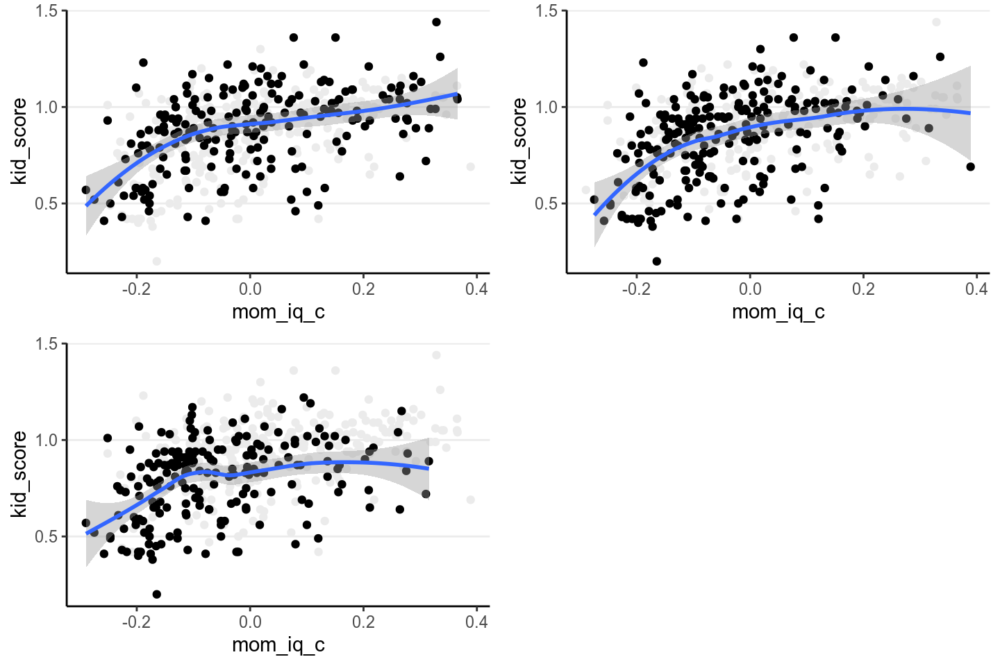
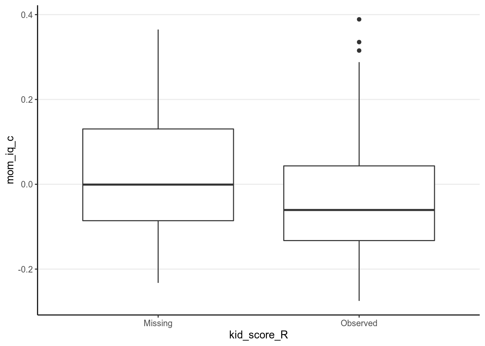
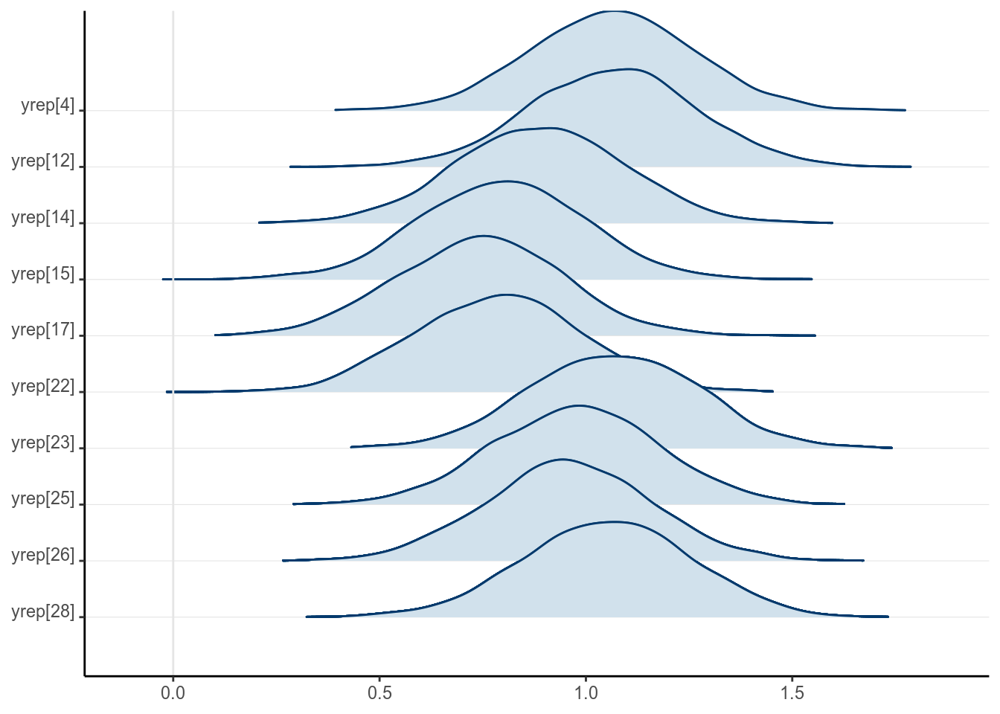

# Missing Data

Missing data are common in many research problems. Sometimes missing data arise
from design, but more often data are missing for reasons that are beyond 
researchers' control. I will first provide some conceptual discussion on
the types of missing data, and then talk about the Bayesian approach for
handling missing data by treating missing data as parameters with some prior
information. I will then give a brief introduction of *multiple imputation* and
its Bayesian origin. A regression with missing data problem will be used to
illustrate two Bayesian approaches to handle missing data. 

## Missing Data Mechanisms

To simplify the discussion, assume that missing values are only present in the
outcome $Y$ in a hypothetical regression problem of using people's age ($X$) to
predict their voting intention ($Y$).

Let $R$ be an indicator variable that denotes whether
$Y$ is missing ($R = 0$) or not ($R = 1$). For example, if $Y$ looks like


```r
set.seed(3)
N <- 30
x <- sort(sample(18:80, N, replace = TRUE))
y <- 0.5 * x / sd(x) + rnorm(N, sd = 0.8)
y <- round(y * 1.4 + 2, 1)
ifelse(y[1:10] > 4, NA, y[1:10])
```

```
>#  [1] 2.4 2.7 2.4 2.0 2.0 3.9 3.2 2.3 1.7  NA
```

then $R$ will be


```
>#  [1] 1 1 1 1 1 1 1 1 1 0
```

Assume our data look like the first scatter plot below if there are no missing 
data:


```r
demo_data <- tibble(y = y, x = x, 
                    r_mcar = rep(c(TRUE, FALSE, TRUE), 10), 
                    r_mar = 1:N >= 11, 
                    r_nmar = rank(0.2 * x / sd(x) + 0.8 * y / sd(y)) >= 11)
```


```
># `geom_smooth()` using formula 'y ~ x'
># `geom_smooth()` using formula 'y ~ x'
># `geom_smooth()` using formula 'y ~ x'
># `geom_smooth()` using formula 'y ~ x'
># `geom_smooth()` using formula 'y ~ x'
># `geom_smooth()` using formula 'y ~ x'
># `geom_smooth()` using formula 'y ~ x'
># `geom_smooth()` using formula 'y ~ x'
```

<div class="figure">

<p class="caption">(\#fig:mechanism-plots)Scatter plots for different types of missing data</p>
</div>

Missing data can be related to the predictor $X$ (e.g., older people are more 
likely to give a missing response), the outcome $Y$ itself (e.g., people with 
lower voting intention are less likely to respond), and some other unmeasured 
factors that relate to neither $X$ nor $Y$, which I summarize as $Z$. Depending
on what causes missing data, the three missing data algorithms are `MCAR`
(missing completely at random), `MAR` (missing at random), and `NMAR` (not
missing at random), as summarized in the figures below, which I will further 
explain.

<!--  -->

### MCAR (Missing Completely at Random)

<!--html_preserve--><div id="htmlwidget-748157f64609652d122e" style="width:672px;height:480px;" class="grViz html-widget"></div>
<script type="application/json" data-for="htmlwidget-748157f64609652d122e">{"x":{"diagram":"\ndigraph mcar {\n\n  # a \"graph\" statement\n  graph [overlap = true, fontsize = 10]\n\n  node [shape = plaintext]\n  Y; X; \n  Ystar [label = \"Y*\"]\n  RY [label = <R<FONT POINT-SIZE=\"8\"><SUB>Y<\/SUB><\/FONT>>]\n\n  # paths\n  X -> Ystar;\n  Ystar -> Y;\n  RY -> Y;\n}\n","config":{"engine":"dot","options":null}},"evals":[],"jsHooks":[]}</script><!--/html_preserve-->

`MCAR` means that the probability of a missing response (denoted as $R$) is
unrelated to anything of interest in the research question. For example, for the
left graph in Figure 2, $Z$ maybe some haphazard events such as interviewers
accidentally erase responses for some people, which we believe to be unrelated
to participants' ages or voting intentions. The plot on the top right panel of
Figure 1 is an example, with the missing cases being grayed out.

One quick-and-dirty method to check for MCAR is to check whether the 
distribution of $X$ is similar for cases with or without missing data on $Y$,
and as you can see in the above graph the means and variances of $X$ for the
group with missing data and for the group without are highly similar. This
method can be generalized to data with missing data on multiple variables, and
one can check whether missing data on every variable affect all other variables.

As you can see, the regression line barely changes with or without the missing
data. 

> In general, under `MCAR`, using only cases with no missing value still give
valid inferences and unbiased estimations. However, for more complex models
complete case analyses (also called listwise deletion) can greatly reduce the 
sample size for analysis, as it throws away information from cases with 
partial information.

### MAR (Missing At Random)

<!--html_preserve--><div id="htmlwidget-a08941f42e8ad93d0338" style="width:672px;height:480px;" class="grViz html-widget"></div>
<script type="application/json" data-for="htmlwidget-a08941f42e8ad93d0338">{"x":{"diagram":"\ndigraph mar {\n\n  # a \"graph\" statement\n  graph [overlap = true, fontsize = 10]\n\n  node [shape = plaintext]\n  Y; X; \n  Ystar [label = \"Y*\"]\n  RY [label = <R<FONT POINT-SIZE=\"8\"><SUB>Y<\/SUB><\/FONT>>]\n\n  # paths\n  X -> Ystar;\n  X -> RY;\n  Ystar -> Y;\n  RY -> Y;\n}\n","config":{"engine":"dot","options":null}},"evals":[],"jsHooks":[]}</script><!--/html_preserve-->

It's probably not the most intuitive naming, but `MAR` refers to the condition 
that the probability of a missing observation ($R$) can be explained by the
observed data (i.e., $X$ in this case). In other words, missing data does not
relate to the values that would have been observed (which is denoted as
$Y_\textrm{mis}$), once we considered the observed data. For example, for the
middle graph in Figure 2, some missing data on voting intentions can be
explained by some random factor $Z$, but for some cases data are missing
because, for instance, younger people tend to be less motivated to complete the
survey. The plot on the bottom left panel of Figure 1 is an example, with the
missing cases being grayed out.

As can be seen, when data are MAR, the distributions of $X$ are different for
groups with and without missing $Y$ values. Also, the distributions of the
observed $Y$ values differ systematically from the complete data. 

> Under `MAR`, using only the cases without missing values still produces an
unbiased estimate of the regression coefficient, if missing data is only present
in $Y$. However, for more complex models and with missing data in $X$, more
advanced methods generally give more accurate coefficient estimates and standard
errors.

### NMAR (Not Missing At Random)

<!--html_preserve--><div id="htmlwidget-0f7405d6c60f62578b83" style="width:672px;height:480px;" class="grViz html-widget"></div>
<script type="application/json" data-for="htmlwidget-0f7405d6c60f62578b83">{"x":{"diagram":"\ndigraph nmar {\n\n  # a \"graph\" statement\n  graph [overlap = true, fontsize = 10]\n\n  node [shape = plaintext]\n  Y; X; \n  Ystar [label = \"Y*\"]\n  RY [label = <R<FONT POINT-SIZE=\"8\"><SUB>Y<\/SUB><\/FONT>>]\n\n  # paths\n  X -> Ystar;\n  X -> RY;\n  Ystar -> Y;\n  Ystar -> RY;\n  RY -> Y;\n  {rank = same; Ystar; RY;}\n}\n","config":{"engine":"dot","options":null}},"evals":[],"jsHooks":[]}</script><!--/html_preserve-->

`NMAR` is sometimes called *missing not at random* or *non-ignorable 
missingness*, and as the name suggested it refers to conditions where MAR does 
not hold. In other words, NMAR happens when, after considering all the observed
data, the probability of a missing value ($R$) still depends on the value of $Y$
that would have been observed. For example, if we consider people in the same
age group and still find those with lower voting intentions tend not to give
their responses, the situation can be described as `NMAR`. The plot on the 
bottom right panel of Figure 1, where people with lowing voting intentions are 
more likely to miss.

The example looks very similar to the one for MAR, including the fact that the 
distributions of $X$ are different for the group with and without missing $Y$. 
Indeed, there are no statistical procedures that can distinguish between MAR
in general and NMAR. If there are evidence for MCAR then one can be more 
confident in ruling out NMAR, and there have been recent efforts to establish 
procedures for testing some special cases of MAR. However, for many real data 
problems one has to rely on reasoning, judgments, and perhaps some educated 
guessing to decide whether the data is MAR or NMAR.

On the other hand, if one has variables that potentially relates to the 
probability of missing but are not part of the model of interest (e.g., gender, 
SES, etc), these can be included in the imputation model (discussed later) so 
that the missing data mechanism better resembles MAR. Including these
*auxiliary* variables is equivalent to changing them from unmeasured to
measured, and generally can weaken the associations between the unobserved $Y$
and $R$, thus making the estimates less biased.

> With `NMAR`, valid statistical inferences can only be
obtained by correctly modeling the mechanism for the missing data. Including
variables that help explain probability of missing data makes `MAR` more
reasonable.

### Ignorable Missingness*

Let $Y_\textrm{obs}$ be the part of the multivariate data $Y$ that is
observed (i.e., not missing), and $Y_\textrm{mis}$ be the part that would
have been observed. The likelihood now concerns both $Y_\textrm{obs}$ and
$R$, that is, $P(Y_\textrm{obs}, R)$. Let $\bv \phi$ be the set of
parameters that determine the probability of missing in addition to the observed
data, which can be written as $P(R | Y_\textrm{obs}, \bv \phi)$. Note it is 
assumed that $\bv \phi$ is distinct from the model parameters $\bv \theta$.

For a case $i$ with $r_i = 1$, the joint likelihood of $(x_i, y_i, r_i = 1)$ is

$$P(x_i, y_{\textrm{obs}, i}, r_i = 1; \bv \theta, \bv \phi) 
  = P(r_i = 1 | x_i, y_{\textrm{obs}, i}; \bv \phi) 
    P(y_{\textrm{obs}, i} | x_i; \bv \theta) 
    P(x_i).$$
    
For a case with $r_i = 0$, $y_i$ is missing. Assume first we know the
missing value $y_{\textrm{mis}, i}$, and the complete likelihood $(x_i,
y_{\textrm{mis}, i}, r_i = 0)$ is

$$P(x_i, y_{\textrm{mis}, i}, r_i = 0; \bv \theta, \bv \phi) 
  = P(r_i = 0 | x_i, y_{\textrm{mis}, i}; \bv \phi) 
    P(y_{\textrm{mis}, i} | x_i; \bv \theta) 
    P(x_i)$$

But because $y$ is missing, we need to integrate out the missing value to 
obtain the observed likelihood of $(x_i, r_i = 0)$

\begin{align*}
  P(x_i, r_i = 0; \bv \theta, \bv \phi) 
  & = \int P(r_i = 0 | x_i, y_{\textrm{mis}, i}; \bv \phi) 
           P(y_{\textrm{mis}, i} | x_i; \bv \theta) 
           P(x_i) \dd y_{\textrm{mis}, i} \\
  & = P(x_i) \int P(r_i = 0 | x_i, y_{\textrm{mis}, i}; \bv \phi) 
           P(y_{\textrm{mis}, i} | x_i; \bv \theta) 
           \dd y_{\textrm{mis}, i} 
\end{align*}

Because the likelihood depends on $R$ and cannot be separated from $\bv \phi$, 
correct inference on $\bv \theta$ can be obtained only by correct modeling the
missing data mechanism.

#### If MCAR Holds

However, if the condition for MCAR is satisfied such that

$$P(r_i = 0 | x_i, y_{\textrm{mis}, i}; \bv \phi) = P(r_i = 0; \bv \phi),$$

that is, $R$ is related to neither $X$ and $Y$ Then the observed likelihood is 

\begin{align*}
  P(x_i, r_i = 0; \bv \theta, \bv \phi) 
  & = P(x_i) \int P(r_i = 0; \bv \phi) 
           P(y_{\textrm{mis}, i} | x_i; \bv \theta) 
           \dd y_{\textrm{mis}, i} \\
  & = P(x_i) P(r_i = 0; \bv \phi) \times
      \int P(y_{\textrm{mis}, i} | x_i; \bv \theta) 
           \dd y_{\textrm{mis}, i} \\
  & = P(x_i) P(r_i = 0; \bv \phi)
\end{align*}

So inference of $\bv \theta$ does not depend on the missing data mechanism 
$P(r_i = 0; \bv \phi)$, and missingness is *ignorable*. 

#### If MAR Holds

Similarly, if the condition for MAR is satisfied such that

$$P(r_i = 0 | x_i, y_{\textrm{mis}, i}; \bv \phi) 
  = P(r_i = 0 | x_i, ; \bv \phi),$$

that is, $R$ is not related to $Y$ after taking into account $X$. Then the
observed likelihood is

\begin{align*}
  P(x_i, r_i = 0; \bv \theta, \bv \phi) 
  & = P(x_i) \int P(r_i = 0 | x_i; \bv \phi) 
           P(y_{\textrm{mis}, i} | x_i; \bv \theta) 
           \dd y_{\textrm{mis}, i}  \\
  & = P(x_i) P(r_i = 0 | x_i; \bv \phi) \times
      \int P(y_{\textrm{mis}, i} | x_i; \bv \theta) 
           \dd y_{\textrm{mis}, i} \\
  & = P(x_i) P(r_i = 0 | x_i; \bv \phi)
\end{align*}

So inference of $\bv \theta$ does not depend on the missing data mechanism 
$P(r_i = 0 | x_i; \bv \phi)$, and missingness is ignorable. 

On the other hand, if $r_i$ depends on $y_\textrm{mis}$ (i.e., NMAR) so that
$P(r_i = 0 | x_i, y_{\textrm{mis}, i}; \bv \phi)$ cannot be written outside of
the integral, inference of $\bv \theta$ depends on the missing data mechanism,
so missingness is non-ignorable.

The discussion generalizes to missing data on multiple variables. 

***

## Bayesian Approaches for Missing Data

We will be using the `kidiq` data set we discussed in Chapter 7. I'll do the 
same rescaling and coding `mom_hs` as a factor variable:


```r
kidiq <- haven::read_dta("../data/kidiq.dta")
kidiq100 <- kidiq %>% 
  mutate(mom_iq = mom_iq / 100,  # divid mom_iq by 100
         kid_score = kid_score / 100,   # divide kid_score by 100
         mom_iq_c = mom_iq - 1, 
         mom_hs = factor(mom_hs, labels = c("no", "yes"))) %>% 
  select(- mom_iq)
```

In R, the package `mice` can be used to perform *multiple imputation* (to be 
discussed soon), as well as to create missing data. First, let's generate some
missing completely at random (MCAR) data by randomly removing up to 50% of 
the data:


```r
library(mice)
set.seed(1955)
kidiq100_mcar <- ampute(kidiq100, prop = 0.5, 
                        pattern = data.frame(kid_score = c(0, 0, 0), 
                                             mom_hs = c(1, 1, 0), 
                                             mom_work = c(1, 1, 1), 
                                             mom_age = c(1, 1, 1), 
                                             mom_iq_c = c(1, 0, 1)), 
                        freq = c(.2, .4, .4), 
                        mech = "MCAR")
kidiq100_mcar <- kidiq100_mcar$amp
```

The second time, I'll generate some missing at random (MAR) data:


```r
set.seed(1955)
kidiq100_mar <- ampute(kidiq100, prop = 0.5, 
                       pattern = data.frame(kid_score = c(0, 0, 0), 
                                            mom_hs = c(1, 1, 0), 
                                            mom_work = c(1, 1, 1), 
                                            mom_age = c(1, 1, 1), 
                                            mom_iq_c = c(1, 0, 1)), 
                       freq = c(.2, .4, .4), 
                       mech = "MAR")
```

```
># Warning: Data is made numeric because the calculation of weights requires
># numeric data
```

```r
kidiq100_mar <- kidiq100_mar$amp
```

And finally, some not missing at random (NMAR) data:


```r
set.seed(1955)
kidiq100_nmar <- ampute(kidiq100, prop = 0.5, 
                        pattern = data.frame(kid_score = c(0, 0, 0), 
                                             mom_hs = c(1, 1, 0), 
                                             mom_work = c(1, 1, 1), 
                                             mom_age = c(1, 1, 1), 
                                             mom_iq_c = c(1, 0, 1)), 
                        freq = c(.2, .4, .4), 
                        # mice call it MNAR
                        mech = "MNAR")
```

```
># Warning: Data is made numeric because the calculation of weights requires
># numeric data
```

```r
kidiq100_nmar <- kidiq100_nmar$amp
```

Let's check the distributions of the resulting data:


```r
p1 <- ggplot(kidiq100_mcar, aes(x = mom_iq_c, y = kid_score)) + 
  geom_point(data = kidiq100, color = "grey92") + 
  geom_point() + 
  geom_smooth()
p2 <- p1 %+% kidiq100_mar
p3 <- p1 %+% kidiq100_nmar
grid.arrange(p1, p2, p3, nrow = 2)
```

```
># `geom_smooth()` using method = 'loess' and formula 'y ~ x'
```

```
># Warning: Removed 230 rows containing non-finite values (stat_smooth).
```

```
># Warning: Removed 230 rows containing missing values (geom_point).
```

```
># `geom_smooth()` using method = 'loess' and formula 'y ~ x'
```

```
># Warning: Removed 215 rows containing non-finite values (stat_smooth).
```

```
># Warning: Removed 215 rows containing missing values (geom_point).
```

```
># `geom_smooth()` using method = 'loess' and formula 'y ~ x'
```

```
># Warning: Removed 239 rows containing non-finite values (stat_smooth).
```

```
># Warning: Removed 239 rows containing missing values (geom_point).
```



When eyeballing it doesn't appear that the data are very different, but the 
regression slopes are affected by the different missing data mechanisms. We'll
look at the simple regression model of using `mom_iq_c` to predict `kid_score`, 
using the MAR data set. In that data set, the missingness of `kid_score` 
actually depends on both `mom_iq_c` and `mom_hs`, but when the regression does
not include `mom_hs` in the model, the resulting situation will actually be 
NMAR. 

The missing data pattern of the `kidiq100_mar` data set is:


```r
# Recode mom_hs to factor
kidiq100_mar$mom_hs <- factor(kidiq100_mar$mom_hs, labels = c("no", "yes"))
md.pattern(kidiq100_mar, rotate.names = TRUE)
```


```
>#     mom_work mom_age mom_hs mom_iq_c kid_score    
># 219        1       1      1        1         1   0
># 49         1       1      1        1         0   1
># 94         1       1      1        0         0   2
># 72         1       1      0        1         0   2
>#            0       0     72       94       215 381
```

Which shows that only 219 observations had full data, and most were missing the
`kid_score` variable. 

### Complete Case Analysis/Listwise Deletion

By default, `brms` uses only cases with no missing data. For example,


```r
m3_ld <- brm(kid_score ~ mom_iq_c + mom_hs, data = kidiq100_mar, 
             prior = c(prior(normal(0, 1), class = "Intercept"), 
                       # set for all "b" coefficients
                       prior(normal(0, 1), class = "b"),
                       prior(student_t(4, 0, 1), class = "sigma")), 
             seed = 2302
)
```

```
># Warning: Rows containing NAs were excluded from the model.
```


```r
m3_ld
```

```
>#  Family: gaussian 
>#   Links: mu = identity; sigma = identity 
># Formula: kid_score ~ mom_iq_c + mom_hs 
>#    Data: kidiq100_mar (Number of observations: 219) 
># Samples: 4 chains, each with iter = 2000; warmup = 1000; thin = 1;
>#          total post-warmup samples = 4000
># 
># Population-Level Effects: 
>#           Estimate Est.Error l-95% CI u-95% CI Rhat Bulk_ESS Tail_ESS
># Intercept     0.81      0.03     0.76     0.86 1.00     4281     3286
># mom_iq_c      0.71      0.11     0.51     0.91 1.00     4192     3222
># mom_hsyes     0.07      0.03     0.01     0.13 1.00     4361     3233
># 
># Family Specific Parameters: 
>#       Estimate Est.Error l-95% CI u-95% CI Rhat Bulk_ESS Tail_ESS
># sigma     0.20      0.01     0.18     0.22 1.00     4354     3116
># 
># Samples were drawn using sampling(NUTS). For each parameter, Bulk_ESS
># and Tail_ESS are effective sample size measures, and Rhat is the potential
># scale reduction factor on split chains (at convergence, Rhat = 1).
```

Notice that the number of observations is only 219. As previously
explained, this analysis is only valid when data are missing completely at 
random or missing at random (i.e., missingness of the outcome only depends
on `mom_iq_c` and factors unrelated to `Ozone`). 

If you recall in Chapter 7, the coefficient using the full data should be:


```r
m3 <- brm(kid_score ~ mom_iq_c + mom_hs, data = kidiq100, 
          prior = c(prior(normal(0, 1), class = "Intercept"), 
                    # set for all "b" coefficients
                    prior(normal(0, 1), class = "b"),
                    prior(student_t(4, 0, 1), class = "sigma")), 
          seed = 1955
)
```


```r
m3
```

```
>#  Family: gaussian 
>#   Links: mu = identity; sigma = identity 
># Formula: kid_score ~ mom_iq_c + mom_hs 
>#    Data: kidiq100 (Number of observations: 434) 
># Samples: 4 chains, each with iter = 2000; warmup = 1000; thin = 1;
>#          total post-warmup samples = 4000
># 
># Population-Level Effects: 
>#           Estimate Est.Error l-95% CI u-95% CI Rhat Bulk_ESS Tail_ESS
># Intercept     0.82      0.02     0.78     0.86 1.00     4140     2905
># mom_iq_c      0.56      0.06     0.44     0.68 1.00     4044     3195
># mom_hsyes     0.06      0.02     0.02     0.10 1.00     3884     3034
># 
># Family Specific Parameters: 
>#       Estimate Est.Error l-95% CI u-95% CI Rhat Bulk_ESS Tail_ESS
># sigma     0.18      0.01     0.17     0.19 1.00     3902     3132
># 
># Samples were drawn using sampling(NUTS). For each parameter, Bulk_ESS
># and Tail_ESS are effective sample size measures, and Rhat is the potential
># scale reduction factor on split chains (at convergence, Rhat = 1).
```

So the listwise approach overestimated the regression coefficient. We can do 
better. 

Now, take a look on whether missingness in `kid_score` is related to other
variables. 


```r
# Compute the missingness indicator (you can use the `within` function too)
kidiq100_mar_R <- transform(kidiq100_mar, 
                            kid_score_R = factor(as.numeric(!is.na(kid_score)), 
                                                 labels = c("Missing", 
                                                            "Observed")))
```


```r
# Plot distributions of variables against missingness indicator
qplot(kid_score_R, mom_iq_c, data = kidiq100_mar_R, geom = "boxplot")
```

```
># Warning: Removed 94 rows containing non-finite values (stat_boxplot).
```



```r
ggplot(data = kidiq100_mar_R, aes(x = kid_score_R)) + 
  geom_bar(aes(fill = factor(mom_hs)), position = position_dodge())
```


As we already knew, missingness of `kid_score` is related to both `mom_iq_c` 
and `mom_hs`, in that those with higher `mom_iq_c` and those whose mother had
high school degree were more likely to be missing. 

### Treat Missing Data as Parameters

A fully Bayesian approach to handle missing data is to treat the missing
`kid_score` values just as parameters, and assign priors to them. When the
missing data mechanism is ignorable (MCAR or MAR), we can assume that the
missing and observed `kid_score` values are exchangeable, conditioning on the
predictors (i.e., whether `kid_score` is missing or not does not add information
to the `kid_score` values). Therefore, if `kid_score` is missing, we use the
likelihood as the prior for the missing values:

\newcommand{\yttobs}{\mathtt{kid_score}_{\textrm{obs}, i}}
\newcommand{\yttmis}{\mathtt{kid_score}_{\textrm{mis}, i}}
\newcommand{\momiqtt}{\mathtt{mom_iq_c}}
\newcommand{\momhstt}{\mathtt{mom_hs}}

\begin{align*}
  \yttobs & \sim \norm(\beta_0 + \beta_1 \momiqtt_i, \sigma) \\
  \yttmis & \sim \norm(\beta_0 + \beta_1 \momiqtt_i, \sigma) \\
  \beta_0 & \sim \norm(0, 1) \\
  \beta_1 & \sim \norm(0, 1) \\
  \beta_2 & \sim \norm(0, 1)
\end{align*}


```r
library(rstan)
rstan_options(auto_write = TRUE)
```


```stan
data {
  int<lower=0> N;  // number of observations
  vector[N] y;  // response variable (including missing values);
  int<lower=0, upper=1> y_obs[N];  // missingness indicator for Y 
  int<lower=0> p;  // number of predictor variables (exclude intercept)
  matrix[N, p] X;  // predictor variable matrix
}
transformed data {
  int n_obs = sum(y_obs);  // number of observed cases
  int ns[n_obs];  // indices of observed cases
  int ny = 1; 
  for (n in 1:N) {
    if (y_obs[n]) {
      ns[ny] = n;
      ny += 1;
    }
  }
}
parameters {
  real beta_0;  // intercept
  vector[2] beta;  // 2 slopes
  real<lower=0> sigma;  // error standard deviation
}
model {
  // likelihood for observed Y
  y[ns] ~ normal_id_glm(X[ns, ], beta_0, beta, sigma);
  // prior
  beta_0 ~ normal(0, 1);
  beta ~ normal(0, 1);
  sigma ~ student_t(4, 0, 1);
}
generated quantities {
  real yrep[N];  // simulated data based on model
  vector[N] yhat = beta_0 + X * beta;  // used to compute R-squared effect size
  for (i in 1:N) {
    yrep[i] = normal_rng(yhat[i], sigma);
  }
}
```


```r
# Data with no missing X
kidiq100_mar_obsX <- drop_na(kidiq100_mar, mom_iq_c, mom_hs)
```


```r
m3_stan <- stan("../codes/normal_regression_missing.stan", 
                data = list(N = nrow(kidiq100_mar_obsX), 
                            y = replace_na(kidiq100_mar_obsX$kid_score, 99), 
                            y_obs = as.numeric(
                              !is.na(kidiq100_mar_obsX$kid_score)
                            ), 
                            p = 2, 
                            X = model.matrix(~ mom_iq_c + mom_hs, 
                                             data = kidiq100_mar_obsX)[ , -1]), 
                seed = 1234)
```

Note that the results are basically identical to the complete case analyses, and
the posterior distributions of the missing $Y$ values are essentially the 
predictive intervals given the $X$ values. For example, for
the first 10 observations with missing `kid_score` values,


```r
draws_ymis <-
  as.matrix(m3_stan, pars = "yrep")[ , is.na(kidiq100_mar_obsX$kid_score)]
mcmc_areas_ridges(draws_ymis[ , 1:10], bw = "SJ")
```

<div class="figure">

<p class="caption">(\#fig:m3-stan-dens)Posterior density plots of the first two missing values of \texttt{kid_score}</p>
</div>

The posterior distributions of the missing values are highly related to the 
missing data handling technique called *multiple imputation*, which we will 
discuss next. Indeed, each posterior sample can be considered an imputed data
set. The posterior draws of the missing values are also called 
*plausible values*. 

### Multiple Imputation

Multiple imputation is one of the modern techniques for missing data handling,
and is general in that it has a very broad application. It uses the observed
data and the observed associations to predict the missing values, and captures
the uncertainty involved in the predictions by imputing multiple data sets.
That's a bit abstract, but with your Bayesian knowledge, that just means
*getting samples from the posterior distributions of the missing values*, and
then substitute them to the missing holes to form an imputed data set. The
difference is that, instead of using all posterior samples, we usually obtain 20
or 30 imputed data sets, which can be saved and used for almost any kind of
analyses, Bayesian or frequentist.

#### Multiple imputation has several advantages

- It provides valid results when data is MAR
- It reduces biases when data is NMAR by incorporating covariates that help
explain the missing data mechanism (e.g., `mom_work` and `mom_age`)
- It is very flexible and can impute continuous and categorical variables

#### Example of multiple imputation

Although in theory one can use the Bayesian procedures with `Stan` to account
for missing data or to do multiple imputations, there are some limitations.
First, when the goal is to impute missing data instead of making inferences on
the model parameters, the algorithm in `Stan` may not be as efficient as
specialized programs for multiple imputation. Second, the Hamiltonian Monte
Carlo sampler in `Stan` requires the use of derivatives, so it is not (yet)
well-equipped to handle categorical parameters. Thus, it is hard or not possible
to handle categorical missing data. Third, when the number of variables with
missing data is large, it is tedious to specify the missing data mechanism for
all variables.

Instead, as @Gelman2013 recommended, we can handle missing data using a 
*two-step process*:

1. Do multiple imputation using a specialized program
2. Use `brms` or `rstan` (or other Bayesian methods) to analyze each imputed
data set

#### R packages for multiple imputation

There are several packages in R for multiple imputation (e.g., `Amelia`, `jomo`,
`mi`, `mice`, `missForest`, `norm`, `pan`). Although these packages differ in
terms of their underlying algorithms, my experience and also evidence from the
literature suggested that they usually gave similar performance for continuous
missing data, but several packages have specialized functionality for specific
models and data types (e.g., categorical missing data, multilevel data). 

I will illustrate the use of `mice` below. I strongly encourage you to take a
look on the vignettes found on the website of the package:
https://github.com/stefvanbuuren/mice. Also, the author of the package has a
nice book on multiple imputation [@vanburren2018], which is freely available at
https://stefvanbuuren.name/fimd/ and I encourage you to read if you are
interested. Note that the example discussed here is simple so not much fine
tuning for the imputation is needed. For your own analyses multiple imputation
can be complex, and you should consult statisticians or other resources to set
up a reasonable imputation model.

Let's continue with the `kidiq` example. We can use the whole data set for
imputation.

> In general it's recommended to include covariates that have even minor 
associations with the probability of missing. The bias introduced by ignoring an
important covariate usually is higher than the bias introduced by including a 
inappropriate covariate. However, see @thoemmes2014cautious for a cautionary
note.

> In planning a study, if high missing rate on a variable is anticipated, one
can collect covariates that can help explain the missing data mechanism. This
helps recover missing information in the analyses.

##### 1. Setting up and run the imputation

With binary and continuous missing variables, it can be as simple as running 
the following:


```r
library(mice)
# Using mice to impute 20 data sets
kidiq100_imp <- mice(kidiq100_mar, m = 20, maxit = 35,
                     printFlag = FALSE)  # set to false only for knitting to Rmd
```

Of course this oversimplifies the complexity of multiple imputation. By default
it uses the method called "predictive mean matching" to replace missing data 
with a randomly chosen value from several similar cases (see https://stefvanbuuren.name/fimd/sec-pmm.html). Things will get more complicated
when you have more variables and complex data types. 

Typing `kidiq100_imp$imp` will show the imputed missing values. Check `?mice`
for more information. The `complete` function fills the missing values to the
missing holes to form data sets with no missing data.


```r
kidiq100_imp1 <- complete(kidiq100_imp, 1)
head(kidiq100_imp1, 10)
```

```
>#    kid_score mom_hs mom_work mom_age mom_iq_c
># 1       1.21    yes        4      27  -0.1883
># 2       1.26    yes        4      25   0.2754
># 3       0.85    yes        4      27   0.1544
># 4       0.41    yes        3      25  -0.1785
># 5       0.42    yes        4      27  -0.0725
># 6       0.98     no        1      18   0.0790
># 7       0.69    yes        4      20   0.3889
># 8       1.16    yes        3      23   0.2515
># 9       1.02    yes        1      24  -0.1838
># 10      0.95    yes        1      19  -0.0493
```

Compared to the original data:


```r
head(kidiq100, 10)
```

```
># # A tibble: 10 x 5
>#    kid_score mom_hs mom_work mom_age mom_iq_c
>#        <dbl> <fct>     <dbl>   <dbl>    <dbl>
>#  1      0.65 yes           4      27  0.211  
>#  2      0.98 yes           4      25 -0.106  
>#  3      0.85 yes           4      27  0.154  
>#  4      0.83 yes           3      25 -0.00550
>#  5      1.15 yes           4      27 -0.0725 
>#  6      0.98 no            1      18  0.0790 
>#  7      0.69 yes           4      20  0.389  
>#  8      1.06 yes           3      23  0.251  
>#  9      1.02 yes           1      24 -0.184  
># 10      0.95 yes           1      19 -0.0493
```


##### 2. Check for Convergence

We should also look at convergence:


```r
plot(kidiq100_imp)
```


These are basically Markov chains in regular Bayesian analyses. So if you see 
some chains are constantly above or below others then it's problematic. 

See https://www.gerkovink.com/miceVignettes/Convergence_pooling/Convergence_and_pooling.html
for additional steps to check for convergence. 

##### 3. Run `brm_multiple` on imputed data sets

`brms` directly supports multiply imputed data sets. Simply use the 
`brm_multiple` function and supply the multiply imputed data object to it. Also,
for computational efficiency using two chains for each imputed data set would
be faster. 


```r
m3_imp <- brm_multiple(kid_score ~ mom_iq_c + mom_hs, data = kidiq100_imp, 
                       prior = c(prior(normal(0, 1), class = "Intercept"), 
                                 # set for all "b" coefficients
                                 prior(normal(0, 1), class = "b"),
                                 prior(student_t(4, 0, 1), class = "sigma")), 
                       seed = 1955, 
                       chains = 2L, 
                       cores = 2L
)
```

See this vignette: 
https://cran.r-project.org/web/packages/brms/vignettes/brms_missings.html#compatibility-with-other-multiple-imputation-packages for more information. If you look at the results:


```r
m3_imp
```

```
># Warning: Parts of the model have not converged (some Rhats are > 1.05). Be
># careful when analysing the results! We recommend running more iterations and/or
># setting stronger priors.
```

```
>#  Family: gaussian 
>#   Links: mu = identity; sigma = identity 
># Formula: kid_score ~ mom_iq_c + mom_hs 
>#    Data: kidiq100_imp (Number of observations: 434) 
># Samples: 40 chains, each with iter = 2000; warmup = 1000; thin = 1;
>#          total post-warmup samples = 40000
># 
># Population-Level Effects: 
>#           Estimate Est.Error l-95% CI u-95% CI Rhat Bulk_ESS Tail_ESS
># Intercept     0.80      0.02     0.76     0.85 1.15      170      783
># mom_iq_c      0.67      0.10     0.48     0.86 1.40       84      328
># mom_hsyes     0.07      0.03     0.02     0.13 1.18      144      653
># 
># Family Specific Parameters: 
>#       Estimate Est.Error l-95% CI u-95% CI Rhat Bulk_ESS Tail_ESS
># sigma     0.19      0.01     0.18     0.21 1.20      135      246
># 
># Samples were drawn using sampling(NUTS). For each parameter, Bulk_ESS
># and Tail_ESS are effective sample size measures, and Rhat is the potential
># scale reduction factor on split chains (at convergence, Rhat = 1).
```

You will see that there are 40 chains in the results. The `Rhat` value will 
be much higher than 1, as the chains are from different data sets and will never
converge. Instead, you should investigate the `Rhat` for each data set by 


```r
m3_imp$rhats
```

```
>#    b_Intercept b_mom_iq_c b_mom_hsyes sigma  lp__
># 1        1.002      1.000       1.002 1.003 1.002
># 2        0.999      1.001       0.999 1.000 1.000
># 3        1.000      0.999       1.000 1.002 0.999
># 4        0.999      0.999       0.999 1.001 1.004
># 5        1.001      1.001       1.002 1.003 1.001
># 6        1.000      1.001       1.001 1.001 0.999
># 7        1.000      1.000       1.000 1.001 1.000
># 8        1.000      1.000       1.000 1.000 1.002
># 9        1.000      0.999       1.001 0.999 1.002
># 10       0.999      1.000       0.999 1.000 1.003
># 11       0.999      1.001       0.999 1.000 1.000
># 12       0.999      1.000       0.999 0.999 1.000
># 13       1.000      1.000       1.000 1.000 1.000
># 14       1.001      1.000       1.000 0.999 1.001
># 15       1.001      1.000       1.001 1.000 1.000
># 16       0.999      1.000       0.999 0.999 1.001
># 17       1.001      1.000       1.003 0.999 1.000
># 18       1.000      1.000       1.000 0.999 0.999
># 19       1.000      0.999       1.001 0.999 1.000
># 20       1.001      1.000       1.001 1.002 1.003
```

So the chains have converged for each individual data set. 

Now, put the results together:


```r
source("../codes/extract_brmsfit.R")
texreg::screenreg(map(list(m3, m3_ld, m3_imp), 
                      extract_brmsfit, 
                      # LOO-IC and WAIC not meaningful for comparing different
                      # data
                      include.loo.ic = FALSE, 
                      include.waic = FALSE), 
                  custom.model.names = c("Full data", 
                                         "Complete case", 
                                         "MI"))
```

```
># Warning: Parts of the model have not converged (some Rhats are > 1.05). Be
># careful when analysing the results! We recommend running more iterations and/or
># setting stronger priors.
```

```
># Warning: Using only the first imputed data set. Please interpret the results
># with caution until a more principled approach has been implemented.
```

```
># 
># ====================================================
>#            Full data     Complete case  MI          
># ----------------------------------------------------
># Intercept    0.82 *        0.81 *         0.80 *    
>#            [0.78; 0.86]  [0.76; 0.86]   [0.76; 0.85]
># mom_iq_c     0.56 *        0.71 *         0.67 *    
>#            [0.44; 0.68]  [0.51; 0.91]   [0.49; 0.86]
># mom_hsyes    0.06 *        0.07 *         0.07 *    
>#            [0.01; 0.10]  [0.01; 0.13]   [0.02; 0.13]
># ----------------------------------------------------
># R^2          0.21          0.22           0.22      
># Num. obs.  434           219            434         
># ====================================================
># * 0 outside the confidence interval
```

You can see that the coefficients for `mom_iq_c` is closer to the original data
with multiple imputation, and the credible intervals are slightly shorter than
complete case analyses.

For data with more variables, choices of missing data handling method can make a
substantial difference. Therefore, researchers need to be thoughtful in choosing
imputation models that best reflect the missing data mechanism.

Missing data is an active research area, and this note only covers a very small
fraction of the issues discussed in the literature.
